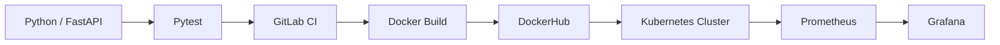

# RNCP 38919 — Bloc 3 — Practice Labs Pack

Ce pack est un **environnement d'entraînement complet** pour le **Bloc 3 — Data Engineer / DevOps** de la certification **RNCP 38919**.  
Il est construit à partir du référentiel et du périmètre officiel DataScientest.

---

## Architecture de la chaîne DevOps ciblée



```text
+---------------------------------------------------------------------------------------+
|                                Pipeline DevOps Complet                                 |
+---------------------------------------------------------------------------------------+
 [Code FastAPI] ---> [Pytest] ---> [GitLab CI] ---> [Docker Image] ---> [DockerHub]
                                                                            |
                                                                            v
 [Tableaux Grafana] <--- [Métriques Prometheus] <--- [Déploiement Kubernetes]
+---------------------------------------------------------------------------------------+
```

---

## Périmètre technique couvert

* **Environnement & Shell :** Bash (`export`, `.bashrc`), variables d'environnement (`os.environ`), environnements virtuels (`venv`).
* **Requêtes HTTP :** Appels synchrones en Bash (`curl`) et Python (`requests` / `httpx`).
* **Développement API & Modèle :** FastAPI, schémas `pydantic.BaseModel`, désérialisation de modèles avec `joblib`.
* **Tests :** Tests unitaires et d'intégration avec `pytest` et `fastapi.testclient.TestClient`.
* **CI/CD :** Dépôt GitLab, pipelines multi-stages `.gitlab-ci.yml`, GitLab Runner de type Shell.
* **Conteneurisation :** `Dockerfile`, volumes de persistance, `docker-compose.yml`, ordonnancement `depends_on`, push/pull `DockerHub`.
* **Orchestration Kubernetes :** `Namespace`, `PersistentVolume`, `PersistentVolumeClaim`, `ConfigMap`, `Service`, `Deployment`.
* **Observabilité & Monitoring :** Exposition via `prometheus-fastapi-instrumentator`, configuration `prometheus.yml`, requêtes PromQL, dashboards & datasources Grafana.

---

## Démarrage rapide

1. Consulter le guide d'accueil interactif : [START_HERE.md](./START_HERE.md).
2. Lancer la simulation d'examen dans [exam/sujet/](./exam/sujet/14_RNCP_38919_BLOC_3_EXAMEN_BLANC_01.md) en utilisant le [starter_project](./exam/starter_project/).
3. Consulter le [projet de référence corrigé](./exam/correction/reference_project/) et son [corrigé détaillé](./exam/correction/15_RNCP_38919_BLOC_3_CORRIGE_EXAMEN_BLANC_01.md).
4. Pratiquer les 13 labs ciblés dans [labs/](./labs/).
5. Réviser les notions clés avec les [fiches de cours et mémos](./resources/study_docs/).
6. Consulter le [retour d'expérience et pièges récurrents](./docs/FEEDBACK_ET_RETOUR_EXPERIENCE.md).

---

## Structure du pack

```text
RNCP_38919_BLOC_3_PRACTICE_LABS_PACK/
├── START_HERE.md          # Guide de démarrage et navigation
├── README.md              # Présentation générale du pack
├── MANIFEST.md            # Inventaire exhaustif des fichiers du pack
├── docs/                  # Documentation stratégique, audits et feedbacks
│   ├── analyses/          # Rapports d'analyse approfondie
│   │   └── ANALYSE_FONCTIONNELLE_ET_EXPERIENCE_DEBUTANT.md
│   ├── plans/             # Programme de remédiation par lots
│   │   ├── 00_CADRAGE_GLOBAL_ET_LOTISSEMENT.md
│   │   ├── LOT_01_STARTER_PROJECT_ET_EXAMEN.md
│   │   ├── LOT_02_AUTONOMIE_ET_FIABILISATION_LABS.md
│   │   ├── LOT_03_PORTABILITE_ET_ENVIRONNEMENTS.md
│   │   └── LOT_04_OUTILLAGE_ET_TESTS_AUTOMATISES.md
│   ├── AUDIT_ET_ANALYSE_OPERATIONNELLE_CORRECTION.md
│   ├── PLAN_IMPLEMENTATION_CORRECTIFS_ET_AMELIORATIONS.md
│   └── FEEDBACK_ET_RETOUR_EXPERIENCE.md
├── exam/                  # Épreuve d'examen blanc
│   ├── sujet/             # Énoncé et données sources
│   ├── starter_project/   # Squelette de départ pour le candidat
│   └── correction/        # Corrigé textuel et projet de référence fonctionnel
├── labs/                  # 13 labs d'entraînement progressifs (LAB_01 à LAB_13)
├── resources/             # Fiches de cours, cheatsheets et checklists
│   └── study_docs/        # 17 documents d'étude thématiques
├── sources/               # Extraits du référentiel source
└── tools/                 # Scripts d'audit et de validation automatisée
```

---

## Validation et conformité

Le pack intègre deux outils de validation automatisée dans `tools/` :
* [validate_entire_pack.py](./tools/validate_entire_pack.py) : audit global en 6 phases de l'intégralité du pack (inventaire, compilation Python, YAML, starter, référence et les 13 labs).
* [validate_reference_project.py](./tools/validate_reference_project.py) : validation approfondie ciblée sur le projet de référence corrigé.
