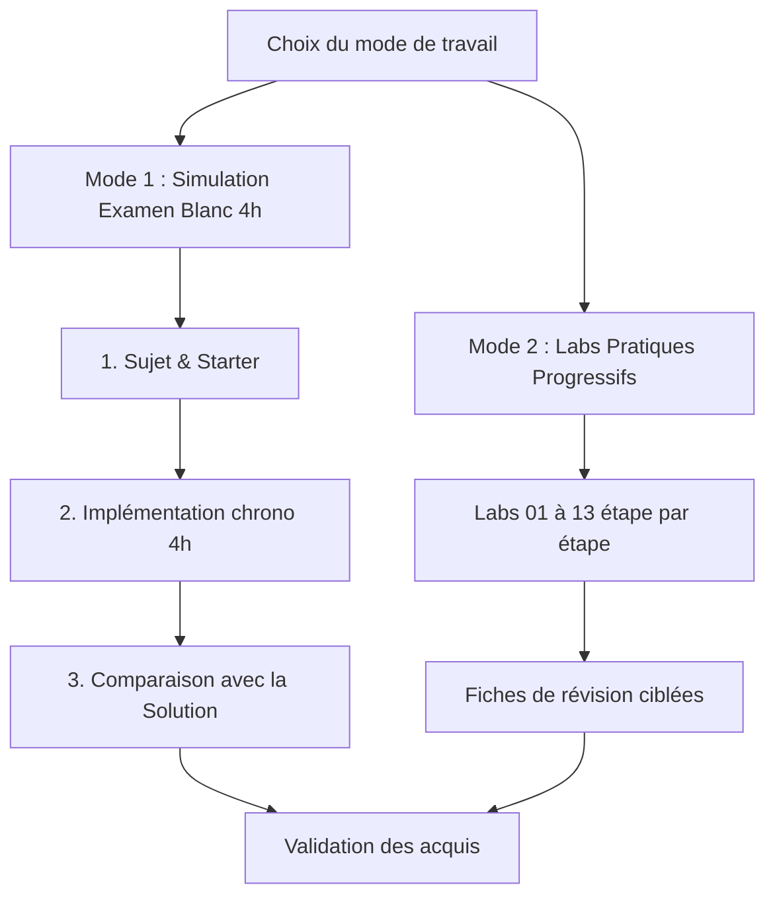

# START HERE — Parcours de préparation RNCP 38919 (Bloc 3)

Bienvenue dans le pack d'entraînement pour l'épreuve **RNCP 38919 — Bloc 3 (Data Engineer / DevOps)**.

---

## 1. Deux modes de préparation



```text
+-------------------------------------------------------------+
|                Choix du mode de travail                     |
+------------------------------+------------------------------+
                               |
        +----------------------+----------------------+
        |                                             |
        v                                             v
[Mode 1 : Simulation 4 h]                  [Mode 2 : Labs Progressifs]
  1. Sujet & Starter                         1. Labs 01 à 13 pas-à-pas
  2. Implémentation chrono                   2. Fiches de cours ciblées
  3. Comparaison avec la Solution            3. Consolidation thématique
        |                                             |
        +----------------------+----------------------+
                               |
                               v
                     [Validation des acquis]
+-------------------------------------------------------------+
```

---

## Mode 1 — Examen blanc en conditions réelles (4 h)

Ce mode simule l'épreuve complète sous surveillance Mereos :

1. **00:00** — Ouvrir le [Sujet de l'Examen Blanc 01](./exam/sujet/14_RNCP_38919_BLOC_3_EXAMEN_BLANC_01.md).
2. **00:00** — Copier le squelette [exam/starter_project/](./exam/starter_project/) dans votre dossier de travail.
3. **00:00** — Consulter la [Stratégie de gestion du temps 4h](./resources/study_docs/12_RNCP_38919_BLOC_3_STRATEGIE_EXAMEN_4H.md) et démarrer le chronomètre.
4. **03:50** — Geler le code, vérifier les tests unitaires et le smoke-test.
5. **04:00** — Générer l'archive `.tar.gz` ou `.zip` de rendu.
6. **Après l'épreuve** — Débriefer avec :
   * Le [Corrigé détaillé de l'examen blanc](./exam/correction/15_RNCP_38919_BLOC_3_CORRIGE_EXAMEN_BLANC_01.md).
   * Le [Projet de référence validé](./exam/correction/reference_project/README.md).
   * La [Checklist d'audit et feedback](./docs/FEEDBACK_ET_RETOUR_EXPERIENCE.md).

> **Règle d'or :** Ne pas consulter le dossier `exam/correction/` pendant les 4 heures de simulation.

---

## Mode 2 — Labs pratiques progressifs

Pour travailler brique par brique ou combler des lacunes ciblées :

| Lab | Thématique | Liens d'accès |
|---|---|---|
| **LAB_01** | Bash, variables d'environnement, venv | [README](./labs/LAB_01_BASH_ENV_VENV/README.md) · [Starter](./labs/LAB_01_BASH_ENV_VENV/starter/) · [Solution](./labs/LAB_01_BASH_ENV_VENV/solution/) |
| **LAB_02** | HTTP avec Bash (curl) et Python (requests/httpx) | [README](./labs/LAB_02_HTTP_BASH_PYTHON/README.md) · [Starter](./labs/LAB_02_HTTP_BASH_PYTHON/starter/) · [Solution](./labs/LAB_02_HTTP_BASH_PYTHON/solution/) |
| **LAB_03** | API FastAPI, validation Pydantic, inférence joblib | [README](./labs/LAB_03_FASTAPI_PYDANTIC_JOBLIB/README.md) · [Starter](./labs/LAB_03_FASTAPI_PYDANTIC_JOBLIB/starter/) · [Solution](./labs/LAB_03_FASTAPI_PYDANTIC_JOBLIB/solution/) |
| **LAB_04** | Tests unitaires et d'API avec Pytest & TestClient | [README](./labs/LAB_04_PYTEST/README.md) · [Starter](./labs/LAB_04_PYTEST/starter/) · [Solution](./labs/LAB_04_PYTEST/solution/) |
| **LAB_05** | Dockerfile, construction d'image, test container | [README](./labs/LAB_05_DOCKER/README.md) · [Starter](./labs/LAB_05_DOCKER/starter/) · [Solution](./labs/LAB_05_DOCKER/solution/) |
| **LAB_06** | Docker Compose multi-services & volumes partagés | [README](./labs/LAB_06_DOCKER_COMPOSE/README.md) · [Starter](./labs/LAB_06_DOCKER_COMPOSE/starter/) · [Solution](./labs/LAB_06_DOCKER_COMPOSE/solution/) |
| **LAB_07** | Pipeline GitLab CI & GitLab Runner Shell | [README](./labs/LAB_07_GITLAB_CI_RUNNER/README.md) · [Starter](./labs/LAB_07_GITLAB_CI_RUNNER/starter/) · [Solution](./labs/LAB_07_GITLAB_CI_RUNNER/solution/) |
| **LAB_08** | Registry DockerHub, login PAT, tagging & push | [README](./labs/LAB_08_DOCKERHUB/README.md) · [Starter](./labs/LAB_08_DOCKERHUB/starter/) · [Solution](./labs/LAB_08_DOCKERHUB/solution/) |
| **LAB_09** | Kubernetes : Namespace, PV, PVC, ConfigMap, Deploy, Service | [README](./labs/LAB_09_KUBERNETES_CORE_OBJECTS/README.md) · [Starter](./labs/LAB_09_KUBERNETES_CORE_OBJECTS/starter/) · [Solution](./labs/LAB_09_KUBERNETES_CORE_OBJECTS/solution/) |
| **LAB_10** | Observabilité Prometheus & requêtes PromQL | [README](./labs/LAB_10_PROMETHEUS_PROMQL/README.md) · [Starter](./labs/LAB_10_PROMETHEUS_PROMQL/starter/) · [Solution](./labs/LAB_10_PROMETHEUS_PROMQL/solution/) |
| **LAB_11** | Tableaux de bord Grafana & provisioning Datasource | [README](./labs/LAB_11_GRAFANA/README.md) · [Starter](./labs/LAB_11_GRAFANA/starter/) · [Solution](./labs/LAB_11_GRAFANA/solution/) |
| **LAB_12** | Défi End-to-End d'intégration complète | [README](./labs/LAB_12_END_TO_END_CHALLENGE/README.md) · [Starter](./labs/LAB_12_END_TO_END_CHALLENGE/starter/) · [Solution](./labs/LAB_12_END_TO_END_CHALLENGE/solution/) |
| **LAB_13** | Méthodologie de Troubleshooting & résolution d'incidents | [README](./labs/LAB_13_TROUBLESHOOTING/README.md) · [Starter](./labs/LAB_13_TROUBLESHOOTING/starter/) · [Solution](./labs/LAB_13_TROUBLESHOOTING/solution/) |

---

## 3. Centre de documentation & Révisions

### Fiches de révision thématiques
* [01 — Fiche de révision de synthèse](./resources/study_docs/01_RNCP_38919_BLOC_3_FICHE_REVISION.md)
* [02 — Mega Cheatsheet commandes & syntaxes](./resources/study_docs/02_RNCP_38919_BLOC_3_MEGA_CHEATSHEET.md)
* [04 — Guide GitLab CI & Runner](./resources/study_docs/04_RNCP_38919_BLOC_3_GITLAB_CICD_RUNNER_GUIDE.md)
* [08 — Guide Kubernetes & persistance PV/PVC](./resources/study_docs/08_RNCP_38919_BLOC_3_KUBERNETES_GUIDE.md)
* [12 — Stratégie d'examen 4h & gestion du temps](./resources/study_docs/12_RNCP_38919_BLOC_3_STRATEGIE_EXAMEN_4H.md)
* [13 — Checklist opérationnelle du Jour J](./resources/study_docs/13_RNCP_38919_BLOC_3_CHECKLIST_JOUR_J.md)
* [16 — Guide des environnements & portabilité multi-OS](./resources/study_docs/16_RNCP_38919_BLOC_3_GUIDE_ENVIRONNEMENTS_ET_PORTABILITE.md)

### Dossier stratégique & Audits techniques
* [Rapport d'analyse de viabilité & expérience débutant](./docs/analyses/ANALYSE_FONCTIONNELLE_ET_EXPERIENCE_DEBUTANT.md)
* [Audit et analyse opérationnelle du projet](./docs/AUDIT_ET_ANALYSE_OPERATIONNELLE_CORRECTION.md)
* [Plan d'implémentation et correctifs appliqués](./docs/PLAN_IMPLEMENTATION_CORRECTIFS_ET_AMELIORATIONS.md)
* [Feedback, pièges récurrents et retour d'expérience](./docs/FEEDBACK_ET_RETOUR_EXPERIENCE.md)

### Programme de remédiation par lots
* [00 — Cadrage global et lotissement](./docs/plans/00_CADRAGE_GLOBAL_ET_LOTISSEMENT.md)
* [Lot 1 — Starter Project & Simulation d'Examen](./docs/plans/LOT_01_STARTER_PROJECT_ET_EXAMEN.md)
* [Lot 2 — Autonomie & Fiabilisation des 13 Labs](./docs/plans/LOT_02_AUTONOMIE_ET_FIABILISATION_LABS.md)
* [Lot 3 — Portabilité & Environnements d'Exécution](./docs/plans/LOT_03_PORTABILITE_ET_ENVIRONNEMENTS.md)
* [Lot 4 — Outillage d'Assurance Qualité & Validation E2E](./docs/plans/LOT_04_OUTILLAGE_ET_TESTS_AUTOMATISES.md)

