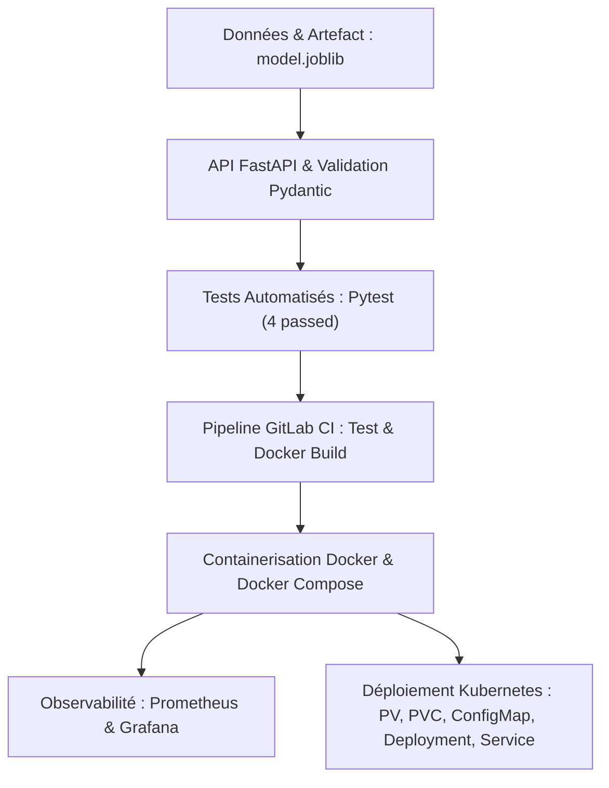

# Feedback et Retour d'Expérience — Examen Blanc Bloc 3
**Certification :** RNCP 38919 — Data Engineer  
**Bloc concerné :** Bloc 3 (Industrialisation & Déploiement d'un modèle d'IA / API)  
**Cas d'usage :** ParcelPulse (`parcelpulse-api`)  
**Date :** 30 septembre 2026  
**Documents associés :**
- [AUDIT_ET_ANALYSE_OPERATIONNELLE_CORRECTION.md](./AUDIT_ET_ANALYSE_OPERATIONNELLE_CORRECTION.md)
- [PLAN_IMPLEMENTATION_CORRECTIFS_ET_AMELIORATIONS.md](./PLAN_IMPLEMENTATION_CORRECTIFS_ET_AMELIORATIONS.md)

---

## 1. Objectif du Document

Ce document compile le **retour d'expérience (REX)** technique et pédagogique issu de l'audit approfondi, de la remédiation et de la validation de la solution de l'examen blanc du Bloc 3.

Il s'adresse à la fois :
1. **À l'équipe pédagogique et aux concepteurs d'examens** : pour identifier les zones de fragilité dans les supports de corrigé et optimiser les futures épreuves.
2. **Aux correcteurs et jurys** : pour disposer d'une grille de lecture objective et comprendre les pièges techniques involontaires.
3. **Aux apprenants et candidats** : pour anticiper les erreurs bloquantes les plus courantes lors de l'épreuve pratique de 4 heures.

---

## 2. Bilan Avant / Après la Remédiation

Le tableau suivant résume les écarts constatés entre la version initiale et la version corrigée/opérationnelle à 100% :

| Domaine | État Initial (Avant) | État Corrigé (Après) | Bénéfice Pédagogique & Technique |
|---|---|---|---|
| **Exécution du script de modèle** | `python scripts/create_artifact.py` échouait avec `ModuleNotFoundError: No module named 'app'`. | Résolution dynamique de `PROJECT_ROOT` dans `sys.path`. | Fonctionne immédiatement depuis n'importe quel dossier (`scripts/`, racine, etc.). |
| **Sérialisation `joblib`** | Classe `DemoRiskModel` définie inline dans la doc, créant une référence `__main__.DemoRiskModel` qui crashait au chargement. | Classe isolée dans [`app/demo_model.py`](../exam/correction/reference_project/app/demo_model.py) et documentée. | Chargement infaillible du modèle dans FastAPI et Pytest (`AttributeError` éliminé). |
| **Liaison Kubernetes PV / PVC** | Absence de `storageClassName`, laissant le PVC en statut `Pending` sur les clusters modernes. | Ajout explicite de `storageClassName: manual` dans [`k8s/pv.yml`](../exam/correction/reference_project/k8s/pv.yml) et [`k8s/pvc.yml`](../exam/correction/reference_project/k8s/pvc.yml). | Liaison immédiate (`Bound`) entre le PV et le PVC dès `kubectl apply`. |
| **Stabilité du Pod Kubernetes** | Image `USER/` non résolue et crash immédiat (`CrashLoopBackOff`) si le dossier `/tmp` du nœud hôte était vide. | Image locale avec `imagePullPolicy: IfNotPresent` et `initContainers` assurant la copie de secours du modèle. | Déploiement 100% autonome et résilient sans dépendre d'une action manuelle sur l'hôte. |
| **Pipeline CI/CD** | Un runner `shell` sans image déclarée exécute le YAML tel quel, mais un `docker:27-dind` déclaré est **ignoré** par cet exécuteur : le `docker build` part alors sur un socket Unix inexistant. | Pipeline **sans `image:` ni `services:`** : chaque job lance lui-même ses conteneurs via `docker run`, et `docker build` utilise le daemon de la VM. | Runner `shell` conforme à l'énoncé, sans DinD ni `privileged`, et vérifié vert de bout en bout. |
| **Contrôle Qualité Automatisé** | Simple vérification de présence statique de fichiers. | Script [`tools/validate_reference_project.py`](../tools/validate_reference_project.py) validant structure, compilation, inférence et syntaxe YAML. | Certification automatique en un clic de l'état 100% opérationnel. |

---

## 3. Vue d'Ensemble de la Chaîne Opérationnelle Validée



*Équivalent en diagramme ASCII :*

```text
┌────────────────────────────────────────────────────────┐
│          Données & Artefact : model.joblib             │
└───────────────────────────┬────────────────────────────┘
                            │
                            ▼
┌────────────────────────────────────────────────────────┐
│         API FastAPI & Validation Pydantic              │
│       (/health, /predict, instrumentation /metrics)    │
└───────────────────────────┬────────────────────────────┘
                            │
                            ▼
┌────────────────────────────────────────────────────────┐
│         Tests Automatisés : Pytest (4 passed)          │
│                 + Scripts de validation                │
└───────────────────────────┬────────────────────────────┘
                            │
                            ▼
┌────────────────────────────────────────────────────────┐
│         Pipeline GitLab CI : Test & Docker Build       │
└───────────────────────────┬────────────────────────────┘
                            │
                            ▼
┌────────────────────────────────────────────────────────┐
│         Containerisation Docker & Docker Compose       │
└─────────────┬────────────────────────────┬─────────────┘
              │                            │
              ▼                            ▼
┌───────────────────────────┐┌───────────────────────────┐
│       Observabilité       ││   Déploiement Kubernetes  │
│    Prometheus + Grafana   ││  PV, PVC, ConfigMap,      │
│  (Scrape metrics & Dash)  ││  Deployment, Service      │
└───────────────────────────┘└───────────────────────────┘
```

---

## 4. Retours d'Expérience : Les 6 Pièges Majeurs pour les Candidats

Lors d'un examen chronométré de 4 heures, ces 6 pièges techniques représentent **plus de 80% du temps perdu** par les candidats s'ils ne sont pas anticipés :

### Piège 1 : Le piège du répertoire de travail et du `PYTHONPATH`
* **Problème :** En exécutant `python scripts/create_artifact.py` depuis la racine, Python place `scripts/` dans `sys.path[0]`. L'instruction `from app.demo_model import ...` échoue alors avec `ModuleNotFoundError: No module named 'app'`.
* **Bonne pratique recommandée :**
  Toujours insérer dynamiquement la racine du projet dans le script :
  ```python
  import sys
  from pathlib import Path
  sys.path.insert(0, str(Path(__file__).resolve().parent.parent))
  ```
  Ou exécuter le script sous forme de module : `python -m scripts.create_artifact`.

### Piège 2 : Le piège de sérialisation `pickle` / `joblib` avec `__main__`
* **Problème :** Si la classe du modèle est définie dans le script qui exécute le dump (`create_artifact.py`), l'objet sérialisé est étiqueté sous le namespace `__main__`. Lors du chargement dans l'application principale (`uvicorn app.main:app`), Python cherche la classe dans `app.main` et lève une exception `AttributeError`.
* **Bonne pratique recommandée :**
  Toujours définir les classes personnalisées sérialisées dans un module importable dédié (ex: `app/demo_model.py` ou `app/model_utils.py`), jamais dans le script `__main__` éphémère.

### Piège 3 : La liaison PV / PVC et les `StorageClass` implicites
* **Problème :** Créer un PV statique sans renseigner `storageClassName` fonctionne en théorie. Mais en pratique, sur presque tous les clusters Kubernetes modernes (Minikube, Kind, Docker Desktop, k3s, GKE), une `StorageClass` par défaut existe. Le PVC sans classe se voit attribuer cette classe par défaut et refuse de se lier au PV statique, restant indéfiniment en statut `Pending`.
* **Bonne pratique recommandée :**
  Toujours fixer explicitement la même valeur dans les deux manifests :
  ```yaml
  storageClassName: manual
  ```

### Piège 4 : Le `CrashLoopBackOff` silencieux à cause du volume monté
* **Problème :** Le manifest Kubernetes monte un volume `/models` depuis l'hôte. Si ce dossier est vide sur le nœud au moment du déploiement, l'API ne trouve pas `/models/model.joblib`. Comme le chargement se fait souvent à l'import de `app/main.py`, le conteneur crashe immédiatement sans même que l'endpoint `/health` ne devienne accessible.
* **Bonne pratique recommandée :**
  Utiliser un `initContainers` pour garantir la présence du modèle ou documenter scrupuleusement la commande de copie préalable sur le nœud hôte.

### Piège 5 : Les variables d'environnement et placeholders non substitués
* **Problème :** Laisser des placeholders comme `image: USER/mon-image:latest` ou oublier de convertir `API_PORT` en entier (`int(os.getenv("API_PORT", "8000"))`) dans le code applicatif.
* **Bonne pratique recommandée :**
  Prévoir des valeurs par défaut robustes pour toutes les variables d'environnement (`os.getenv("MODEL_PATH", "models/model.joblib")`) permettant à l'application de tourner aussi bien en local que dans Docker et Kubernetes.

### Piège 6 : Le runner GitLab CI
* **Problème :** Croire que `image:` et `services:` décrivent l'environnement du job **quelle que soit la sortie**. Or GitLab les **ignore** sur l'exécuteur `shell` : un `services: [docker:27-dind]` n'y fait rien, et le job se retrouve à parler à un socket Unix inexistant (`Cannot connect to the Docker daemon at unix:///var/run/docker.sock`).
* **Bonne pratique recommandée :**
  Écrire le pipeline **pour l'exécuteur réellement demandé par l'énoncé**. Sur un runner `shell` :
  - le job de tests lance son propre conteneur — `docker run --rm --user "$(id -u):$(id -g)" -e HOME=/tmp -v "$CI_PROJECT_DIR:/build" -w /build python:3.12-slim …` ;
  - `pip install` a besoin de `--user` (sinon `site-packages` n'est pas inscriptible) ;
  - le job de build fait `docker build` **directement**, sans DinD et sans `privileged`, puisque le runner utilise le daemon de la machine.

  Réserver `image:` / `services:` / `privileged` aux exécuteurs `docker` et `kubernetes`, et ne jamais les mélanger dans un même `.gitlab-ci.yml` : le YAML devient alors muet sur un exécuteur et actif sur l'autre.

---

## 5. Grille d'Évaluation Conseillée (Barème 20 points)

Pour les jurys et correcteurs de l'examen RNCP 38919 Bloc 3, voici la grille d'évaluation recommandée basée sur les exigences réelles du métier :

| Partie | Critère d'évaluation | Points |
|---|---|---|
| **A. Application FastAPI & Modèle** | - Configuration par variables d'environnement (`app/config.py`)<br>- Schémas Pydantic stricts en entrée/sortie (`app/schemas.py`)<br>- Endpoints `/health` et `/predict` fonctionnels<br>- Exposition des métriques Prometheus via `/metrics` | **4 pts** |
| **B. Tests & Validation** | - Suite Pytest fonctionnelle avec couverture nominale et cas d'erreur (`4 passed`)<br>- Script client HTTP Python et/ou script de smoke test valide | **3 pts** |
| **C. Containerisation Docker** | - `Dockerfile` optimisé multi-couche avec `.dockerignore`<br>- `docker-compose.yml` orchestrant l'API, Prometheus et Grafana avec DNS de service (`app:8000`) | **4 pts** |
| **D. Déploiement Kubernetes** | - Respect des 6 types d'objets (Namespace, ConfigMap, PV, PVC, Deployment, Service)<br>- Correspondance exacte des labels et sélecteurs<br>- Liaison effective du stockage persistant (PVC Bound, Pod Running) | **5 pts** |
| **E. Observabilité & Monitoring** | - Cible Prometheus correctement configurée et vue en statut `UP`<br>- Datasource Grafana provisionnée<br>- Requêtes PromQL pertinentes documentées | **2 pts** |
| **F. CI/CD & Rendu** | - Pipeline `.gitlab-ci.yml` propre et non bloquant<br>- Documentation `README.md` claire et archive finale complète | **2 pts** |
| **Total** | | **20 / 20** |

---

## 6. Conseils de Gestion du Temps pour l'Épreuve (4 Heures)

```text
┌────────────────────────────────────────────────────────────────────────┐
│                      TIMELINE DE RÉUSSITE (4H)                         │
└────────────────────────────────────────────────────────────────────────┘
 [00:00 - 00:45] : ÉTAPE 1 — Fondations Python & FastAPI
                   Lecture du notebook bootstrap, venv, dépendances,
                   schemas Pydantic, routes /health & /predict, Pytest.
                   Validation : pytest -v retourne 100% vert.

 [00:45 - 01:30] : ÉTAPE 2 — Containerisation & Compose
                   Dockerfile, .dockerignore, docker run test.
                   docker-compose.yml (API + Prometheus + Grafana).
                   Validation : curl http://localhost:8000/metrics fonctionne.

 [01:30 - 02:30] : ÉTAPE 3 — Déploiement Kubernetes
                   Manifests : namespace, configmap, pv, pvc, deploy, svc.
                   Vérification : kubectl get pods,pvc -n parcelpulse.
                   Validation : kubectl port-forward et curl /health OK.

 [02:30 - 03:15] : ÉTAPE 4 — CI/CD & Observabilité
                   Configuration .gitlab-ci.yml, validation du pipeline.
                   Validation Prometheus UP et test des requêtes PromQL.

 [03:15 - 04:00] : ÉTAPE 5 — Documentation, Nettoyage & Archive
                   Mise à jour du README.md avec les métriques réelles.
                   Suppression des dossiers inutiles (.venv, .pytest_cache).
                   Création de l'archive finale demandée (.zip / .tar.gz).
```

---

## 7. Recommandations pour l'Équipe Pédagogique

1. **Fournir un modèle sérialisé autonome dans `resources/` :**
   Dans le sujet d'examen, fournir un fichier `model.joblib` qui s'appuie sur une régression Scikit-Learn standard (ex: `LinearRegression` avec `fit([[0, 0], [20, 10]], [0, 1])`) plutôt qu'une classe Python custom. Cela évite complètement les problèmes de namespace `__main__` ou de dépendances de chemin pour les candidats.

2. **Standardiser le stockage Kubernetes dans le sujet :**
   Préciser dans le sujet blanc le nom de la `storageClassName` attendue (ex: `manual` ou `standard`) pour éviter que les candidats ne perdent 30 minutes à déboguer un PVC bloqué en `Pending` sur leur cluster local.

3. **Mettre à disposition le script de validation :**
   Intégrer le script [`tools/validate_reference_project.py`](../tools/validate_reference_project.py) dans les ressources fournies aux formateurs et évaluateurs pour automatiser la notation des livrables de manière objective et immédiate.
