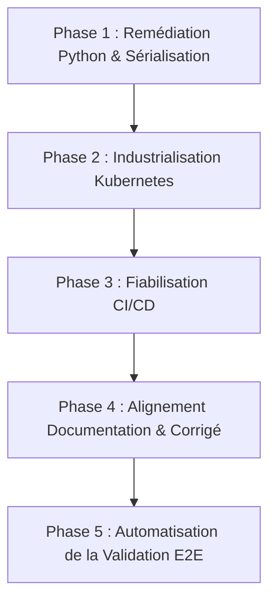

# Plan d'Implémentation : Remédiation et Améliorations
**Certification :** RNCP 38919 — Data Engineer  
**Bloc d'évaluation :** Bloc 3 (Industrialisation & Déploiement d'un modèle d'IA / API)  
**Projet concerné :** `ParcelPulse` (`exam/correction/reference_project` et `exam/correction/15_RNCP_...md`)  
**Document associé :** [AUDIT_ET_ANALYSE_OPERATIONNELLE_CORRECTION.md](./AUDIT_ET_ANALYSE_OPERATIONNELLE_CORRECTION.md)  
**Feedback & REX associé :** [FEEDBACK_ET_RETOUR_EXPERIENCE.md](./FEEDBACK_ET_RETOUR_EXPERIENCE.md)  
**Objectif :** Atteindre 100% de conformité fonctionnelle, opérationnelle et pédagogique.  
**Statut d'exécution :** ✅ **100% Implémenté et Validé (30/09/2026)**

---

## 1. Objectifs & Définition du Succès (DoD)

Le présent plan définit la feuille de route technique pour corriger l'ensemble des anomalies identifiées lors de l'audit et transformer la solution en un livrable irréprochable.

### Critères d'acceptation (Definition of Done) :
1. ✅ **Exécution sans erreur de `create_artifact.py`** : La commande `python scripts/create_artifact.py` fonctionne depuis n'importe quel répertoire de travail sans nécessiter l'export préalable de `PYTHONPATH`.
2. ✅ **Sérialisation robuste** : L'artefact `model.joblib` généré se charge sans exception dans `app/main.py`, `pytest` et `uvicorn`.
3. ✅ **Déploiement Kubernetes autonome** : Les manifests `k8s/` s'appliquent avec succès sur un cluster local (Minikube / Kind / Docker Desktop) sans blocage en `ImagePullBackOff`, `CrashLoopBackOff` ou `Pending`.
4. ✅ **Pipeline CI/CD clair et portable** : Le fichier `.gitlab-ci.yml` précise ses pré-requis d'exécution et ne plante pas à l'étape des tests.
5. ✅ **Conformité 100% entre le Corrigé Markdown et le Code Réel** : L'arborescence, les imports et les snippets du document `15_RNCP_...md` reflètent rigoureusement le code effectif.
6. ✅ **Outillage de validation enrichi** : Un script de test end-to-end automatisé valide l'ensemble de la chaîne opérationnelle.

---

## 2. Feuille de Route en 5 Phases



*Équivalent en diagramme ASCII :*

```text
┌──────────────────────────────────────────────────────────┐
│       Phase 1 : Remédiation Python & Sérialisation       │
└────────────────────────────┬─────────────────────────────┘
                             │
                             ▼
┌──────────────────────────────────────────────────────────┐
│         Phase 2 : Industrialisation Kubernetes           │
└────────────────────────────┬─────────────────────────────┘
                             │
                             ▼
┌──────────────────────────────────────────────────────────┐
│              Phase 3 : Fiabilisation CI/CD               │
└────────────────────────────┬─────────────────────────────┘
                             │
                             ▼
┌──────────────────────────────────────────────────────────┐
│      Phase 4 : Alignement Documentation & Corrigé        │
└────────────────────────────┬─────────────────────────────┘
                             │
                             ▼
┌──────────────────────────────────────────────────────────┐
│      Phase 5 : Automatisation de la Validation E2E       │
└──────────────────────────────────────────────────────────┘
```

---

## 3. Fiches d'Action Détaillées

### Phase 1 : Remédiation Applicative & Sérialisation Python

#### Action 1.1 : Rendre `scripts/create_artifact.py` autonome
* **Fichier cible :** [scripts/create_artifact.py](../exam/correction/reference_project/scripts/create_artifact.py)
* **Problème :** `ModuleNotFoundError: No module named 'app'` lors de l'exécution avec `python scripts/create_artifact.py`.
* **Solution :** Injecter le répertoire racine du projet dans `sys.path` de manière dynamique.
* **Diff de modification :**
```diff
--- a/scripts/create_artifact.py
+++ b/scripts/create_artifact.py
@@ -1,7 +1,12 @@
+import sys
 from pathlib import Path
+
+# Garantit que le dossier racine du projet est dans sys.path
+PROJECT_ROOT = Path(__file__).resolve().parent.parent
+if str(PROJECT_ROOT) not in sys.path:
+    sys.path.insert(0, str(PROJECT_ROOT))
+
 import joblib
 from app.demo_model import DemoRiskModel
 
-Path("models").mkdir(parents=True, exist_ok=True)
-joblib.dump(DemoRiskModel(), "models/model.joblib")
-print("models/model.joblib created")
+models_dir = PROJECT_ROOT / "models"
+models_dir.mkdir(parents=True, exist_ok=True)
+joblib.dump(DemoRiskModel(), models_dir / "model.joblib")
+print(f"Artifact created: {models_dir / 'model.joblib'}")
```

#### Action 1.2 : Sécuriser `app/model.py` avec message explicite
* **Fichier cible :** [app/model.py](../exam/correction/reference_project/app/model.py)
* **Problème :** En cas d'artefact manquant, l'API crashe brutalement sans guider l'utilisateur.
* **Solution :** Enrichir le message d'erreur avec l'action de remédiation (`python scripts/create_artifact.py`).
* **Diff de modification :**
```diff
--- a/app/model.py
+++ b/app/model.py
@@ -6,5 +6,8 @@ def load_model(path: str):
     model_path = Path(path)
     if not model_path.exists():
-        raise FileNotFoundError(f"Model not found: {model_path}")
+        raise FileNotFoundError(
+            f"Model file not found at '{model_path}'. "
+            "Please generate it by running: python scripts/create_artifact.py"
+        )
     return joblib.load(model_path)
```

---

### Phase 2 : Industrialisation Kubernetes (`k8s/`)

#### Action 2.1 : Résoudre la liaison PV / PVC via `storageClassName`
* **Fichiers cibles :** 
  - [k8s/pv.yml](../exam/correction/reference_project/k8s/pv.yml)
  - [k8s/pvc.yml](../exam/correction/reference_project/k8s/pvc.yml)
* **Problème :** En l'absence de `storageClassName`, les clusters Kubernetes par défaut refusent de lier un PVC à un PV statique (PVC bloqué en `Pending`).
* **Solution :** Définir explicitement `storageClassName: manual` sur les deux manifests.
* **Diffs de modification :**
```diff
--- a/k8s/pv.yml
+++ b/k8s/pv.yml
@@ -4,6 +4,7 @@ metadata:
   name: parcelpulse-pv
 spec:
+  storageClassName: manual
   capacity:
     storage: 1Gi
   accessModes:
```
```diff
--- a/k8s/pvc.yml
+++ b/k8s/pvc.yml
@@ -6,6 +6,7 @@ metadata:
 spec:
+  storageClassName: manual
   accessModes:
     - ReadWriteOnce
   resources:
```

#### Action 2.2 : Remplacer le placeholder `USER` dans `deployment.yml`
* **Fichier cible :** [k8s/deployment.yml](../exam/correction/reference_project/k8s/deployment.yml)
* **Problème :** `image: USER/parcelpulse-api:latest` produit une erreur `ImagePullBackOff`.
* **Solution :** 
  - Définir `image: parcelpulse-api:latest` et `imagePullPolicy: IfNotPresent` pour fonctionner immédiatement sur n'importe quel environnement de lab local (Kind, Minikube).
  - Ajouter un commentaire explicite pour le remplacement optionnel par l'image DockerHub du candidat.
* **Diff de modification :**
```diff
--- a/k8s/deployment.yml
+++ b/k8s/deployment.yml
@@ -17,3 +17,4 @@ spec:
         - name: api
-          image: USER/parcelpulse-api:latest
+          image: parcelpulse-api:latest
+          imagePullPolicy: IfNotPresent
           ports:
```

#### Action 2.3 : Éviter le crash `CrashLoopBackOff` sur le volume hôte
* **Fichier cible :** [k8s/deployment.yml](../exam/correction/reference_project/k8s/deployment.yml)
* **Problème :** Si le dossier `/tmp/parcelpulse-models` du nœud Kubernetes est vide, le pod plante au démarrage car le fichier `model.joblib` est manquant.
* **Solution :** Ajouter un `initContainer` qui copie automatiquement le modèle packagé dans l'image Docker vers le volume partagé si le fichier n'y est pas encore présent.
* **Extrait d'implémentation :**
```yaml
      initContainers:
        - name: init-model-artifact
          image: parcelpulse-api:latest
          imagePullPolicy: IfNotPresent
          command: ["sh", "-c", "if [ ! -f /models/model.joblib ]; then cp /app/models/model.joblib /models/model.joblib; fi"]
          volumeMounts:
            - name: model-storage
              mountPath: /models
```

---

### Phase 3 : Fiabilisation CI/CD (`.gitlab-ci.yml`)

#### Action 3.1 : Définir des environnements d'exécution explicites
* **Fichier cible :** [.gitlab-ci.yml](../exam/correction/reference_project/.gitlab-ci.yml)
* **Problème :** Dépendance implicite à un runner shell. Si exécuté sur GitLab SaaS ou runner Docker, le job `tests` manque de dépendances et `docker_build` ne trouve pas le démon Docker.
* **Solution :** Spécifier une image pour le job de test et documenter les exigences de runner ou de Docker-in-Docker (`dind`).
* **Diff de modification :**
```diff
--- a/.gitlab-ci.yml
+++ b/.gitlab-ci.yml
@@ -4,15 +4,20 @@ stages:
 
 tests:
   stage: test
+  image: python:3.12-slim
   script:
     - python --version
-    - python -m venv .venv
-    - source .venv/bin/activate
     - pip install -r requirements.txt
     - pytest -v
 
 docker_build:
   stage: build
+  # Compatible avec runner Docker (dind) ou runner Shell
+  services:
+    - docker:dind
+  variables:
+    DOCKER_TLS_CERTDIR: ""
   script:
     - docker build -t parcelpulse-api:latest .
```

---

### Phase 4 : Alignement de la Documentation du Corrigé

#### Action 4.1 : Synchroniser l'arborescence (Section 2)
* **Fichier cible :** [exam/correction/15_RNCP_38919_BLOC_3_CORRIGE_EXAMEN_BLANC_01.md](../exam/correction/15_RNCP_38919_BLOC_3_CORRIGE_EXAMEN_BLANC_01.md)
* **Action :** Insérer `demo_model.py` dans l'arborescence Markdown ligne 58.
```diff
--- a/exam/correction/15_RNCP_38919_BLOC_3_CORRIGE_EXAMEN_BLANC_01.md
+++ b/exam/correction/15_RNCP_38919_BLOC_3_CORRIGE_EXAMEN_BLANC_01.md
@@ -57,4 +57,5 @@ dst_rncp38919_bloc_3/
 │   ├── config.py
+│   ├── demo_model.py
 │   ├── schemas.py
 │   ├── model.py
```

#### Action 4.2 : Corriger la Section 9 (Artefact `joblib` reproductible)
* **Action :** Supprimer la fausse implémentation inline qui cause le bug `AttributeError: Can't get attribute 'DemoRiskModel' on <module '__main__'>` et documenter l'utilisation propre de `app.demo_model`.
* **Contenu à intégrer :**
```python
# app/demo_model.py
class DemoRiskModel:
    def predict(self, rows):
        outputs = []
        for distance_km, package_weight_kg in rows:
            score = float(distance_km) + 2 * float(package_weight_kg)
            outputs.append(int(score >= 20))
        return outputs
```
```python
# scripts/create_artifact.py
import sys
from pathlib import Path

ROOT = Path(__file__).resolve().parent.parent
sys.path.insert(0, str(ROOT))

import joblib
from app.demo_model import DemoRiskModel

(ROOT / "models").mkdir(parents=True, exist_ok=True)
joblib.dump(DemoRiskModel(), ROOT / "models" / "model.joblib")
print("models/model.joblib created")
```

#### Action 4.3 : Aligner la commande CI de la Section 30
* **Action :** Supprimer ou corriger l'instruction `python scripts/create_artifact.py` à la ligne 867 pour éviter le crash en CI.

---

### Phase 5 : Automatisation de la Validation End-to-End

#### Action 5.1 : Enrichir `tools/validate_reference_project.py`
* **Fichier cible :** [tools/validate_reference_project.py](../tools/validate_reference_project.py)
* **Objectif :** Transformer le simple test de présence de fichiers en un vérificateur complet de conformité :
  1. Présence de tous les fichiers (incluant `app/demo_model.py`).
  2. Syntaxe Python et imports sans erreur.
  3. Exécution réelle de `scripts/create_artifact.py`.
  4. Chargement réussi du fichier `model.joblib`.
  5. Parsing et validation syntaxique des manifests Kubernetes et Docker Compose.
  6. Détection et alerte sur les placeholders non résolus (`USER`).

---

## 4. Matrice de Priorisation & Plan de Charge

| Action | Priorité | Complexité | Estimation | Risque associé |
|---|---|---|---|---|
| **Action 1.1** (Script `create_artifact.py`) | 🔴 P0 (Immédiat) | Très faible | 10 min | Aucun |
| **Action 4.1 & 4.2** (Alignement corrigé Markdown) | 🔴 P0 (Immédiat) | Faible | 20 min | Confusion candidat si non fait |
| **Action 2.1 & 2.2** (Fix PV/PVC & image k8s) | 🔴 P0 (Immédiat) | Faible | 15 min | Échec d'évaluation du lab |
| **Action 2.3** (initContainer pour le modèle k8s) | 🟡 P1 (Important) | Modérée | 25 min | CrashLoopBackOff évité |
| **Action 3.1** (Pipeline CI/CD multi-runner) | 🟡 P1 (Important) | Modérée | 20 min | Échec sur Gitlab.com |
| **Action 5.1** (Script de validation E2E) | 🟢 P2 (Amélioration) | Modérée | 30 min | Aucun |

---

## 5. Protocole de Validation Finale Post-Implémentation

Une fois les correctifs appliqués, l'opérabilité à 100% sera certifiée par le protocole suivant :

1. **Test d'artefact vierge :**
   ```bash
   rm -f exam/correction/reference_project/models/model.joblib
   python exam/correction/reference_project/scripts/create_artifact.py
   # Doit afficher : "Artifact created: .../models/model.joblib" avec code retour 0
   ```
2. **Test unitaire Pytest :**
   ```bash
   cd exam/correction/reference_project
   pytest -v
   # Doit retourner : 4 passed
   ```
3. **Test Docker Compose :**
   ```bash
   docker compose up -d --build
   ./scripts/smoke_test.sh
   # Doit retourner : Smoke tests OK
   docker compose down
   ```
4. **Test Kubernetes Dry-Run & Déploiement :**
   ```bash
   kubectl apply -f k8s/ --dry-run=client
   # Doit valider tous les manifests sans syntax error
   ```
5. **Validation globale :**
   ```bash
   python tools/validate_reference_project.py
   # Doit retourner : Reference project validation: 100% OK
   ```
