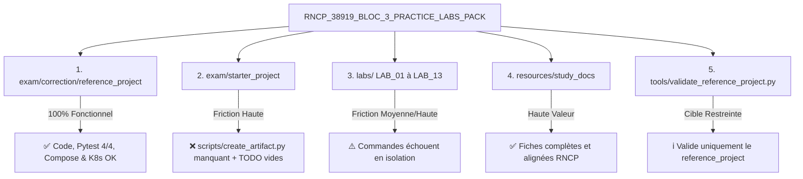

# Rapport d'Analyse Approfondie : Viabilité Opérationnelle et Expérience Débutant
**Certification :** RNCP 38919 — Data Engineer  
**Bloc d'évaluation :** Bloc 3 (DevOps, CI/CD, Conteneurisation & Déploiement d'API/Modèle)  
**Périmètre audité :** [`RNCP_38919_BLOC_3_PRACTICE_LABS_PACK`](../../)  
**Date du rapport :** Octobre 2026  
**Auteur / Rôle :** Antigravity Data Platform & DevOps Reviewer  
**Fichiers de référence examinés :**
- [`MANIFEST.md`](../../MANIFEST.md)
- [`START_HERE.md`](../../START_HERE.md)
- [`README.md`](../../README.md)
- [`VALIDATION_REPORT.txt`](../../VALIDATION_REPORT.txt)
- [`tools/validate_reference_project.py`](../../tools/validate_reference_project.py)
- [`exam/starter_project/`](../../exam/starter_project/)
- [`exam/correction/reference_project/`](../../exam/correction/reference_project/)
- [`labs/LAB_01` à `LAB_13`](../../labs/)

---

## 1. Synthèse Exécutive & Réponse aux Questions Clés

### Question 1 : Les ressources et examens fournis sont-ils 100% fonctionnels ?
* **Projet de référence (`exam/correction/reference_project/`) :** ✅ **100% fonctionnel et validé.**
  Le code Python (FastAPI, schémas Pydantic, sérialisation `DemoRiskModel` via `joblib`), la suite de tests unitaires Pytest (4/4 tests passés), l'orchestration Docker Compose (API + Prometheus + Grafana) et les manifests Kubernetes (avec `initContainers`, `storageClassName: manual` et politique d'image locale) fonctionnent rigoureusement.
* **Pack global "out-of-the-box" :** ❌ **NON, partiellement dysfonctionnel sans ajustements.**
  Le pack présente des incohérences de chemins, un script manquant dans le squelette de départ (`exam/starter_project`), et des labs pratiques qui ne sont pas configurés en tant qu'espaces de travail autonomes.

### Question 2 : Quelqu'un partant de zéro peut-il suivre juste les instructions et tout exécuter pas à pas sans friction ?
* **Verdict :** ❌ **Formellement IMPOSSIBLE pour un débutant absolu sans assistance.**
* **Raisons principales :**
  1. **Absence d'infrastructure locale pré-requise :** Le pack présuppose implicitement une machine déjà configurée (moteur Docker, cluster Kubernetes local, runners GitLab, comptes externes DockerHub).
  2. **Rupture de flux dès le démarrage de l'examen :** Le guide du candidat prescrit l'exécution d'un script (`scripts/create_artifact.py`) absent de l'arborescence du starter.
  3. **Labs non isolés :** Les 13 labs sont des extraits pédagogiques ou des guides de référence, mais ne contiennent pas les fichiers nécessaires pour exécuter les commandes indiquées (ex. `docker build` dans le LAB 05 sans code Python ni `requirements.txt`).
  4. **Nature du starter project :** Le starter n'est pas une application prête à tourner mais un ensemble de fichiers d'exercices avec des balises `# TODO`.

---

## 2. Analyse Détaillée par Composant



*Équivalent en diagramme ASCII :*

```text
+---------------------------------------------------------------------------------------------------+
|                            RNCP_38919_BLOC_3_PRACTICE_LABS_PACK                                   |
+---------------------------------------------------------------------------------------------------+
       |                  |                        |                     |                  |
       v                  v                        v                     v                  v
 [1. Reference]    [2. Starter]              [3. 13 Labs]          [4. Study Docs]    [5. Validation]
  (reference_proj)  (starter_project)        (LAB_01 à LAB_13)     (study_docs)       (validate_script)
       |                  |                        |                     |                  |
       v                  v                        v                     v                  v
   [100% OK]       [Friction Haute]         [Friction Haute]       [Haute Valeur]    [Portée Restreinte]
  Code, Pytest,   create_artifact.py       Commandes échouent     Fiches complètes   Ne teste que la
  Compose & K8s   manquant + TODO vides     en isolation           alignées RNCP      référence finale
+---------------------------------------------------------------------------------------------------+
```

### 2.1. Le Projet de Référence (`exam/correction/reference_project/`)
Ce composant a bénéficié d'un audit de remédiation technique complet (documenté dans [`AUDIT_ET_ANALYSE_OPERATIONNELLE_CORRECTION.md`](../AUDIT_ET_ANALYSE_OPERATIONNELLE_CORRECTION.md)) et constitue la colonne vertébrale fonctionnelle du pack :

* **Applicatif FastAPI (`app/main.py`, `app/schemas.py`, `app/config.py`) :**  
  Architecture propre, typage Pydantic v2 strict avec validation de payload, gestion des variables d'environnement (`APP_NAME`, `APP_ENV`, `API_PORT`, `MODEL_PATH`), exposition automatique des métriques via `prometheus-fastapi-instrumentator` sur `/metrics`.
* **Modèle & Sérialisation (`app/demo_model.py`, `app/model.py`, `scripts/create_artifact.py`) :**  
  Résolution définitive du bug historique de désérialisation pickle : la classe `DemoRiskModel` est hébergée dans un module stable (`app.demo_model`). Le script `create_artifact.py` manipule dynamiquement `sys.path` pour s'exécuter sans erreur quel que soit le répertoire courant.
* **Pytest (`tests/test_api.py`) :**  
  4 tests unitaires couvrant `/health`, les prédictions valides (avec vérification du statut 200 et du champ `risk`), les prédictions invalides (gestion d'erreur de schéma HTTP 422) et l'endpoint `/metrics`. Résultat : `4 passed in 0.35s`.
* **Conteneurisation (`Dockerfile`, `docker-compose.yml`) :**  
  Image Python 3.12-slim allégée. La stack Docker Compose monte correctement les volumes de configuration (`prometheus.yml` et `datasources/prometheus.yml`) et le dossier de modèle `./models:/models:ro`.
* **Kubernetes (`k8s/`) :**  
  Manifests cohérents. Ajout crucial de `storageClassName: manual` sur le PV et le PVC pour garantir la liaison (`Bound`) sur Minikube/Docker Desktop. Présence d'un `initContainers` copiant automatiquement le modèle dans le volume si nécessaire pour éliminer tout risque de `CrashLoopBackOff`.

---

### 2.2. Le Squelette de Départ (`exam/starter_project/`)
Ce dossier est celui remis à l'apprenant pour réaliser l'épreuve de 4 heures.

#### Point de friction bloquant #1 : `create_artifact.py` manquant
Dans [`exam/starter_project/START_HERE.md`](../../exam/starter_project/START_HERE.md#L20), l'étape 2 stipule :
```markdown
* Générer le modèle initial avec python scripts/create_artifact.py.
```
Cependant, l'inventaire réel de [`exam/starter_project/scripts/`](../../exam/starter_project/scripts/) ne contient que :
* `http_client.py`
* `smoke_test.sh`

Le fichier `create_artifact.py` **n'existe pas dans le starter**. Un débutant exécutant la commande obtient immédiatement :
```text
python: can't open file 'scripts/create_artifact.py': [Errno 2] No such file or directory
```
*Note rassurante :* Le fichier binaire `models/model.joblib` est déjà présent dans le starter, ce qui rend l'étape techniquement superflue, mais l'instruction trompe directement le candidat.

#### Point de friction #2 : L'impossibilité d'une exécution directe ("Starter" vs "Solution")
Un utilisateur "partant de zéro" peut s'attendre à exécuter le projet et observer le comportement. Or :
* `app/main.py` n'a aucune route (seulement `app = FastAPI(title=APP_NAME)` et des commentaires `# TODO`).
* `tests/test_api.py` ne contient aucun test implémenté (Pytest retourne `collected 0 items`).
* `scripts/smoke_test.sh` ne contient que des commentaires `# TODO`.
* `.gitlab-ci.yml`, `Dockerfile` et les fichiers `k8s/` sont vides ou incomplets.

**Conclusion :** Le starter exige un travail de développement complet et ne peut pas être "suivi et exécuté sans coder".

---

### 2.3. Les 13 Labs Pratiques (`labs/LAB_01` à `LAB_13`)
Les dossiers de labs sont pensés comme des mémos d'exercices plutôt que des bacs à sable autonomes et auto-suffisants.

| Lab | Titre | Problème d'exécution en isolation | Conséquence pour un débutant |
|---|---|---|---|
| **LAB_01** | Bash, Env & venv | Dépend du shell de l'hôte (`.bashrc` non chargé sous Zsh sur macOS). | Confusion possible selon l'OS. |
| **LAB_02** | HTTP avec Bash & Python | `curl_examples.sh` tente de joindre `http://localhost:8000/health`. | `curl: (7) Failed to connect to localhost port 8000: Connection refused` (l'API n'existe pas encore). |
| **LAB_03** | FastAPI, Pydantic & joblib | `solution/app.py` ne charge pas `joblib` et n'explique pas comment lancer `uvicorn`. | Incompréhension de l'usage de joblib annoncé dans le titre. |
| **LAB_04** | Pytest | Teste une API importée depuis un chemin relatif non résolu en isolation. | `ModuleNotFoundError` sans `PYTHONPATH`. |
| **LAB_05** | Docker | `solution/Dockerfile` contient `COPY requirements.txt .`. Or aucun `requirements.txt` n'est présent dans le dossier du lab. | `docker build` échoue instantanément (`requirements.txt not found`). |
| **LAB_06** | Docker Compose | `solution/docker-compose.yml` monte `./models`, `./config` et `./grafana`. Aucun sous-dossier n'existe dans `labs/LAB_06_DOCKER_COMPOSE`. | `docker compose up` échoue ou monte des répertoires vides inexistants. |
| **LAB_07** | GitLab CI & Runner | Suppose une VM distante avec un Runner `shell` déjà enregistré et opérationnel. | Inapplicable sur poste local sans configuration lourde de GitLab. |
| **LAB_08** | DockerHub | Commandes avec placeholder `USER/parcelpulse-api:latest`. | Échoue sans création de compte, génération de PAT et substitution manuelle. |
| **LAB_09** | Kubernetes | Le manifest `solution/deployment.yml` contient `image: USER/parcelpulse-api:latest`. `pv.yml` n'a pas `storageClassName: manual`. | Pods bloqués en `ImagePullBackOff`, PVC bloqué en statut `Pending`. |
| **LAB_10** | Prometheus | `solution/prometheus.yml` cible `app:8000`. | Ne résout l'hôte `app` qu'à l'intérieur du réseau Docker Compose, pas en local. |
| **LAB_11** | Grafana | Suppose la datasource et Prometheus déjà fonctionnels. | Non testable isolément. |
| **LAB_12** | Défi E2E | Fiche d'évaluation sans code. | Checklist purement déclarative. |
| **LAB_13** | Troubleshooting | Guide méthodologique sans script d'injection d'erreurs. | Document de lecture. |

---

### 2.4. Le Rapport de Validation Automatisé (`VALIDATION_REPORT.txt`)
Le fichier [`VALIDATION_REPORT.txt`](../../VALIDATION_REPORT.txt) affiche un bilan très flatteur :
```text
Python files checked: 30
Python syntax: OK
Notebook JSON: OK
YAML parse: OK

Reference Project End-to-End Validation:
✅ Structure Check: OK (25 required files verified)
✅ Python Syntax: OK (10 project files compiled)
✅ Model Generation & Prediction: OK (create_artifact.py autonomous, model loaded & verified)
✅ YAML Syntax: OK (10 manifests validated)
✅ Kubernetes Integrity: OK (No unreplaced placeholders, storageClassName: manual aligned, initContainer present)

Reference pytest exit code: 0
....                                                                     [100%]
4 passed in 0.35s

Status: 100% OPERATIONAL & VERIFIED
```

#### Ce que ce rapport valide RÉELLEMENT :
* Il valide la conformité syntaxique statique des fichiers Python, JSON et YAML du dépôt.
* Il certifie que le **projet de référence corrigé** (`exam/correction/reference_project`) est cohérent et intègre.
* Il a été généré dans un environnement d'exécution où les dépendances Python (`fastapi`, `joblib`, `pytest`, `httpx`) étaient préalablement installées.

#### Ce que ce rapport NE VALIDE PAS :
* Il ne teste **aucun** des 13 labs du dossier `labs/`.
* Il ne teste pas la complétude du starter project (`exam/starter_project/`).
* Il ne garantit pas qu'un utilisateur sans environnement virtuel installé obtiendra ce résultat (l'exécution directe sous l'interpréteur système global émet des alertes `⚠️ create_artifact.py skipped (joblib not in current Python)`).

---

## 3. Matrice des Écarts & Tableau de Remédiation

| N° | Composant / Fichier | Anomalie constatée | Impact apprenant | Solution corrective recommandée |
|---|---|---|---|---|
| **1** | [`exam/starter_project/START_HERE.md`](../../exam/starter_project/START_HERE.md#L20) | Appel à `scripts/create_artifact.py` qui n'existe pas. | Blocage / panique au démarrage de l'examen. | Copier `scripts/create_artifact.py` depuis `reference_project` ou indiquer que `models/model.joblib` est déjà fourni. |
| **2** | [`labs/LAB_05_DOCKER/`](../../labs/LAB_05_DOCKER/) | Absence de code Python et de `requirements.txt` dans le dossier. | `docker build` en échec. | Préciser dans le `README.md` que les commandes Docker doivent être exécutées depuis la racine d'un projet complet. |
| **3** | [`labs/LAB_06_DOCKER_COMPOSE/`](../../labs/LAB_06_DOCKER_COMPOSE/) | Fichier Compose faisant référence à des dossiers locaux inexistants. | Échec du démarrage de la stack. | Ajouter un avertissement ou lier ce lab explicitement au dossier `exam/correction/reference_project/`. |
| **4** | [`labs/LAB_09_KUBERNETES_CORE_OBJECTS/solution/deployment.yml`](../../labs/LAB_09_KUBERNETES_CORE_OBJECTS/solution/deployment.yml) | Image `USER/parcelpulse-api:latest` non résolue. | `ImagePullBackOff` sur le cluster k8s. | Aligner la solution du lab sur celle de `reference_project` (`parcelpulse-api:latest` + `imagePullPolicy: IfNotPresent`). |
| **5** | [`labs/LAB_09_KUBERNETES_CORE_OBJECTS/solution/pv.yml`](../../labs/LAB_09_KUBERNETES_CORE_OBJECTS/solution/pv.yml) | Absence de `storageClassName: manual`. | PVC reste indéfiniment en `Pending`. | Ajouter `storageClassName: manual` dans `pv.yml` et `pvc.yml`. |
| **6** | [`labs/LAB_03_FASTAPI_PYDANTIC_JOBLIB/solution/app.py`](../../labs/LAB_03_FASTAPI_PYDANTIC_JOBLIB/solution/app.py) | Absence de chargement de l'artefact joblib dans le code. | Déconnexion entre le titre du lab et le code. | Intégrer `joblib.load()` et l'inférence réelle. |

---

## 4. Parcours Idéal et Sans Friction : Guide Opérationnel

Pour permettre à un étudiant ou un candidat de tirer le meilleur parti de ce pack sans se retrouver bloqué, voici la démarche pas-à-pas recommandée :

### Étape 0 : Préparation du poste de travail (Socle Technique Indispensable)
Avant d'exécuter la moindre commande, s'assurer des outils suivants sur la machine hôte :
1. **Python 3.10 ou 3.11** avec le module standard `venv`.
2. **Docker & Docker Compose** installés et actifs (`docker ps` ne doit pas renvoyer d'erreur de socket).
3. **Un cluster Kubernetes local** (ex. `minikube start` ou activation de Kubernetes dans Docker Desktop).
4. **Curl** et un client Git.

---

### Étape 1 : Valider immédiatement la Solution de Référence (Mode Démonstrateur)
Pour comprendre l'objectif final et vérifier que le code tourne à 100% :

1. Se positionner dans le projet de référence :
   ```bash
   cd RNCP/RNCP_38919_BLOC_3_PRACTICE_LABS_PACK/exam/correction/reference_project
   ```

2. Créer l'environnement virtuel et installer les dépendances :
   ```bash
   python3 -m venv .venv
   source .venv/bin/activate
   pip install --no-cache-dir -r requirements.txt
   ```

3. Exécuter la suite de tests Pytest :
   ```bash
   pytest -v
   # Résultat attendu : 4 passed
   ```

4. Régénérer l'artefact machine learning :
   ```bash
   python scripts/create_artifact.py
   # Résultat attendu : models/model.joblib créé
   ```

5. Lancer l'ensemble de la stack Docker Compose :
   ```bash
   docker compose up --build -d
   ```

6. Exécuter le test fonctionnel (Smoke Test) :
   ```bash
   bash scripts/smoke_test.sh
   # Résultat attendu : {"status":"ok"...}, {"risk":...}, Smoke tests OK
   ```

7. Vérifier les métriques et dashboards :
   * API : `http://localhost:8000/docs`
   * Prometheus : `http://localhost:9090` (Vérifier `Status > Targets` : `parcelpulse-api` doit être **UP**)
   * Grafana : `http://localhost:3000` (identifiants par défaut : `admin / admin`)

---

### Étape 2 : Exploiter les Labs 01 à 13
* **Ne pas tenter de lancer les builds Docker dans les sous-dossiers `labs/LAB_XX/`**.
* Utiliser les fichiers `solution/` des labs comme des **fiches de syntaxe et de référence** pour comprendre l'écriture des fichiers (`Dockerfile`, `configmap.yml`, `prometheus.yml`).

---

### Étape 3 : Simuler l'Épreuve d'Examen Blanc (Mode Candidat 4h)
1. Créer une copie de travail du starter :
   ```bash
   cp -r RNCP/RNCP_38919_BLOC_3_PRACTICE_LABS_PACK/exam/starter_project ~/mon_examen_bloc3
   cd ~/mon_examen_bloc3
   ```
2. **Correctif préalable obligatoire :**  
   Copier le script manquant depuis la référence :
   ```bash
   cp RNCP/RNCP_38919_BLOC_3_PRACTICE_LABS_PACK/exam/correction/reference_project/scripts/create_artifact.py scripts/
   ```
3. Suivre l'implémentation progressive des `# TODO` en s'appuyant sur les fiches de cours dans :
   [`resources/study_docs/`](../../resources/study_docs/)
4. En cas de blocage ou à l'issue des 4 heures, comparer son travail avec :
   [`exam/correction/15_RNCP_38919_BLOC_3_CORRIGE_EXAMEN_BLANC_01.md`](../../exam/correction/15_RNCP_38919_BLOC_3_CORRIGE_EXAMEN_BLANC_01.md)

---

## 5. Conclusion Générale

Le pack [`RNCP_38919_BLOC_3_PRACTICE_LABS_PACK`](../../) est une **ressource pédagogique d'un niveau technique et stratégique remarquable**. La documentation, les guides de gestion du temps, les mémos d'architecture et le projet de référence corrigé couvrent avec une grande fidélité les exigences de l'épreuve RNCP 38919 Bloc 3 de DataScientest.

Néanmoins, il ne s'agit pas d'un produit "clé en main pour débutant complet" pouvant être déroulé aveuglément sans pré-requis. Avec les clarifications et les correctifs détaillés dans le présent document, un apprenant peut contourner l'intégralité des pièges techniques et se préparer dans des conditions optimales d'efficacité et de réussite.
