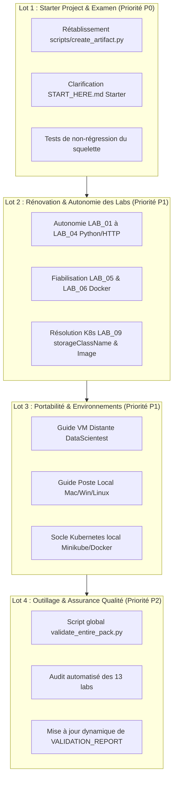

# Programme de Remédiation — Cadrage Global et Lotissement
**Certification :** RNCP 38919 — Data Engineer  
**Bloc d'évaluation :** Bloc 3 (DevOps, CI/CD, Conteneurisation & Déploiement)  
**Projet :** [`RNCP_38919_BLOC_3_PRACTICE_LABS_PACK`](../../)  
**Date de cadrage :** Octobre 2026  
**Document d'analyse source :** [docs/analyses/ANALYSE_FONCTIONNELLE_ET_EXPERIENCE_DEBUTANT.md](../analyses/ANALYSE_FONCTIONNELLE_ET_EXPERIENCE_DEBUTANT.md)  
**Statut :** Planifié / En cours de lotissement  

---

## 1. Vision et Objectifs Stratégiques

L'analyse approfondie de viabilité opérationnelle a démontré que si le **projet de référence** ([`exam/correction/reference_project/`](../../exam/correction/reference_project/)) est techniquement robuste et validé à 100%, l'expérience globale pour un apprenant partant de zéro souffre de ruptures de flux critiques :
1. **L'épreuve d'examen blanc** est bloquée dès l'étape 2 du starter project (script manquant).
2. **Les 13 labs progressifs** ne sont pas conçus pour être exécutés en autonomie sans fichiers supports pré-existants.
3. **Les pré-requis système** (Docker, Kubernetes, GitLab Runner) ne sont pas documentés de manière adaptée aux postes de travail personnels (Mac, Windows WSL2, Linux brut).
4. **L'outillage de contrôle automatique** valide uniquement la référence finale et ignore le parcours d'apprentissage intermédiaire.

### Objectif Final
Transformer ce pack en un **système de formation et de simulation 100% autonome, zéro friction et reproductible**, permettant à n'importe quel candidat de progresser sans blocage depuis la première ligne de Bash jusqu'au déploiement Kubernetes monitoré.

---

## 2. Découpage du Programme en 4 Lots Opérationnels



*Équivalent en diagramme ASCII :*

```text
+-------------------------------------------------------------------------+
|                Lot 1 : Starter Project & Examen (Priorité P0)           |
|  - Rétablissement de scripts/create_artifact.py                         |
|  - Clarification du guide START_HERE.md                                 |
|  - Tests de non-régression du squelette                                 |
+------------------------------------+------------------------------------+
                                     |
                                     v
+------------------------------------+------------------------------------+
|            Lot 2 : Rénovation & Autonomie des Labs (Priorité P1)        |
|  - Autonomie des LAB 01 à 04 (Python / HTTP)                            |
|  - Fiabilisation des LAB 05 & 06 (Docker / Compose)                     |
|  - Résolution du LAB 09 (K8s storageClassName & Image locale)           |
+------------------------------------+------------------------------------+
                                     |
                                     v
+------------------------------------+------------------------------------+
|            Lot 3 : Portabilité & Environnements (Priorité P1)           |
|  - Guide de connexion VM Distante DataScientest (SSH & tunnel)          |
|  - Guide d'amorçage Poste Local (Mac arm64, Windows WSL2, Linux)        |
|  - Socle Kubernetes local (Minikube / Docker Desktop)                   |
+------------------------------------+------------------------------------+
                                     |
                                     v
+------------------------------------+------------------------------------+
|          Lot 4 : Outillage & Assurance Qualité (Priorité P2)            |
|  - Script d'intégration global validate_entire_pack.py                  |
|  - Audit automatisé des 13 labs pratiques                               |
|  - Génération dynamique de VALIDATION_REPORT.txt                        |
+-------------------------------------------------------------------------+
```

| Lot | Document de spécification | Périmètre ciblé | Priorité | Livrables clés |
|---|---|---|---|---|
| **Lot 1** | [`LOT_01_STARTER_PROJECT_ET_EXAMEN.md`](./LOT_01_STARTER_PROJECT_ET_EXAMEN.md) | `exam/starter_project/`, `exam/sujet/` | **P0 (Bloquant)** | `scripts/create_artifact.py` ajouté au starter, guide `START_HERE.md` corrigé, tests de cohérence. |
| **Lot 2** | [`LOT_02_AUTONOMIE_ET_FIABILISATION_LABS.md`](./LOT_02_AUTONOMIE_ET_FIABILISATION_LABS.md) | `labs/LAB_01` à `LAB_13` | **P1 (Majeur)** | Labs 02, 03, 05, 06 et 09 corrigés pour s'exécuter sans erreur en isolation. |
| **Lot 3** | [`LOT_03_PORTABILITE_ET_ENVIRONNEMENTS.md`](./LOT_03_PORTABILITE_ET_ENVIRONNEMENTS.md) | `resources/study_docs/`, guides d'installation | **P1 (Majeur)** | Guides d'amorçage pour la VM distante (Ubuntu + SSH) et postes locaux (Mac Silicon, Windows WSL2). |
| **Lot 4** | [`LOT_04_OUTILLAGE_ET_TESTS_AUTOMATISES.md`](./LOT_04_OUTILLAGE_ET_TESTS_AUTOMATISES.md) | `tools/`, `VALIDATION_REPORT.txt` | **P2 (Qualité)** | Outil de validation couvrant 100% des fichiers du pack et CI de non-régression. |

---

## 3. Matrice de Criticité des Anomalies Adressées

| Identifiant | Description de l'anomalie | Lot assigné | Criticité |
|---|---|---|---|
| **ANOM-01** | `exam/starter_project/START_HERE.md` demande `python scripts/create_artifact.py`, mais le script n'existe pas dans le starter. | **Lot 1** | **Bloquante (P0)** |
| **ANOM-02** | `labs/LAB_05_DOCKER/solution/Dockerfile` échoue à la construction car aucun `requirements.txt` n'est présent dans le répertoire. | **Lot 2** | **Majeure (P1)** |
| **ANOM-03** | `labs/LAB_06_DOCKER_COMPOSE/` fait référence à `./models` et des configs inexistantes localement. | **Lot 2** | **Majeure (P1)** |
| **ANOM-04** | `labs/LAB_09_KUBERNETES_CORE_OBJECTS/` : PV/PVC sans `storageClassName: manual` et image `USER/...` non résolue. | **Lot 2** | **Bloquante (P0)** |
| **ANOM-05** | Aucune procédure d'amorçage n'est fournie pour un candidat exécutant le pack sur son propre ordinateur personnel (sans VM). | **Lot 3** | **Majeure (P1)** |
| **ANOM-06** | `tools/validate_reference_project.py` ignore le starter et les labs, donnant un statut faussement global dans `VALIDATION_REPORT.txt`. | **Lot 4** | **Moyenne (P2)** |

---

## 4. Définition du Succès (Definition of Done Globale)

Le programme de remédiation sera considéré comme achevé dès lors que les critères suivants seront validés :
1. ✅ **Examen blanc sans friction :** Un apprenant peut cloner le dossier `exam/starter_project/`, exécuter `START_HERE.md` de la première à la dernière ligne sans rencontrer un seul `FileNotFoundError` ou `ModuleNotFoundError`.
2. ✅ **Autonomie des Labs :** Chaque sous-dossier `labs/LAB_XX` dispose de son propre contexte ou d'une consigne non ambiguë permettant à un débutant de valider l'exercice.
3. ✅ **Multi-OS vérifié :** Les procédures d'installation couvrent les architectures x86_64 et ARM64 (Apple Silicon), ainsi que WSL2 sur Windows.
4. ✅ **Certification automatisée :** Un script d'intégration globale valide statiquement et dynamiquement l'intégralité des 145+ fichiers du pack.
