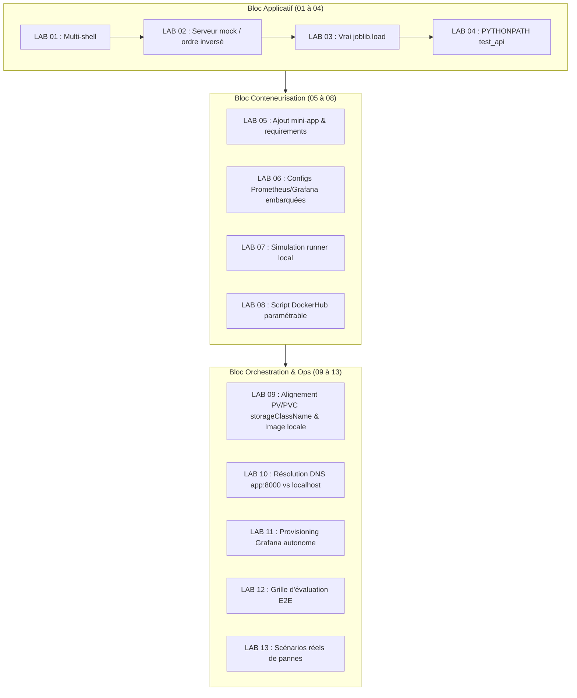

# Plan de Remédiation — Lot 2 : Autonomie et Fiabilisation des 13 Labs Pratiques
**Priorité :** P1 (Majeure)  
**Périmètre :** [`labs/LAB_01_BASH_ENV_VENV`](../../labs/LAB_01_BASH_ENV_VENV) à [`labs/LAB_13_TROUBLESHOOTING`](../../labs/LAB_13_TROUBLESHOOTING)  
**Objectif :** Transformer les 13 labs en unités d'apprentissage autonomes ou accompagnées d'instructions sans ambiguïté, pour que chaque commande puisse être jouée sans surprise.

---

## 1. Diagnostic Global des Labs

Les 13 labs actuels ont été conçus comme des extraits conceptuels. Ils présentent trois types de défaillances pour un apprenant débutant :
1. **Dépendance non documentée entre labs consécutifs :** Le LAB 02 requiert une API qui n'est créée qu'au LAB 03.
2. **Absence de contexte de build local :** Les LAB 05 (Docker) et LAB 06 (Docker Compose) ne contiennent ni code applicatif ni fichiers de configuration montés, provoquant l'échec immédiat des commandes `docker build` et `docker compose up`.
3. **Manifests Kubernetes désalignés :** Le LAB 09 contient les mêmes anomalies que celles initialement identifiées sur le projet de référence (absence de `storageClassName: manual` et placeholder `USER/` non résolu).

---

## 2. Feuille d'Actions Détaillées Lab par Lab



*Équivalent en diagramme ASCII :*

```text
+-----------------------------------------------------------------------------------------+
|                       Bloc Applicatif (LAB 01 à LAB 04)                                 |
|  [LAB 01: Multi-shell] -> [LAB 02: Mock HTTP] -> [LAB 03: joblib.load] -> [LAB 04: Path]|
+--------------------------------------------+--------------------------------------------+
                                             |
                                             v
+--------------------------------------------+--------------------------------------------+
|                     Bloc Conteneurisation & CI (LAB 05 à LAB 08)                        |
|  [LAB 05: Mini-app Docker] -> [LAB 06: Configs Compose] -> [LAB 07: Runner] -> [LAB 08] |
+--------------------------------------------+--------------------------------------------+
                                             |
                                             v
+--------------------------------------------+--------------------------------------------+
|                     Bloc Orchestration & Ops (LAB 09 à LAB 13)                          |
|  [LAB 09: K8s Storage/Image] -> [LAB 10/11: Prom/Graf] -> [LAB 12: E2E] -> [LAB 13: REX] |
+-----------------------------------------------------------------------------------------+
```

### 2.1. Labs Applicatifs (LAB 01 à LAB 04)

#### Action 2.1 : LAB 01 — Bash, Variables d'Environnement et venv
* **Problème :** L'instruction `source ~/.bashrc` ne fonctionne pas sur macOS (shell par défaut Zsh utilisant `~/.zshrc`).
* **Correctif :** Ajouter dans [`labs/LAB_01_BASH_ENV_VENV/README.md`](../../labs/LAB_01_BASH_ENV_VENV/README.md) la distinction :
  ```bash
  # Linux (Bash)
  source ~/.bashrc
  # macOS (Zsh)
  source ~/.zshrc
  ```

#### Action 2.2 : LAB 02 — HTTP avec Bash et Python
* **Problème :** `curl http://localhost:8000/health` échoue car aucun serveur n'est démarré.
* **Correctif :** 
  * Option A : Indiquer clairement que ce lab nécessite d'avoir préalablement lancé l'application du LAB 03 dans un terminal séparé (`uvicorn app:app --port 8000`).
  * Option B : Fournir un mini serveur de mock HTTP en une ligne Python :
    ```bash
    python3 -c "import http.server; http.server.HTTPServer(('', 8000), http.server.SimpleHTTPRequestHandler).serve_forever()"
    ```

#### Action 2.3 : LAB 03 — FastAPI, Pydantic et joblib
* **Problème :** [`labs/LAB_03_FASTAPI_PYDANTIC_JOBLIB/solution/app.py`](../../labs/LAB_03_FASTAPI_PYDANTIC_JOBLIB/solution/app.py) calcule le risque par une formule arithmétique codée en dur et n'utilise pas `joblib`. De plus, aucune commande de lancement n'est documentée.
* **Correctif :**
  1. Importer `joblib` et charger un modèle local :
     ```python
     import joblib
     from fastapi import FastAPI
     from pydantic import BaseModel
     from prometheus_fastapi_instrumentator import Instrumentator

     app = FastAPI()
     # Chargement réel de l'artefact
     model = joblib.load("model.joblib")
     ```
  2. Ajouter dans le `README.md` la commande standard :
     ```bash
     uvicorn app:app --host 0.0.0.0 --port 8000 --reload
     ```

#### Action 2.4 : LAB 04 — Pytest
* **Problème :** Exécuter `pytest` directement dans `labs/LAB_04_PYTEST/` génère un `ModuleNotFoundError` car le fichier de test importe `from app import app` sans résolution de chemin.
* **Correctif :** Ajouter un fichier `conftest.py` configurant automatiquement `sys.path`.

---

### 2.2. Labs Conteneurisation & CI/CD (LAB 05 à LAB 08)

#### Action 2.5 : LAB 05 — Docker
* **Problème :** `solution/Dockerfile` contient `COPY requirements.txt .` et `COPY . .`. Mais le dossier `labs/LAB_05_DOCKER/` ne contient aucun fichier de code, rendant `docker build` impossible.
* **Correctif :** Créer dans `labs/LAB_05_DOCKER/starter/` et `solution/` :
  * Un fichier `requirements.txt` minimal (`fastapi`, `uvicorn`).
  * Un fichier `app/main.py` minimal exposant `/health`.
  * Rendre le test immédiatement exécutable sans dépendance externe :
    ```bash
    docker build -t test-api .
    docker run -d -p 8000:8000 --name test-api test-api
    curl http://localhost:8000/health
    docker rm -f test-api
    ```

#### Action 2.6 : LAB 06 — Docker Compose
* **Problème :** `solution/docker-compose.yml` monte `./models`, `./config/prometheus.yml` et `./grafana/provisioning/...`. Aucun de ces dossiers n'est présent dans le répertoire du lab.
* **Correctif :** Embarquer les configurations minimales de Prometheus et Grafana directement dans le sous-dossier du lab ou documenter que ce lab s'exécute depuis la racine d'un projet complet.

#### Action 2.7 : LAB 07 — GitLab CI et Runner Shell
* **Problème :** Suppose un accès à une VM DataScientest pré-configurée avec un runner `shell`.
* **Correctif :** Ajouter un guide de test local sans runner distant grâce à l'émulation des commandes du pipeline dans un script de validation locale `test_pipeline_locally.sh`.

#### Action 2.8 : LAB 08 — DockerHub
* **Problème :** Commandes avec placeholder `USER/parcelpulse-api:latest`.
* **Correctif :** Fournir un script `commands.sh` interactif invitant à saisir son identifiant DockerHub :
  ```bash
  read -p "Entrez votre DockerHub username: " DOCKER_USER
  docker tag parcelpulse-api:latest "${DOCKER_USER}/parcelpulse-api:latest"
  docker push "${DOCKER_USER}/parcelpulse-api:latest"
  ```

---

### 2.3. Labs Orchestration & Observabilité (LAB 09 à LAB 13)

#### Action 2.9 : LAB 09 — Kubernetes Core Objects
* **Problème :** 
  * `pv.yml` et `pvc.yml` n'ont pas `storageClassName: manual`. Le PVC reste bloqué en statut `Pending`.
  * `deployment.yml` a l'image `USER/parcelpulse-api:latest`, provoquant un crash `ImagePullBackOff`.
* **Correctif :**
  1. Aligner les manifestes du LAB 09 sur ceux validés dans [`exam/correction/reference_project/k8s/`](../../exam/correction/reference_project/k8s/) :
     * Ajouter `storageClassName: manual` dans `pv.yml` et `pvc.yml`.
     * Définir `image: parcelpulse-api:latest` et `imagePullPolicy: IfNotPresent` dans `deployment.yml`.
     * Ajouter l'`initContainers` pour garantir la présence du modèle.

#### Action 2.10 : LAB 10 & 11 — Prometheus et Grafana
* **Problème :** La configuration cible `app:8000`, ce qui ne fonctionne que sous Docker Compose et échoue si Prometheus est lancé en standalone sur l'hôte.
* **Correctif :** Documenter explicitement les deux modes :
  * Mode Stack Compose : target `app:8000`.
  * Mode Local : target `host.docker.internal:8000` (Mac/Win) ou `172.17.0.1:8000` (Linux).

---

## 3. Protocole de Recette du Lot 2

Chaque lab doit pouvoir être validé par un script de test dédié :
```bash
# Exemple de validation automatique du LAB 05
cd labs/LAB_05_DOCKER/solution
docker build -t lab05-test .
docker run --rm -d -p 8000:8000 --name lab05 lab05-test
sleep 2
curl -fsS http://localhost:8000/health
docker stop lab05
```
Ce test doit sortir avec le code de retour `0`.
