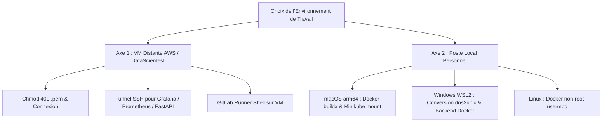

# Plan de Remédiation — Lot 3 : Portabilité & Environnements d'Exécution
**Priorité :** P1 (Majeure)  
**Périmètre :** Guides d'infrastructure, compatibilité multi-OS, configuration réseau et cloud  
**Objectif :** Supprimer toutes les barrières matérielles et logicielles pour permettre l'exécution fluide du pack aussi bien sur la VM d'examen officielle que sur n'importe quel poste de travail personnel (Mac, Windows WSL2, Linux).

---

## 1. Contexte et Dualité des Environnements

Le pack a été historiquement conçu dans le cadre des formations DataScientest qui mettent à disposition des candidats une machine virtuelle Linux distante (AWS Ubuntu) accessible en SSH (comme référencé dans [`SERVER.md`](../../SERVER.md)) :
```bash
ssh -i "./data_enginering_machine.pem" ubuntu@52.31.224.223
```

Cependant, les apprenants qui s'entraînent sur leur propre machine se heurtent à des disparités techniques majeures :
* **macOS (Apple Silicon arm64) :** Problèmes de virtualisation des volumes Kubernetes `hostPath`, architecture CPU arm64 vs amd64 lors des builds Docker, shell Zsh par défaut.
* **Windows (WSL2) :** Fins de ligne de fichiers DOS/Windows (`CRLF`) corrompant l'exécution des scripts Bash (`smoke_test.sh: \r: command not found`), configuration de Docker Desktop WSL2.
* **Accès aux interfaces graphiques distantes :** Impossibilité d'accéder au port 3000 (Grafana) ou 9090 (Prometheus) de la VM distante sans tunnel SSH ou ouverture de firewall.

---

## 2. Feuille d'Actions Détaillées



*Équivalent en diagramme ASCII :*

```text
+-----------------------------------------------------------------------------------------+
|                         Choix de l'Environnement de Travail                             |
+--------------------------------------------+--------------------------------------------+
                      |                                                   |
                      v                                                   v
+--------------------------------------------+   +----------------------------------------+
|   Axe 1 : VM Distante AWS / DataScientest  |   |     Axe 2 : Poste Local Personnel      |
+--------------------------------------------+   +----------------------------------------+
  |-- 1. Droits clé : chmod 400 .pem               |-- macOS arm64 : Docker buildx & mount
  |-- 2. Tunnel SSH (-L 8000/9090/3000)            |-- Windows WSL2 : dos2unix & backend Docker
  `-- 3. Configuration Runner Shell                `-- Linux : Docker permissions non-root
```

### 2.1. Axe 1 : Guide Opérationnel pour la VM Distante DataScientest

#### Action 3.1 : Sécurisation et Automatisation de la Connexion SSH
* **Problème :** Une clé privée sans permissions restrictives (`chmod 400`) est rejetée par OpenSSH (`Permissions 0644 are too open`).
* **Correctif :** Documenter le script de connexion sécurisé :
  ```bash
  chmod 400 data_enginering_machine.pem
  ssh -i "./data_enginering_machine.pem" ubuntu@<IP_SERVEUR>
  ```

#### Action 3.2 : Mise en Place du Tunnel de Port-Forwarding SSH
* **Problème :** Les ports 8000 (FastAPI), 9090 (Prometheus) et 3000 (Grafana) ne sont pas ouverts au public pour des raisons de sécurité. Le candidat ne peut pas visualiser les dashboards Grafana.
* **Correctif :** Fournir la commande de tunnel SSH standard permettant d'accéder à toutes les interfaces locales depuis le navigateur de sa propre machine :
  ```bash
  ssh -i "./data_enginering_machine.pem" \
      -L 8000:localhost:8000 \
      -L 9090:localhost:9090 \
      -L 3000:localhost:3000 \
      ubuntu@<IP_SERVEUR>
  ```
  *Accès immédiat sur la machine locale :*
  * FastAPI : `http://localhost:8000/docs`
  * Prometheus : `http://localhost:9090`
  * Grafana : `http://localhost:3000`

---

### 2.2. Axe 2 : Prise en Charge des Postes de Travail Locaux

#### Action 3.3 : Compatibilité macOS (Apple Silicon M1/M2/M3/M4)
* **Problème 1 : Architecture des images Docker.** Si l'image est buildée sur Mac Silicon et pushée sur un registry sans spécifier la plateforme, elle est en format `linux/arm64`. Sur un runner ou cluster x86_64, elle plante en `exec format error`.
  * **Correctif :** Documenter l'usage de `--platform linux/amd64` pour le push DockerHub.
* **Problème 2 : Stockage persistant Kubernetes (`hostPath`).** Sur Docker Desktop Mac, `/tmp/parcelpulse-models` n'est pas le dossier `/tmp` du Mac mais celui de la machine virtuelle interne Docker.
  * **Correctif :** Documenter l'utilisation de l'`initContainer` (validé dans la référence) qui s'affranchit totalement du montage manuel de l'hôte.

#### Action 3.4 : Compatibilité Windows (WSL2) & Nettoyage CRLF
* **Problème :** Sous Windows, Git checkout souvent les fichiers avec des sauts de ligne `\r\n` (CRLF). Lorsqu'un script Bash comme `scripts/smoke_test.sh` est exécuté sous Linux/WSL2, Bash tente d'exécuter `\r` et plante brutalement.
* **Correctif :**
  1. Ajouter un fichier `.gitattributes` à la racine du pack pour forcer les fins de ligne Unix (`LF`) sur tous les scripts shell :
     ```gitattributes
     *.sh text eol=lf
     Dockerfile text eol=lf
     *.yml text eol=lf
     ```
  2. Fournir la commande de secours `dos2unix scripts/smoke_test.sh`.

#### Action 3.5 : Socle Kubernetes Local Automatisé
* **Problème :** Un débutant ne sait pas comment démarrer Kubernetes sur sa machine sans friction.
* **Correctif :** Fournir une fiche de démarrage express pour deux options éprouvées :
  * **Option A (Docker Desktop) :** Cocher simplement `Settings > Kubernetes > Enable Kubernetes`.
  * **Option B (Minikube) :**
    ```bash
    minikube start --driver=docker
    kubectl get nodes
    ```

---

## 3. Protocole de Recette du Lot 3

1. **Test Cross-Platform :**
   * Validation de l'exécution de `smoke_test.sh` sur environnement macOS, Linux et WSL2.
   * Vérification de l'absence de caractères `\r` résiduels via `file scripts/smoke_test.sh`.
2. **Test Port-Forwarding :**
   * Connexion avec la commande SSH tunnel et validation du chargement de la page de login Grafana sur `http://localhost:3000`.
