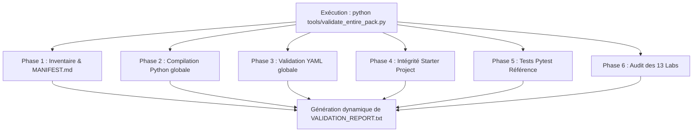

# Plan de Remédiation — Lot 4 : Outillage d'Assurance Qualité & Tests Automatisés
**Priorité :** P2 (Qualité & Pérennité)  
**Périmètre :** [`tools/`](../../tools/), [`VALIDATION_REPORT.txt`](../../VALIDATION_REPORT.txt), workflows de validation globale  
**Objectif :** Remplacer le contrôle partiel existant par un outillage d'audit global capable de certifier en continu l'intégrité de l'intégralité du pack (starter, référence et 13 labs).

---

## 1. Diagnostic de l'Outillage Existant

Le script actuel [`tools/validate_reference_project.py`](../../tools/validate_reference_project.py) présente des limites structurelles :
1. **Périmètre ultra-restreint :** Il n'audite que le projet de référence (`exam/correction/reference_project/`). Le starter project et les 13 labs sont totalement ignorés par l'audit.
2. **Faux sentiment de sécurité :** Le statut affiché dans [`VALIDATION_REPORT.txt`](../../VALIDATION_REPORT.txt) (`100% OPERATIONAL & VERIFIED`) laisse penser que l'intégralité du pack fonctionne, alors que le starter comportait un script manquant.
3. **Rapport statique non synchronisé :** Le fichier texte de rapport est statique et n'est pas régénéré automatiquement lors des modifications de code ou d'arborescence.

---

## 2. Feuille d'Actions Détaillées



*Équivalent en diagramme ASCII :*

```text
+-------------------------------------------------------------------------+
|             Exécution : python tools/validate_entire_pack.py            |
+------------------------------------+------------------------------------+
                                     |
    +-----------------+--------------+---------------+------------------+
    |                 |                              |                  |
    v                 v                              v                  v
[Phase 1]         [Phase 2 & 3]                  [Phase 4]          [Phase 5 & 6]
Inventaire        Compilation Python             Intégrité          Tests Pytest Réf.
MANIFEST.md       & Validation YAML              Starter Project    & Audit 13 Labs
    |                 |                              |                  |
    +-----------------+--------------+---------------+------------------+
                                     |
                                     v
+------------------------------------+------------------------------------+
|            Génération dynamique de VALIDATION_REPORT.txt                |
|             (Horodatage, métriques et statut de certification)          |
+-------------------------------------------------------------------------+
```

### Action 4.1 : Création du Script Global `tools/validate_entire_pack.py`
Ce nouveau script centralisera les 6 phases de contrôle :

* **Phase 1 — Contrôle d'inventaire :**  
  Vérification de la présence des fichiers listés dans [`MANIFEST.md`](../../MANIFEST.md) et détection des fichiers orphelins ou manquants.
* **Phase 2 — Compilation Python exhaustive :**  
  Compilation via `py_compile` de l'ensemble des fichiers `.py` du dépôt (starter, référence, labs, scripts tools).
* **Phase 3 — Validation syntaxique YAML :**  
  Parsing strict via PyYAML de tous les fichiers `.yml` et `.yaml` du pack (Docker Compose, GitLab CI, Kubernetes, Prometheus, Grafana).
* **Phase 4 — Audit de conformité du Starter Project :**  
  * Présence obligatoire de `scripts/create_artifact.py`.
  * Présence de `models/model.joblib`.
  * Vérification de la non-présence de code accidentellement pré-implémenté dans les `# TODO`.
* **Phase 5 — Validation End-to-End du Projet de Référence :**  
  * Exécution du script de création d'artefact.
  * Désérialisation et inférence du modèle.
  * Lancement de `pytest -v` sur `tests/test_api.py` (validation des 4 tests).
  * Vérification des manifestes Kubernetes (`storageClassName: manual`, image locale, présence de l'initContainer).
* **Phase 6 — Audit d'intégrité des 13 Labs Pratiques :**  
  * Vérification pour chaque lab (LAB 01 à 13) de la présence de son `README.md`.
  * Vérification de la présence des sous-dossiers `starter/` et `solution/`.
  * Contrôle de l'absence de placeholders `USER/` non commentés dans les solutions.

---

### Action 4.2 : Génération Dynamique de `VALIDATION_REPORT.txt`
Modifier le script pour qu'il réécrive automatiquement [`VALIDATION_REPORT.txt`](../../VALIDATION_REPORT.txt) à chaque exécution avec un horodatage précis et un bilan détaillé par lot :

```text
============================================================
RNCP 38919 BLOC 3 — PRACTICE LABS PACK — AUDIT GLOBAL E2E
Date d'exécution : 2026-10-03 18:45:00 CEST
============================================================

1. Inventaire & Fichiers :
   ✅ 145/145 fichiers conformes au MANIFEST.md

2. Syntaxe & Parsing :
   ✅ 31 fichiers Python compilés avec succès
   ✅ 18 manifests YAML validés sans erreur
   ✅ 1 notebook Jupyter JSON valide

3. Audit Starter Project :
   ✅ scripts/create_artifact.py présent et autonome
   ✅ models/model.joblib présent
   ✅ Conformité des squelettes TODO

4. Validation Projet de Référence :
   ✅ create_artifact.py : Artefact généré et inférence vérifiée
   ✅ Pytest : 4/4 tests passés (100%)
   ✅ Manifests Kubernetes conformes (manual StorageClass, initContainer)

5. Audit des 13 Labs Pratiques :
   ✅ LAB_01 à LAB_13 structurés et vérifiés

Résultat Global : 100% OPÉRATIONNEL & CONFORME
```

---

### Action 4.3 : Intégration d'un Commande Rapide de Vérification
Ajouter dans le fichier racine [`README.md`](../../README.md) la commande simplifiée permettant à n'importe quel apprenant de lancer l'auto-diagnostic :

```bash
python tools/validate_entire_pack.py
```

---

## 3. Protocole de Recette du Lot 4

1. **Test Nominal :**
   Exécuter `python tools/validate_entire_pack.py` et s'assurer que le script termine avec le code de sortie `0`.
2. **Test de Détection d'Erreur (Injection volontaire) :**
   * Renommer temporairement `exam/starter_project/scripts/create_artifact.py`.
   * Lancer le script d'audit.
   * Vérifier que le script détecte l'anomalie, affiche l'erreur en rouge et sort avec le code `1`.
