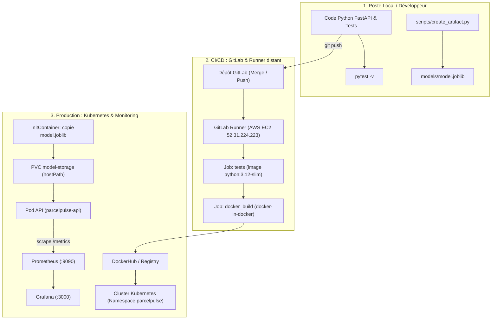

# 00 — Architecture & Fonctionnement Global de la Correction
## Projet ParcelPulse — RNCP 38919 Bloc 3

Ce document pose les bases indispensables pour comprendre la correction de référence : de quoi il s'agit, comment tous les blocs s'articulent, et quel rôle joue notre Runner GitLab opérationnel sur la machine AWS.

---

## 1. Le Scénario Métier : ParcelPulse

**ParcelPulse** est une entreprise de logistique qui souhaite prédire en temps réel si une livraison de colis présente un risque élevé de retard.

- **Entrées du modèle :**
  - `distance_km` (flottant) : Distance en kilomètres entre l'entrepôt et le destinataire.
  - `package_weight_kg` (flottant) : Poids du colis en kilogrammes.
- **Sortie du modèle :**
  - `risk` (entier binaire) : `1` (risque de retard élevé) ou `0` (livraison normale dans les délais).
- **Service exposé :**
  Une API REST construite avec **FastAPI**, qui charge l'artefact entraîné `models/model.joblib` et répond en moins de 10 millisecondes sur `/predict`.

---

## 2. Architecture Globale du Projet de Référence



### Schéma ASCII équivalent

```text
+---------------------------------------------------------------------------------------------------+
|                        ARCHITECTURE GLOBALE BOUT EN BOUT — PARCELPULSE                           |
+---------------------------------------------------------------------------------------------------+

 [POSTE LOCAL / DEV]
   │
   ├── app/ (main.py, schemas.py, model.py)
   ├── scripts/create_artifact.py ──► models/model.joblib
   └── tests/test_api.py (pytest -v ✅)
   │
   ▼ git push
 [GITLAB REPOSITORY]
   │
   ▼ Déclenche le pipeline
 [GITLAB RUNNER SUR AWS EC2 (52.31.224.223)] ◄── RUNNER SHELL OPÉRATIONNEL
   │
   ├── Stage TEST  : conteneur python:3.12-slim lance pytest -v
   └── Stage BUILD : docker build compile l'image (parcelpulse-api:latest)
   │
   ▼ Image prête
 [KUBERNETES DEPLOYMENT (Namespace: parcelpulse)]
   │
   ├── PV & PVC : Stockage persistant pour model.joblib
   ├── InitContainer : Initialise le fichier de modèle si absent
   ├── Pods FastAPI : Servent /health, /predict, /metrics
   └── Service : Expose le port 8000
   │
   ▼ Scraping automatique toutes les 15s
 [MONITORING & OBSERVABILITÉ]
   ├── Prometheus (:9090) : Récupère les métriques HTTP & inférences
   └── Grafana (:3000)    : Tableaux de bord de latence et volumétrie
```

---

## 3. Cartographie Complète des Fichiers de la Correction

Le dossier [`../reference_project`](../reference_project) est structuré selon les standards industriels :

| Fichier / Dossier | Rôle et Responsabilité |
|---|---|
| [`app/main.py`](../reference_project/app/main.py) | Point d'entrée FastAPI : instancie l'app, enregistre `/health`, `/predict` et instrumente Prometheus via `Instrumentator`. |
| [`app/config.py`](../reference_project/app/config.py) | Configuration dynamique par variables d'environnement (`APP_NAME`, `MODEL_PATH`, `DEFAULT_PORT`). |
| [`app/schemas.py`](../reference_project/app/schemas.py) | Schémas Pydantic (`PredictionRequest` et `PredictionResponse`) assurant le typage strict. |
| [`app/model.py`](../reference_project/app/model.py) | Logique de chargement sécurisé du modèle Joblib avec fallback en cas d'absence. |
| [`models/model.joblib`](../reference_project/models/model.joblib) | Artefact binaire sérialisé contenant le modèle de classification entraîné. |
| [`scripts/create_artifact.py`](../reference_project/scripts/create_artifact.py) | Script Python autonome qui entraîne et exporte `model.joblib`. |
| [`scripts/smoke_test.sh`](../reference_project/scripts/smoke_test.sh) | Script Bash de test de fumée (Smoke Test) validant les réponses HTTP 200 en production. |
| [`tests/test_api.py`](../reference_project/tests/test_api.py) | Suite de tests automatisés Pytest validant tous les endpoints et la gestion d'erreurs (422). |
| [`Dockerfile`](../reference_project/Dockerfile) | Définition de l'image de conteneur basée sur `python:3.12-slim`. |
| [`docker-compose.yml`](../reference_project/docker-compose.yml) | Orchestration locale des 3 services : API, Prometheus et Grafana. |
| [`.gitlab-ci.yml`](../reference_project/.gitlab-ci.yml) | Pipeline d'intégration continue (stages `test` et `build`). |
| [`k8s/`](../reference_project/k8s) | Les 6 manifests Kubernetes (`namespace`, `configmap`, `pv`, `pvc`, `deployment`, `service`). |
| [`config/prometheus.yml`](../reference_project/config/prometheus.yml) | Configuration de scraping Prometheus ciblant l'API toutes les 15 secondes. |
| [`grafana/`](../reference_project/grafana) | Provisioning automatique de la datasource Prometheus dans Grafana. |

---

## 4. Notre Runner GitLab sur AWS EC2

Dans votre terminal actif, vous disposez d'un accès SSH à votre instance cloud AWS :
```bash
ssh -i "./data_enginering_machine.pem" ubuntu@52.31.224.223
```

Sur cette machine (`ip-172-31-44-121`), un **GitLab Runner de type `shell`** est installé, enregistré auprès de GitLab.com et actif (`/etc/gitlab-runner/config.toml`, identifiant `57025042`).

### Ce que fait ce Runner :
1. Dès que vous effectuez un `git push` sur votre projet GitLab, GitLab envoie un signal au Runner.
2. Le Runner récupère votre code dans `/home/gitlab-runner/builds/…` et exécute le script du job **directement sur la machine virtuelle**.
3. Le job de test lance lui-même un conteneur `python:3.12-slim` pour disposer de la même version de Python que le `Dockerfile`, puis exécute `pytest -v`.
4. Si les tests réussissent, le job suivant exécute `docker build` en s'appuyant sur le daemon Docker de la VM, puis vérifie que l'image s'importe correctement.
5. Une fois terminé, GitLab supprime le dossier de travail. ⚠️ **Les images Docker, elles, restent** : pensez à `sudo docker image prune` sur une VM de 20 Go.

> ⚠️ **Le runner n'a volontairement pas accès à Kubernetes.** Lui transmettre le `kubeconfig` administrateur en ferait un *cluster-admin* : n'importe quel `git push` pourrait alors recharger Kubernetes. Le déploiement de l'application se fait **à la main**, depuis la VM, avec l'utilisateur `ubuntu` — voir le [guide 04](04_DEPLOIEMENT_KUBERNETES_PAS_A_PAS.md).

---

### Prochaine étape :

Passez au guide [01_EXECUTION_LOCALE_PAS_A_PAS.md](01_EXECUTION_LOCALE_PAS_A_PAS.md) pour faire tourner et tester le code sur votre machine locale !
