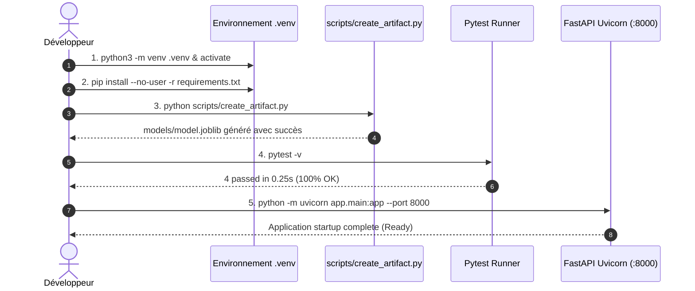

# 01 — Exécution Locale Pas à Pas
## Faire Tourner et Tester la Correction sur Votre Machine

Ce guide détaille chaque commande pour exécuter le projet de référence ([`../reference_project`](../reference_project)) en local sur votre Mac/Linux, sans Docker ni Kubernetes.

---

## Vue d'Ensemble du Flux Local



### Schéma ASCII équivalent

```text
+-----------------------------------------------------------------------------------+
|                     CHRONOLOGIE D'EXÉCUTION EN LOCAL                              |
+-----------------------------------------------------------------------------------+

 1. Isolation     : python3 -m venv .venv && source .venv/bin/activate
 2. Dépendances   : pip install --no-user -r requirements.txt
 3. Modèle ML     : python scripts/create_artifact.py  ──►  Génère models/model.joblib
 4. Tests Pytest  : pytest -v                          ──►  4/4 tests valident l'API
 5. Démarrage API : python -m uvicorn app.main:app     ──►  API active sur :8000
 6. Vérifications : curl http://localhost:8000/health  ──►  HTTP 200 OK
```

---

## Étape 1 : Se positionner dans le dossier du projet

Ouvrez un terminal et naviguez dans le dossier du projet de référence :

```bash
cd /Users/awf/workspace/learning/datascientest/RNCP/RNCP_38919_BLOC_3_PRACTICE_LABS_PACK/exam/correction/reference_project
pwd
```
*Vérifiez que votre `pwd` se termine bien par `exam/correction/reference_project`.*

---

## Étape 2 : Créer et activer l'environnement virtuel (.venv)

```bash
# 1. Créer le venv
python3 -m venv .venv

# 2. Activer le venv
source .venv/bin/activate
```
*Votre invite de commande doit afficher le préfixe `(.venv)`.*

---

## Étape 3 : Installer les dépendances

Installez les bibliothèques requises avec l'option `--no-user` (pour éviter le conflit d'isolation utilisateur sur macOS) :

```bash
pip install --no-user -r requirements.txt
```

Le fichier [`requirements.txt`](../reference_project/requirements.txt) installe :
- `fastapi`, `uvicorn` : Framework web et serveur
- `pydantic` : Validation des schémas JSON
- `joblib` : Sérialisation et chargement du modèle
- `pytest`, `httpx` : Moteur de test unitaire et client de test
- `prometheus-fastapi-instrumentator` : Export des métriques Prometheus

---

## Étape 4 : Générer l'artefact Machine Learning

Avant de démarrer l'API, le fichier de modèle doit exister sur le disque :

```bash
python scripts/create_artifact.py
```

*Sortie attendue :*
```text
Artefact généré : models/model.joblib
```
*Vérification : Tapez `ls -lh models/model.joblib`, le fichier doit peser environ 1 à 2 Ko.*

---

## Étape 5 : Lancer la suite de tests automatisés (Pytest)

Avant de lancer le serveur, validez l'intégrité de tous les composants avec Pytest :

```bash
pytest -v
```

*Sortie attendue :*
```text
============================= test session starts ==============================
rootdir: /.../exam/correction/reference_project
collected 4 items

tests/test_api.py::test_health PASSED                                    [ 25%]
tests/test_api.py::test_predict_valid PASSED                             [ 50%]
tests/test_api.py::test_predict_invalid PASSED                           [ 75%]
tests/test_api.py::test_metrics PASSED                                   [100%]

============================== 4 passed in 0.32s ===============================
```

### Que vérifient ces 4 tests ?
1. `test_health` : S'assure que `GET /health` répond HTTP 200 avec `{"status": "ok", "app": "parcelpulse-api"}`.
2. `test_predict_valid` : Envoie des données conformes (`distance_km: 12.5`, `package_weight_kg: 3.2`) et vérifie que la clé `risk` est bien présente dans la réponse.
3. `test_predict_invalid` : Envoie un type invalide (`distance_km: "abc"`) et s'assure que Pydantic rejette la requête avec une erreur 422 (`Unprocessable Entity`).
4. `test_metrics` : S'assure que `GET /metrics` répond HTTP 200 pour le scraping Prometheus.

---

## Étape 6 : Démarrer le serveur API en local

Lancez Uvicorn via `python -m uvicorn` :

```bash
python -m uvicorn app.main:app --host 0.0.0.0 --port 8000 --reload
```

*Sortie attendue :*
```text
INFO:     Will watch for changes in these directories: ['/.../exam/correction/reference_project']
INFO:     Uvicorn running on http://0.0.0.0:8000 (Press CTRL+C to quit)
INFO:     Started reloader process [31245] using StatReload
INFO:     Started server process [31247]
INFO:     Waiting for application startup.
INFO:     Application startup complete.
```

---

## Étape 7 : Tester les endpoints (dans un second terminal)

Laissez le premier terminal tourner et ouvrez un **second terminal** pour interroger votre API :

### 1. Endpoint de santé `/health`
```bash
curl -i http://localhost:8000/health
```
*Réponse attendue :*
```http
HTTP/1.1 200 OK
content-type: application/json

{"status":"ok","app":"parcelpulse-api"}
```

### 2. Endpoint de prédiction `/predict` (Cas normal : Risque faible = 0)
```bash
curl -X POST http://localhost:8000/predict \
  -H "Content-Type: application/json" \
  -d '{"distance_km": 5.0, "package_weight_kg": 1.5}'
```
*Réponse attendue : `{"risk":0}`*

### 3. Endpoint de prédiction `/predict` (Cas critique : Risque élevé = 1)
```bash
curl -X POST http://localhost:8000/predict \
  -H "Content-Type: application/json" \
  -d '{"distance_km": 45.0, "package_weight_kg": 12.0}'
```
*Réponse attendue : `{"risk":1}`*

### 4. Client Python fourni
Vous pouvez aussi exécuter le script client :
```bash
python scripts/http_client.py
```

### 5. Endpoint de métriques Prometheus `/metrics`
```bash
curl http://localhost:8000/metrics | grep http_requests_total
```
*Vous verrez le compteur Prometheus s'incrémenter à chaque requête !*

---

## Étape 8 : Arrêt du serveur

- Dans le terminal du serveur, appuyez sur `Ctrl + C` pour arrêter Uvicorn.
- Pour quitter le venv : tapez `deactivate`.

---

### Prochaine étape :

Passez au guide [02_CONTENEURISATION_DOCKER_ET_COMPOSE.md](02_CONTENEURISATION_DOCKER_ET_COMPOSE.md) pour empaqueter cette API dans un conteneur Docker et démarrer la stack complète avec Prometheus et Grafana !
