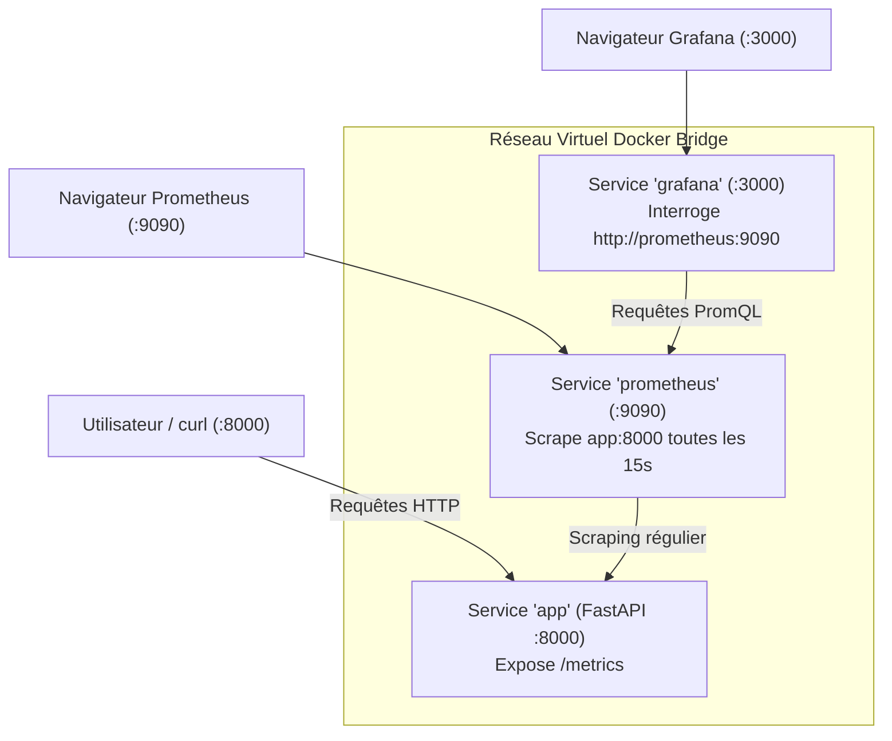

# 02 — Conteneurisation avec Docker & Docker-Compose
## Empaqueter l'API et Orchestrer la Stack Complète (API + Prometheus + Grafana)

Ce guide explique comment transformer notre code Python en une image Docker portable et comment faire tourner simultanément l'API, le moteur de collecte de métriques **Prometheus** et l'interface de visualisation **Grafana**.

---

## 1. Comprendre le Dockerfile de Référence

Le fichier [`Dockerfile`](../reference_project/Dockerfile) contient 6 lignes fondamentales :

```dockerfile
FROM python:3.12-slim
WORKDIR /app
COPY requirements.txt .
RUN pip install --no-cache-dir -r requirements.txt
COPY . .
CMD ["uvicorn", "app.main:app", "--host", "0.0.0.0", "--port", "8000"]
```

### Décryptage pas à pas :
1. **`FROM python:3.12-slim`** : Utilise une image officielle Debian minimale (environ 150 Mo au lieu de 1 Go pour l'image Python standard), réduisant la surface d'attaque et le temps de téléchargement.
2. **`WORKDIR /app`** : Définit le répertoire de travail dans le conteneur. Toutes les commandes suivantes s'exécuteront dans `/app`.
3. **`COPY requirements.txt .`** et **`RUN pip install ...`** :
   > [!TIP]
   > **Optimisation du cache des couches Docker :** On copie et installe les dépendances *avant* de copier le reste du code. Ainsi, si vous modifiez une ligne dans `main.py`, Docker réutilise le cache pip sans retélécharger tous les paquets !
4. **`COPY . .`** : Copie l'intégralité du code source (dossiers `app/`, `models/`, `scripts/`) dans `/app`.
5. **`CMD [...]`** : Commande par défaut exécutée au démarrage du conteneur. Notez `--host 0.0.0.0` impératif pour écouter sur toutes les interfaces réseau du conteneur.

---

## 2. Tester l'Image Docker Seule

Depuis le dossier `exam/correction/reference_project` :

### 1. Construire l'image Docker
```bash
docker build -t parcelpulse-api:latest .
```
*Sortie attendue : `naming to docker.io/library/parcelpulse-api:latest done`.*

### 2. Démarrer le conteneur
```bash
docker run --rm -p 8000:8000 parcelpulse-api:latest
```
*L'option `-p 8000:8000` relie le port 8000 de votre machine locale au port 8000 interne du conteneur.*

### 3. Tester dans un second terminal
```bash
curl http://localhost:8000/health
```
*Réponse attendue : `{"status":"ok","app":"parcelpulse-api"}`.*

*(Appuyez sur `Ctrl + C` pour arrêter le conteneur).*

---

## 3. Orchestration Complète avec Docker-Compose

En production ou en simulation d'examen, l'API ne fonctionne pas seule : elle doit être monitorée par **Prometheus** et visualisée dans **Grafana**.

### Architecture Réseau de Docker-Compose



### Schéma ASCII équivalent

```text
+-----------------------------------------------------------------------------------+
|               RÉSEAU MULTI-SERVICES DOCKER COMPOSE                                |
+-----------------------------------------------------------------------------------+

   Poste Hôte / Navigateur (localhost)
        │
        ├──► :8000 ──► [Conteneur app]        (FastAPI + Pydantic + Joblib)
        │                                            ▲
        │                                            │ Scraping HTTP /metrics (15s)
        ├──► :9090 ──► [Conteneur prometheus] ───────┘
        │                     ▲
        │                     │ Requêtes PromQL internes (http://prometheus:9090)
        └──► :3000 ──► [Conteneur grafana] ──────────┘
```

---

## 4. Démarrage de la Stack Docker-Compose

Le fichier [`docker-compose.yml`](../reference_project/docker-compose.yml) configure les 3 services avec leurs volumes et leurs ports.

### Étape 1 : Lancer tous les services en arrière-plan (`-d`)
```bash
docker compose up -d --build
```

### Étape 2 : Vérifier que les 3 conteneurs sont `Up`
```bash
docker compose ps
```

*Sortie attendue :*
```text
NAME                               IMAGE             COMMAND                  SERVICE      STATUS      PORTS
reference_project-app-1            parcelpulse-api   "uvicorn app.main:ap…"   app          running     0.0.0.0:8000->8000/tcp
reference_project-grafana-1        grafana/grafana   "/run.sh"                grafana      running     0.0.0.0:3000->3000/tcp
reference_project-prometheus-1     prom/prometheus   "/bin/prometheus --c…"   prometheus   running     0.0.0.0:9090->9090/tcp
```

### Étape 3 : Vérifier les logs de l'API
```bash
docker compose logs -f app
```
*(Appuyez sur `Ctrl + C` pour sortir des logs sans arrêter les conteneurs).*

---

## 5. Accéder aux Interfaces Web

Ouvrez votre navigateur web :

1. **API Swagger UI :** [http://localhost:8000/docs](http://localhost:8000/docs)
   - Vous pouvez tester interactivement l'envoi de requêtes sur `/health` et `/predict`.
2. **Prometheus Web UI :** [http://localhost:9090/targets](http://localhost:9090/targets)
   - Cliquez sur le menu **Status > Targets**.
   - Vous devez voir `parcelpulse-api (1/1 up)` avec un voyant vert **UP** !
3. **Grafana UI :** [http://localhost:3000](http://localhost:3000)
   - Identifiant par défaut : `admin` / Mot de passe : `admin` (vous pouvez cliquer sur "Skip" au changement de mot de passe).
   - Allez dans **Connections > Data sources** : la datasource **Prometheus** est déjà provisionnée automatiquement !

---

## 6. Tester et Générer du Trafic

Dans votre terminal, lancez quelques requêtes pour alimenter Prometheus :

```bash
# Requête GET health
curl http://localhost:8000/health

# Requête POST prédiction
curl -X POST http://localhost:8000/predict \
  -H "Content-Type: application/json" \
  -d '{"distance_km": 15.0, "package_weight_kg": 4.5}'

# Ou exécutez le smoke test complet :
bash scripts/smoke_test.sh
```

Allez sur Prometheus ([http://localhost:9090/graph](http://localhost:9090/graph)), entrez la requête PromQL :
```promql
http_requests_total{app="parcelpulse-api"}
```
et cliquez sur **Execute** : vous verrez le compteur exact des requêtes enregistrées !

---

## 7. Arrêter la Stack Proprement

Lorsque vous avez terminé :
```bash
docker compose down
```
*Cette commande arrête et supprime proprement les conteneurs et le réseau virtuel sans toucher à vos fichiers sources.*

---

### Prochaine étape :

Passez au guide [03_GITLAB_CI_ET_RUNNER_SHELL.md](03_GITLAB_CI_ET_RUNNER_SHELL.md) pour découvrir comment automatiser les tests et le build via **GitLab CI** grâce à notre Runner actif sur AWS EC2 !
