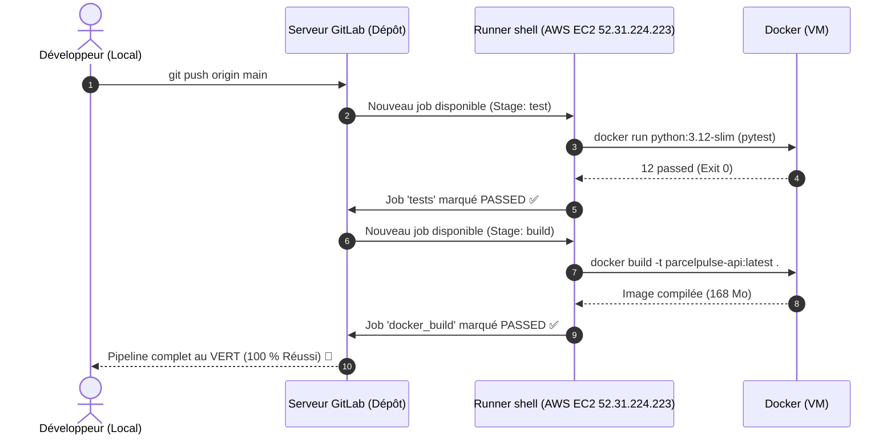

# 03 — Intégration Continue avec GitLab CI & Runner Shell
## Automatiser les Tests et le Build avec le Runner `shell` de votre Machine AWS EC2

Ce guide explique pas à pas comment fonctionne le pipeline d'intégration continue de ParcelPulse ([`.gitlab-ci.yml`](../reference_project/.gitlab-ci.yml)) et comment il s'exécute sur le **GitLab Runner `shell` installé sur votre machine AWS EC2 (`52.31.224.223`)**.

> ⚠️ **Pourquoi un runner `shell` et pas un runner Kubernetes ?**
> L'énoncé de l'examen demande explicitement : « *Créez un Runner de type **shell** nommé `shell`* ». Le runner sert à exécuter les jobs CI ; Kubernetes, lui, sert à **déployer l'application** (voir le [guide 04](04_DEPLOIEMENT_KUBERNETES_PAS_A_PAS.md)). Les deux rôles sont distincts, et les confondre est la erreur la plus fréquente.
>
> Conséquence pratique : sur un runner `shell`, GitLab **ignore** les mots-clés `image:` et `services:` d'un job. Le job s'exécute directement sur la machine virtuelle. C'est pourquoi le pipeline ci-dessous lance lui-même ses conteneurs avec `docker run`.

---

## 1. Vue d'Ensemble du Flux CI/CD



### Schéma ASCII équivalent

```text
+---------------------------------------------------------------------------------------------------+
|                  FONCTIONNEMENT DU PIPELINE AVEC NOTRE RUNNER SHELL                                |
+---------------------------------------------------------------------------------------------------+

  [Développeur] ──(git push origin main)──► [GitLab CI Orchestrator]
                                                     │
                                                     ▼ Déclenche le job
                    [SERVEUR AWS EC2 : ubuntu@52.31.224.223]
                    [Runner shell : /etc/gitlab-runner/config.toml]
                    [exécuteur : shell — les jobs tournent sur la VM]
                                                     │
                    ┌────────────────────────────────┴──────────────────────────────┐
                    │                                                               │
                    ▼ STAGE 1 : TESTS                                               ▼ STAGE 2 : BUILD
           +─────────────────────────────+                                 +─────────────────────────────+
           │ Conteneur python:3.12-slim  │                                 │ Docker de la VM (natif)    │
           │ • pip install requirements  │                                 │ • docker build -t API      │
           │ • create_artifact.py        │                                 │ • docker run (contrôle)    │
           │ • pytest -v (12 passed)     │                                 │ • (optionnel) docker push  │
           +─────────────────────────────+                                 +─────────────────────────────+
                    │                                                               │
                    └────────────────────────────────┬──────────────────────────────┘
                                                     │
                                                     ▼
                                   [Pipeline GitLab : 100% SUCCÈS ✅]
```

> **Pourquoi passer les tests dans un conteneur si le runner est déjà sur la VM ?**
> Pour garantir **exactement** la même version de Python que le `Dockerfile` (3.12), et éviter d'installer les dépendances au niveau système de la VM — ce qui pollue la machine et crée des conflits de versions. Le conteneur est éphémère : il disparaît avec le job.

---

## 2. Décryptage du Fichier `.gitlab-ci.yml`

Le fichier [`.gitlab-ci.yml`](../reference_project/.gitlab-ci.yml) contient la définition déclarative des étapes :

```yaml
stages:
  - test
  - build

variables:
  IMAGE: parcelpulse-api:latest
  PYTHON_IMAGE: python:3.12-slim

tests:
  stage: test
  script:
    - |
      docker run --rm \
        --user "$(id -u):$(id -g)" \
        -e HOME=/tmp \
        -v "$CI_PROJECT_DIR:/build" -w /build \
        "$PYTHON_IMAGE" \
        sh -c 'set -e
               python --version
               python -m pip install --no-cache-dir --user -r requirements.txt
               python scripts/create_artifact.py
               python -m pytest -v'

docker_build:
  stage: build
  script:
    - docker build -t "$IMAGE" .
    - docker run --rm "$IMAGE" python -c "from app.main import app; print('Import OK:', app.title)"
```

### Analyse détaillée pour l'examen :

1. **`stages:`** : Définit l'ordre séquentiel. Le stage `build` ne s'exécute **que si et seulement si** le stage `test` réussit à 100 %.
2. **Aucun `image:` ni `services:`** : c'est la signature d'un pipeline conçu pour un runner `shell`. Sur les exécuteurs `docker` et `kubernetes`, GitLab crée un conteneur par job ; sur l'excepteur `shell`, ces mots-clés sont **ignorés**. Les écrire ici donnerait l'illusion d'un isolation qui n'existe pas.
3. **Job `tests` :**
   - **`docker run --rm …`** : lance un conteneur éphémère `python:3.12-slim`. `--rm` garantit sa suppression immédiate.
   - **`-v "$CI_PROJECT_DIR:/build"`** : monte le dépôt (récupéré par le runner) dans le conteneur. `CI_PROJECT_DIR` est une variable fournie par GitLab qui pointe vers le dossier du projet sur la VM.
   - **`--user "$(id -u):$(id -g)"` et `-e HOME=/tmp`** : le conteneur s'exécute avec l'identifiant de l'utilisateur du runner. Deux conséquences : les fichiers produits (`model.joblib`, `.pytest_cache`) lui appartiennent et restent donc supprimables par le nettoyage automatique de GitLab, et `pip` **doit** être lancé avec `--user` — sans quoi l'installation échoue faute de droits sur `site-packages`.
   - **`python -m pip install --no-cache-dir --user -r requirements.txt`** : installe les dépendances dans le conteneur, sans cache inutile.
   - **`python scripts/create_artifact.py`** : l'API charge l'artefact ML au démarrage ([`app/model.py`](../reference_project/app/model.py) lève une `FileNotFoundError` si le fichier est absent). Sans cette étape, `pytest` échoue.
   - **`python -m pytest -v`** : exécute les 12 tests de [`tests/test_api.py`](../reference_project/tests/test_api.py). Une seule assertion en échec renvoie un code de sortie non nul et le pipeline s'arrête.
   - **Pourquoi `python -m pytest` et non `pytest`** : avec `--user`, les scripts sont installés dans `$HOME/.local/bin`, qui n'est pas dans le `PATH`. `python -m` trouve le module où qu'il soit installé.
4. **Job `docker_build` :**
   - **`docker build -t "$IMAGE" .`** : compile l'image. Le runner étant dans le groupe `docker`, il utilise **directement le daemon Docker de la VM** — pas de Docker-in-Docker, donc **aucun besoin de `privileged`**.
   - **`docker run --rm "$IMAGE" python -c "from app.main import app; …"`** : vérifie que l'image produite est réellement fonctionnelle : l'artefact ML a bien été copié et l'application s'importe sans erreur. Sans ce contrôle, une image qui se construit mais ne démarre pas serait déclarée verte.
5. **Job `docker_push`** (manuel) : `when: manual` et `allow_failure: true` — il ne bloque pas le pipeline. Voir la [section 6](#6-bonus-examen--pousser-limage-vers-dockerhub).

> **Piège classique en CI : le job semble vert alors que la variable n'a pas été appliquée.** C'est exactement ce qui s'est produit sur ce projet : `docker build` échouait avec
> `ERROR: Cannot connect to the Docker daemon at unix:///var/run/docker.sock`.
> Sur un runner `kubernetes`, le service `docker:27-dind` est joignable sur `tcp://localhost:2375` (tous les conteneurs d'un pod partagent le namespace réseau), et sans `DOCKER_HOST` le client retombait sur un socket Unix inexistant. Erreur analogue en miroir, mais une **seule variable** suffisait — pas de changement de runner.

---

## 3. Le Runner `shell` sur la Machine AWS

### 3.1 Où se trouve sa configuration

L'énoncé demande de « manipuler un Runner via la commande `gitlab-runner` ». Sur la VM, tout tient dans **un seul fichier** :

```bash
ssh -i "./data_enginering_machine.pem" ubuntu@52.31.224.223

# Le fichier de configuration, à savoir lire (il contient un token : ne jamais le copier en entier)
sudo cat /etc/gitlab-runner/config.toml
```

```toml
concurrent = 1
check_interval = 0

[[runners]]
  name = "shell"          # ← le nom exigé par l'énoncé
  url = "https://gitlab.com"
  id = 57025042
  token = "glrt-…"        # ← SECRET : ne jamais diffuser ni committer
  executor = "shell"      # ← pas "kubernetes" : les jobs tournent sur la VM
  request_concurrency = 2
```

> ⚠️ **`token` est un secret d'authentification.** Il donne le droit de se présenter comme ce runner. Ne le copiez jamais dans un message, une capture d'écran ou un dépôt Git. Pour relire le fichier sans rien divulguer :
> ```bash
> sudo sed -E 's/(token|password)[[:space:]]*=.*/\1 = "XXX"/' /etc/gitlab-runner/config.toml
> ```
>
> **`check_interval = 0`** signifie que le runner utilise le *long polling* : il garde une connexion HTTPS ouverte vers GitLab plutôt que d'interroger périodiquement. C'est le réglage recommandé ; le runner n'apparaît donc pas dans les logs à intervalles réguliers, et son état se vérifie par la connexion réseau :
> ```bash
> PID=$(pgrep -f 'gitlab-runner run --config /etc/gitlab-runner' | head -1)
> sudo ss -tnp | grep "pid=$PID"      # doit montrer ESTAB ... :443
> ```

### 3.2 Les commandes `gitlab-runner` exigées par l'énoncé

```bash
# État du service : il doit être "active" (et "enabled" pour redémarrer après un reboot)
systemctl is-active gitlab-runner
systemctl is-enabled gitlab-runner

# Lister les runners enregistrés et leur état
sudo gitlab-runner list

# Vérifier l'enregistrement auprès de GitLab (la commande la plus importante)
sudo -u gitlab-runner gitlab-runner verify
#   => Verifying runner... is valid

# Démarrer / arrêter / redémarrer
sudo systemctl restart gitlab-runner

# Enregistrer un runner (fait une fois, depuis le navigateur : Settings > CI/CD > Runners)
#   sudo gitlab-runner register --url https://gitlab.com --token <TOKEN_DE_REGISTRATION> --executor shell
#   → saisir « shell » comme Description, « shell » comme Tags, « untagged » comme Runner Configuration

# Supprimer définitivement un runner (attention : le token devient inutilisable)
sudo gitlab-runner unregister --all-config
```

> ⚠️ **`gitlab-runner register` n'est pas anodin.** Si vous ré-enregistrez, l'ancien token est remplacé. L'énoncé demande de *créer* un runner de type shell nommé `shell` : le fichier ci-dessus est le résultat de cette étape, et il n'est pas nécessaire de le refaire pour la suite.

### 3.3 Ce que le runner doit pouvoir faire sur la VM

Vérifications faites sur la machine (`gitlab-runner` est l'utilisateur qui exécute les jobs) :

```bash
id gitlab-runner | tr ',' '\n' | grep -i docker   # → doit apparaître : groupe docker
sudo -u gitlab-runner docker version               # → client=27.5.1 server=27.5.1
sudo -u gitlab-runner python3 -V                   # → Python 3.10.12
```

| Capacité | Nécessaire pour | État |
|---|---|---|
| Membre du groupe `docker` | `docker build` / `docker run` dans les jobs | ✅ |
| Docker qui fonctionne | construction d'image | ✅ 27.5.1 |
| Bash | exécution des scripts | ✅ |
| Accès à Kubernetes | **non requis** | ❌ absent — et c'est volontaire |

> ⚠️ **Le runner n'a volontairement pas accès à Kubernetes.** Lui donner le `kubeconfig` administrateur (`~/.kube/config`) en ferait un **cluster-admin** : n'importe quel `git push` pourrait alors recharger Kubernetes — créer, supprimer ou modifier des pods sur la machine. Le déploiement Kubernetes se fait à la main, depuis la VM, avec l'utilisateur `ubuntu` : c'est [`scripts/deploy_k8s.sh`](../reference_project/scripts/deploy_k8s.sh), traité au [guide 04](04_DEPLOIEMENT_KUBERNETES_PAS_A_PAS.md).

### 3.4 Le réglage qui fait tout bloquer : « Run untagged jobs »

> ⚠️ **C'est le piège n°1 de cette section.** Un runner configuré avec des **tags** n'exécute que les jobs qui portent **le même tag**. Notre `.gitlab-ci.yml` ne déclare **aucun `tags:`** — et c'est volontaire, pour rester simple.
>
> Résultat : si la case **Run untagged jobs** n'est pas cochée dans **Settings > CI/CD > Runners > runner `shell` > Edit**, GitLab ne propose **jamais** ce runner pour nos jobs. Symptôme : le runner interroge GitLab sans cesse (`Checking for jobs... received`), aucune erreur n'apparaît, et le pipeline reste **bloqué indéfiniment** sur *pending / stuck*.
>
> Ce réglage est **côté serveur** : il n'apparaît **pas** dans `config.toml`. Un runner avec cette case décochée est indistinguishable d'un runner mort en lisant le fichier de configuration.
>
> **La parade est le tag explicite**, plus robuste et plus professionnel :
> 1. dans le YAML, ajouter `tags: [shell]` à chaque job ;
> 2. dans l'UI, s'assurer que le runner porte le tag `shell` **et** que « Run untagged jobs » est coché.
>
> C'est aussi la bonne pratique pour un projet à plusieurs pipelines : elle évite qu'un runner inattendu saisisse vos jobs.

### 3.5 Où le runner travaille, et ce qu'il laisse derrière lui

```bash
# Répertoire de travail du projet courant
/home/gitlab-runner/builds/<runner-short-id>/<concurrent>/<namespace>/<projet>/
# exemple : /home/gitlab-runner/builds/57rYfgq8b/0/devops3274103/parcelpulse-api/

# Après le job, GitLab nettoie ce dossier. Les images Docker, en revanche, restent :
sudo docker images parcelpulse-api
```

| Élément | Nettoyé automatiquement ? |
|---|---|
| Code source (`builds/…`) | ✅ oui, à la fin du job |
| Images Docker construites | ❌ **non** — elles s'accumulent. Sur une VM de 20 Go, pensez à `sudo docker image prune` |
| `~/.local` du runner | non, mais on n'installe rien au niveau système |

---

## 4. Pousser le Projet sur GitLab Pas à Pas

### Étape 1 : Initialiser le dépôt local
Depuis le dossier `exam/correction/reference_project` sur votre machine locale :
```bash
cd /chemin/vers/RNCP_38919_BLOC_3_PRACTICE_LABS_PACK/exam/correction/reference_project

git init
git branch -M main
```

### Étape 2 : Configurer le remote GitLab
Créez un nouveau projet **privé** sur GitLab — l'énoncé demande un répertoire nommé `dst_rncp38919_bloc_3` — puis :
```bash
git remote add origin https://gitlab.com/<VOTRE_UTILISATEUR>/parcelpulse-api.git
```

> 💡 L'énoncé demande aussi de créer une **clé SSH sur la machine virtuelle** et d'ajouter la clé **publique** à votre compte GitLab. C'est ce qui permet un push sans mot de passe :
> ```bash
> ssh-keygen -t ed25519 -C "gitlab"      # sur la VM
> cat ~/.ssh/id_ed25519.pub                # copier cette ligne dans GitLab > Preferences > SSH Keys
> git remote add origin git@gitlab.com:<VOTRE_UTILISATEUR>/parcelpulse-api.git
> ```

### Étape 3 : Activer le runner sur le projet

Dans **Settings > CI/CD > Runners** du projet :
1. le runner `shell` doit apparaître comme **Active** ;
2. **cochez « Run untagged jobs »** (voir [section 3.4](#34-le-réglage-qui-fait-tout-bloquer--run-untagged-jobs)) ;
3. vérifiez que le runner est **assigné à ce projet** (et pas seulement disponible).

### Étape 4 : Commiter et Pousser
```bash
git add .
git commit -m "feat(ci): initial parcelpulse project with tests and docker build"
git push -u origin main
```
Le push déclenche immédiatement le pipeline.

---

## 5. Suivi du Pipeline dans l'Interface GitLab

1. **Build > Pipelines** (menu de gauche).
2. Le pipeline apparaît avec ses pastilles : `tests`, puis `docker_build`, puis `docker_push` (manuel).
3. Cliquez sur **`tests`** pour voir défiler les logs de Pytest.
4. **Vérifiez la ligne d'en-tête du log de chaque job** — c'est elle qui prouve qui a réellement exécuté :
   ```text
   Running with gitlab-runner 19.4.1
     on shell 57rYfgq8b, system ID: s_bec3b3a4a628
   Preparing the "shell" executor
   Using Shell (bash) executor...
   Running on ip-172-31-44-121...
   ```
   `on shell …` puis `Using Shell (bash) executor` : c'est **bien** votre runner sur la VM.
5. Quand les deux jobs automatiques sont verts, le pipeline affiche **Passed**.

> ⚠️ **Un pipeline vert ne prouve pas que c'est VOTRE runner qui a travaillé.** GitLab.com propose **136 runners d'instance** partagés, tous éligibles par défaut. Un pipeline peut donc passer au vert sur une machine GitLab sans que votre VM soit impliquée. Deux parades :
> - **Settings > CI/CD > Runners > Disable instance runners** : il ne reste que vos runners ;
> - **vérifier la ligne `on …` du log**, systématiquement.
>
> Ce piège s'est réellement produit sur ce projet : le premier pipeline « vert » avait été exécuté par un runner partagé `docker+machine` de GitLab, où DinD fonctionne **par construction** (une VM jetable par job) — ce qui masquait complètement un problème de configuration de notre runner.

---

## 6. Bonus Examen : Pousser l'Image vers DockerHub

L'énoncé mentionne « l'utilisation des répertoires d'un compte hébergé par DockerHub ». Le pipeline contient déjà le job `docker_push`, **manuel** pour ne pas bloquer la CI :

1. **Settings > CI/CD > Variables**, ajouter :
   - `DOCKERHUB_USER` — votre identifiant DockerHub ;
   - `DOCKERHUB_PASSWORD` — votre token d'accès personnel, coché **Masked** et **Protected**.

2. Lancer le job depuis **Build > Pipelines > Pipeline (current) > docker_push** (bouton ▶).

Le job exécute :

```bash
echo "$DOCKERHUB_PASSWORD" | docker login -u "$DOCKERHUB_USER" --password-stdin
docker build -t "$DOCKERHUB_USER/parcelpulse-api:latest" .
docker push "$DOCKERHUB_USER/parcelpulse-api:latest"
```

> ⚠️ **Ne mettez jamais les identifiants en clair dans `.gitlab-ci.yml`.** Le fichier est versionné et lisible par quiconque clone le dépôt. `--password-stdin` évite également que le mot de passe s'affiche dans les logs du job.

### Résultat vérifié

Job `docker_push` lancé manuellement depuis le pipeline, sur le runner `shell` :

```text
$ echo "$DOCKERHUB_PASSWORD" | docker login -u "$DOCKERHUB_USER" --password-stdin
Login Succeeded
$ docker build -t "$DOCKERHUB_USER/parcelpulse-api:latest" .
#10 writing image sha256:726e95acccbb… done
$ docker push "$DOCKERHUB_USER/parcelpulse-api:latest"
latest: digest: sha256:5c559c5c905ff246037b9d3c8a77ae88cbe74669d3a1ac97b8b3fc148755cad5 size: 1993
```

Puis vérification **sans aucun credential**, depuis une autre machine :

```console
$ docker pull tawounfouet/parcelpulse-api:latest
$ docker run --rm tawounfouet/parcelpulse-api:latest \
    python -c "from app.main import app; print('Import OK:', app.title)"
Import OK: parcelpulse-api
```

> 💡 **Pourquoi `--password-stdin` et non `--password $VAR` ?** Avec `--password`, le secret est passé en argument du processus : il apparaît dans le log du job **et** dans la liste des processus de la machine pendant son exécution. Avec `--password-stdin`, il transite par un tube et n'est jamais affiché. Le message `WARNING! Your password will be stored unencrypted in /home/gitlab-runner/.docker/config.json` est normal : il indique seulement que le token est écrit en clair sur le disque de la VM. Pour le retirer :
> ```bash
> sudo -u gitlab-runner docker logout
> ```

---

## 7. Annexe — Le runner Kubernetes de la VM (hors sujet de l'examen)

La VM héberge aussi un runner **`kubernetes`** (chart Helm `gitlab-runner-0.93.0`, namespace `order-dev`, pods isolés). Il **n'est pas demandé par l'énoncé** et n'est pas utilisé par le pipeline de référence. Il reste utile de savoir comment il fonctionne, et de ne pas le confondre avec le runner `shell` :

| | Runner `shell` | Runner `kubernetes` |
|---|---|---|
| Où s'exécute le job | dans un `docker run` / sur la VM | dans un **Pod** éphémère |
| `image:` / `services:` | **ignorés** | honorés |
| `docker build` | daemon Docker de la VM | DinD → **exige `privileged: true`** |
| Isolation | faible (la VM est partagée) | forte (pod jetable) |
| Pour cet examen | ✅ ** Demandé** | ❌ hors sujet |

Points vérifiés sur ce cluster, utiles si le sujet évolue :

```bash
export KUBECONFIG="$HOME/.kube/config"
K="/snap/microk8s/current/kubectl"      # kubectl n'est PAS dans le PATH par défaut

$K get pods -n order-dev                # le pod du runner
$K exec -n order-dev deploy/gitlab-runner -- gitlab-runner verify
$K get pods -n order-dev | grep -E 'runner-.*-project-[0-9]+-concurrent'
```

**Si vous devez un jour utiliser ce runner avec DinD**, deux	constats mesurés sur le cluster réel :

1. `DOCKER_HOST: tcp://localhost:2375` est **obligatoire** (les conteneurs d'un pod partagent le namespace réseau), sinon le client cherche `unix:///var/run/docker.sock` et échoue.
2. Le service `docker:27-dind` **ne démarre pas** sans privilèges — mesuré sur ce cluster :
   ```text
   mount: mounting none on /sys/kernel/security failed: Permission denied
   Could not mount /sys/kernel/security.
   ```
   Le correctif se fait dans le **`config.toml` du runner** (`[runners.kubernetes] privileged = true`), généré par le template `runners.config` de `values.yaml`. ⚠️ **Pas** dans `securityContext.privileged`, qui ne concerne que le conteneur du runner lui-même, et ⚠️ **pas** via `--set privileged=true` : le chart n'expose aucune clé racine `privileged`, et Helm accepterait la commande **sans rien changer** — un échec silencieux.

---

### Prochaine étape :

Passez au guide [04_DEPLOIEMENT_KUBERNETES_PAS_A_PAS.md](04_DEPLOIEMENT_KUBERNETES_PAS_A_PAS.md) pour déployer cette application dans le cluster Kubernetes avec stockage persistant !

Pour la procédure complète de validation (tests, Compose, Prometheus/Grafana, cluster local, diagnostic VM, dépannage), voir le [runbook 07](07_RUNBOOK_COMPLET_VALIDATION_ET_PIPELINE_CI.md).