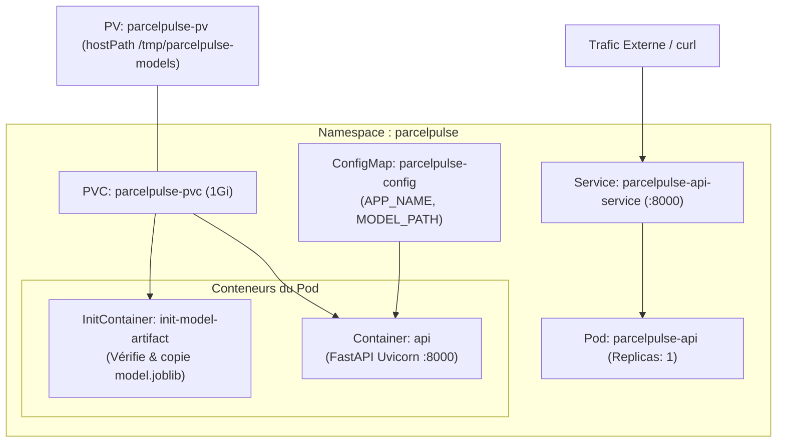

# 04 — Déploiement Kubernetes Pas à Pas
## Déployer ParcelPulse dans un Cluster K8s avec Stockage Persistant

Ce guide explique le rôle de chaque fichier du dossier [`../reference_project/k8s/`](../reference_project/k8s), comment fonctionne le stockage persistant du modèle Machine Learning, et comment déployer et tester l'application dans un cluster Kubernetes (local ou distant).

---

## 1. Architecture des Objets Kubernetes



### Schéma ASCII équivalent

```text
+-----------------------------------------------------------------------------------+
|               OBJETS KUBERNETES DANS LE NAMESPACE "parcelpulse"                   |
+-----------------------------------------------------------------------------------+

                           [Requêtes Clients HTTP]
                                      │
                                      ▼
             [Service : parcelpulse-api-service (Port 8000)]
                                      │
                                      ▼ Redirige vers
     +─────────────────────────────────────────────────────────────────+
     │ Pod : parcelpulse-api                                           │
     │                                                                 │
     │  1. InitContainer : copie model.joblib vers /models             │
     │  2. Conteneur API : FastAPI écoute sur :8000                    │
     │                                                                 │
     │  Variables d'env ◄── [ConfigMap : parcelpulse-config]           │
     │  Volume monté    ◄── [PVC : parcelpulse-pvc (storage: 1Gi)]     │
     +───────────────────────────────────┬─────────────────────────────+
                                         │ Lié (Bound)
                                         ▼
                 [PersistentVolume : parcelpulse-pv (hostPath)]
```

---

## 2. Décryptage des 6 Manifests Kubernetes

Tous les fichiers se trouvent dans [`../reference_project/k8s/`](../reference_project/k8s) :

### 1. `k8s/namespace.yml` (Isolation)
Crée une cloison étanche (`parcelpulse`) pour séparer notre application des autres charges de travail du cluster.

### 2. `k8s/configmap.yml` (Configuration sans recompiler)
Injecte les variables d'environnement dans les conteneurs :
- `APP_NAME: parcelpulse-api`
- `APP_ENV: kubernetes`
- `MODEL_PATH: /models/model.joblib`

### 3. `k8s/pv.yml` & `k8s/pvc.yml` (Stockage Persistant du Modèle ML)
- Le **PV** (`PersistentVolume`) déclare 1 Go de stockage physique sur le disque du nœud hôte via `hostPath: /tmp/parcelpulse-models`.
- Le **PVC** (`PersistentVolumeClaim`) réserve cet espace de stockage pour notre namespace.
> [!IMPORTANT]
> Les deux manifests partagent la directive **`storageClassName: manual`**, ce qui permet à Kubernetes de les relier immédiatement (`Bound`) sans attendre de provisionneur de cloud complexe. Aucune StorageClass `manual` n'est d'ailleurs créée : c'est un **PV statique**, c'est-à-dire provisionné manuellement.

> [!NOTE]
> `hostPath` désigne un emplacement **local au nœud**, pas au cluster. C'est adapté à un cluster mono-nœud (kind, minikube, k3d). Sur un cluster multi-nœuds, il faudrait un `StorageClass` dynamique (`local-path`, `standard`, `nfs`…) pour que le volume suive le pod d'un nœud à l'autre.

### 4. `k8s/deployment.yml` (Le Cœur du Déploiement)
Ce manifest contient deux points importants :
```yaml
      initContainers:
        - name: init-model-artifact
          image: tawounfouet/parcelpulse-api:latest
          imagePullPolicy: IfNotPresent
          command:
            - sh
            - -c
            - "if [ ! -f /models/model.joblib ]; then cp /app/models/model.joblib /models/model.joblib; fi"
          volumeMounts:
            - name: model-storage
              mountPath: /models
```
**Astuce n°1 — l'artefact ML est inoculé dans le volume persistant.**
Un volume persistant nouvellement créé est vide. L'`initContainer` s'exécute *avant* que l'API ne démarre : il vérifie si `model.joblib` est présent sur le volume persistant. S'il ne l'est pas, il le copie depuis l'image Docker vers le volume partagé. Ainsi, l'API FastAPI démarre toujours avec un modèle prêt à l'emploi !

**Astuce n°2 — l'image porte un nom de REGISTRE, pas un nom local.**
C'est le point qui fait la différence entre un déploiement qui marche et un pod bloqué en `ErrImageNeverPull` :

> ⚠️ **Docker et containerd n'ont pas le même magasin d'images.**
> Kubernetes fait tourner les pods avec **containerd**, pas avec le daemon Docker. Une image construite par `docker build` sur la machine est **invisible** du cluster : le pod part en `ErrImageNeverPull` alors que l'image existe bel et bien sur la machine.
>
> En désignant l'image par son nom de registre (`tawounfouet/parcelpulse-api:latest`), **un seul manifest sert aux deux situations** :
>
> | Cluster | Ce qui se passe | `IfNotPresent` |
> |---|---|---|
> | **kind / minikube** (local) | l'image est chargée dans le nœud (`kind load docker-image`) | aucun pull, elle est déjà là |
> | **MicroK8s / EKS / GKE** | containerd **tire l'image publique** du registre | un seul pull, puis cache local |
>
> Cerise sur le gâteau : l'image déployée est **exactement celle construite par la CI** et publiée par le job `docker_push`. On peut le vérifier sur le pod :
> ```console
> $ kubectl get pod -n parcelpulse -l app=parcelpulse-api \
>     -o jsonpath='{.items[0].status.containerStatuses[0].imageID}'
> docker.io/tawounfouet/parcelpulse-api@sha256:5c559c5c905ff246037b9d3c8a77ae88cbe74669d3a1ac97b8b3fc148755cad5
> ```
> Ce digest est **le même** que celui annoncé par le job CI : `latest: digest: sha256:5c559c5c…`. La chaîne `git push → CI → image → registre → pod` est prouvée de bout en bout.

> **Déploiement 100 % hors-ligne ?** Utilisez un nom local (`parcelpulse-api:latest`), importe l'image dans containerd et passe `imagePullPolicy` à `Never` :
> ```bash
> docker save parcelpulse-api:latest -o /tmp/img.tar
> sudo microk8s ctr images import /tmp/img.tar
> ```
> C'est exactement ce que fait `bash scripts/deploy_k8s.sh --import-local`. Le prix à payer : le déploiement dépend de l'état local de la machine, et il faut refaire l'import après chaque build CI.

### 5. `k8s/service.yml` (Point d'Entrée Réseau)
Expose le port 8000 du Pod sous un nom DNS stable : `parcelpulse-api-service.parcelpulse.svc.cluster.local`.

---

## 3. Déploiement Pas à Pas sur le Cluster

Depuis le dossier `exam/correction/reference_project` :

### Étape 0 : Vérifier qu'un cluster est bien démarré

`kubectl apply` a besoin de l'API server Kubernetes. Si aucun cluster ne tourne, l'erreur affiche **le symptôme d'un cluster arrêté, pas un YAML invalide** :

```text
error validating "k8s/configmap.yml": error validating data: failed to download openapi:
Get "https://127.0.0.1:54522/openapi/v2?timeout=32s": dial tcp 127.0.0.1:54522:
connect: connection refused
```

Démarrez un cluster local, puis vérifiez :

```bash
kind create cluster          # ou : minikube start --driver=docker
kubectl cluster-info         # doit répondre, sinon stoppez tout et réessayez
```

> [!TIP]
> `kubectl config get-contexts` liste vos contextes. Un contexte qui pointe vers un cluster supprimé reste dans la liste : c'est la cause la plus fréquente de ce message.

### Étape 1 : Rendre l'image visible du cluster

Cela dépend du cluster, et c'est **la** cause n°1 d'un déploiement qui ne démarre pas.

**a) Cluster local (kind, minikube, k3d)** — le cluster ne voit pas les images construites sur la machine. Sans cette étape, le pod reste bloqué en `ErrImageNeverPull`.

```bash
docker build -t tawounfouet/parcelpulse-api:latest .
kind load docker-image tawounfouet/parcelpulse-api:latest   # minikube : minikube image load …
```
> ⚠️ Il faut construire **et** charger sous le **nom exact du manifest**. Charger `parcelpulse-api:latest` alors que le manifest attend `tawounfouet/parcelpulse-api:latest` ne sert à rien.

**b) Cluster distant (MicroK8s, EKS, GKE)** — aucune manipulation : containerd **tire l'image du registre**, à condition que le dépôt soit accessible (public, ou `imagePullSecrets` si privé). C'est le chemin utilisé pour le déploiement sur la VM AWS.

```bash
docker build -t tawounfouet/parcelpulse-api:latest .   # ou laisser la CI publier l'image
kubectl apply -f k8s/namespace.yml && kubectl apply -f k8s/
```

> [!WARNING]
> **Ne passez pas `imagePullPolicy` à `Always` sur un tag `:latest` qui n'existe pas sur Docker Hub** : le pod part alors en `ImagePullBackOff`. Réservez `Always` au cas où vous voulez **forcer** la récupération d'un tag mutable malgré le cache local — c'est ce que fait `deploy_k8s.sh --refresh`.

### Étape 1 bis : Le déploiement en une commande

`scripts/deploy_k8s.sh` choisit automatiquement la bonne stratégie selon le contexte :

```bash
bash scripts/deploy_k8s.sh              # détecte kind/minikube/MicroK8s et applique
bash scripts/deploy_k8s.sh --smoke      # + smoke test automatisé
bash scripts/deploy_k8s.sh --refresh    # force la re-téléchargement d'un tag :latest
bash scripts/deploy_k8s.sh --import-local   # repli hors-ligne (injection dans containerd)
```

Sur la VM AWS (cluster MicroK8s), deux détails d'environnement sont nécessaires : `kubectl` n'est pas dans le `PATH` (utiliser `/snap/microk8s/current/kubectl`) et le compte `ubuntu` doit appartenir au groupe `docker` pour utiliser le daemon.

```bash
export KUBECONFIG="$HOME/.kube/config"
alias kubectl=/snap/microk8s/current/kubectl
sg docker -c "bash scripts/deploy_k8s.sh --smoke"   # sg applique le groupe docker au sous-shell
```
> ⚠️ **N'utilisez pas `sudo bash scripts/deploy_k8s.sh`** : `sudo` remet `HOME` à `/root`, donc `kubectl` ne trouve plus votre kubeconfig et affiche `Contexte actif : <aucun>`. Si les droits Docker manquent, utilisez `sg docker -c` ou ajoutez `ubuntu` au groupe `docker`.

### Étape 2 : Appliquer les manifests (namespace en premier !)

```bash
kubectl apply -f k8s/namespace.yml
kubectl apply -f k8s/
```

> [!IMPORTANT]
> **Pourquoi deux commandes ?**
> `kubectl apply -f <dossier>` traite les fichiers par **ordre alphabétique**. Comme `configmap.yml` et `deployment.yml` passent **avant** `namespace.yml`, ils échouent avec :
>
> ```text
> Error from server (NotFound): error when creating "k8s/configmap.yml":
> namespaces "parcelpulse" not found
> ```
>
> Le namespace, lui, est bien créé. Un second `kubectl apply -f k8s/` rattrape l'erreur, mais autant appliquer le namespace en premier et obtenir une sortie propre du premier coup.

*Sortie attendue :*
```text
namespace/parcelpulse created
configmap/parcelpulse-config created
persistentvolume/parcelpulse-pv created
persistentvolumeclaim/parcelpulse-pvc created
deployment.apps/parcelpulse-api created
service/parcelpulse-api-service created
```

### Étape 3 : Tout valider en une commande

```bash
bash scripts/deploy_k8s.sh --smoke
```

Le script enchaîne les étapes 0 à 2, attend le rollout, puis ouvre un `port-forward` **temporaire**, lance le smoke test et referme le tunnel.

> [!TIP]
> **Pourquoi cette option existe ?**
> Un `kubectl port-forward` est lié au **pod** qu'il cible. Or l'étape précédente fait un `rollout restart` : le tunnel est donc coupé à chaque déploiement, et le smoke test échoue avec `[ECHEC] L'API ne répond pas` alors que le déploiement est parfaitement sain.
>
> C'est un faux négatif très trompeur pour un débutant. Deux solutions :
> - `bash scripts/deploy_k8s.sh --smoke` — le tunnel est géré automatiquement (recommandé)
> - garder la main : rouvrir `kubectl port-forward` **après** le déploiement, puis `bash scripts/smoke_test.sh` dans un autre terminal

---

## 4. Vérification et Diagnostic de l'État du Cluster

### 1. Vérifier le PVC (Doit être `Bound`)
```bash
kubectl get pvc -n parcelpulse
```
*Sortie attendue :*
```text
NAME              STATUS   VOLUME           CAPACITY   ACCESS MODES   STORAGECLASS   AGE
parcelpulse-pvc   Bound    parcelpulse-pv   1Gi        RWO            manual         10s
```
> [!TIP]
> Si le statut est `Pending`, vérifiez que le PV a bien été créé avec `kubectl get pv`.

### 2. Vérifier les Pods (Doit passer de `Init` à `Running`)
```bash
kubectl get pods -n parcelpulse
```
*Sortie attendue :*
```text
NAME                               READY   STATUS    RESTARTS   AGE
parcelpulse-api-7b8f9c4d6e-x5y2z   1/1     Running   0          25s
```

### 3. Consulter les logs du conteneur API
```bash
kubectl logs -f deployment/parcelpulse-api -n parcelpulse
```
*Sortie attendue :*
```text
INFO:     Uvicorn running on http://0.0.0.0:8000 (Press CTRL+C to quit)
INFO:     Application startup complete.
```

---

## 5. Tester l'API dans Kubernetes

Pour envoyer des requêtes à l'API déployée dans le cluster depuis votre machine de test :

### Étape 1 : Ouvrir un tunnel de port (Port-Forwarding)
Dans un terminal dédié :
```bash
kubectl port-forward svc/parcelpulse-api-service 8000:8000 -n parcelpulse
```
*Sortie attendue : `Forwarding from 127.0.0.1:8000 -> 8000`.*

### Étape 2 : Exécuter le Smoke Test (dans un autre terminal)

```bash
bash scripts/smoke_test.sh
```

Le script valide 11 assertions sur les deux régimes du modèle. Règle métier de `app/demo_model.py` :
`risk = 1` si `distance_km + 2 × package_weight_kg >= 20`, sinon `0`.

*Sortie attendue :*
```text
=== 1. Test GET /health ===
  OK    code HTTP                                  200
  OK    status                                     ok
  OK    app                                        parcelpulse-api

=== 2. Test POST /predict - risque faible (12.5 km / 3.2 km) ===   score = 18.9 < 20
  OK    risk (score=18.9 < 20)                     0

=== 3. Test POST /predict - risque eleve (20 km / 5 kg) ===         score = 30 >= 20
  OK    risk (score=30 >= 20)                      1

=== 4. Test POST /predict - seuil exact (18 km / 1 kg) ===          score = 20 >= 20
  OK    risk (score=20 >= 20)                      1

=== 5. Test POST /predict - payload invalide (422 attendu) ===
  OK    code HTTP                                  422

=== 6. Test GET /metrics (exposition Prometheus) ===
  OK    code HTTP                                  200
  OK    metrique http_requests_total exposee       http_requests_total{handler="/docs",...

=== Bilan ===
Smoke test OK - 11 verifications reussies
```

Le script renvoie un code de sortie non nul si une assertion échoue, ce qui le rend utilisable tel quel dans un script de vérification ou un job CI.

---

## 6. Nettoyage du Déploiement

Le plus simple :

```bash
bash scripts/undeploy_k8s.sh
```

En manuel :

```bash
kubectl delete -f k8s/
kubectl delete namespace parcelpulse
kubectl delete pv parcelpulse-pv
```

> [!WARNING]
> **Ne sautez pas `kubectl delete pv parcelpulse-pv`.**
> `pv.yml` déclare `persistentVolumeReclaimPolicy: Retain`. Si vous supprimez le PVC sans le PV, celui-ci passe à l'état `Released` : il ne sera plus jamais associé à un nouveau PVC, et votre prochain déploiement aura un PVC bloqué en `Pending` — sans message d'erreur évident. C'est le piège n°1 du stockage persistant en Kubernetes.

---

### Prochaine étape :

Passez au guide [05_SUPERVISION_PROMETHEUS_ET_GRAFANA.md](05_SUPERVISION_PROMETHEUS_ET_GRAFANA.md) pour apprendre à exploiter les métriques réelles avec PromQL et construire vos dashboards Grafana !
