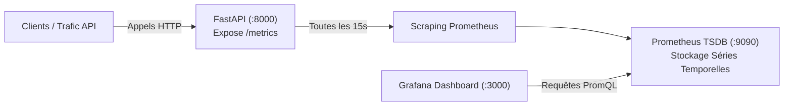

# 05 — Supervision avec Prometheus & Grafana
## Mesurer les Performances de l'API et Maîtriser PromQL pour l'Examen

Dans le référentiel **RNCP 38919 Bloc 3**, savoir déployer une API ne suffit pas : vous devez être capable de **surveiller sa santé en production**, d'écrire des requêtes **PromQL réelles** et de configurer des tableaux de bord **Grafana**.

---

## 1. Architecture de l'Observabilité



### Schéma ASCII équivalent

```text
+-----------------------------------------------------------------------------------+
|               FLUX DE COLLECTE ET VISUALISATION DES MÉTRIQUES                     |
+-----------------------------------------------------------------------------------+

   [Appels Utilisateurs sur /predict et /health]
                         │
                         ▼
             [FastAPI : app.main.py]
             • Instrumentator().instrument(app).expose(app)
             • Expose les métriques sur http://localhost:8000/metrics
                         │
                         │ Scraping toutes les 15s (config/prometheus.yml)
                         ▼
             [Serveur Prometheus :9090]
             • Stocke les séries temporelles (TSDB)
             • Exécute le moteur de requêtes PromQL
                         │
                         │ Requêtes graphiques (Datasource http://prometheus:9090)
                         ▼
             [Tableaux de Bord Grafana :3000]
             • Visualisation en temps réel (Jauges, Graphes de latence, RPS)
```

---

## 2. Comment l'API Expose ses Métriques (`/metrics`)

Dans [`app/main.py`](../reference_project/app/main.py), une seule ligne active toute la télémétrie :

```python
from prometheus_fastapi_instrumentator import Instrumentator

# À la fin de la déclaration des routes :
Instrumentator().instrument(app).expose(app)
```

Cette ligne intercepte automatiquement chaque requête entrante et calcule :
- Le nombre total de requêtes (`http_requests_total`)
- Le code de statut HTTP (`status="200"`, `status="422"`, etc.)
- La méthode HTTP (`method="GET"`, `method="POST"`)
- La durée exacte de traitement sous forme d'histogramme (`http_request_duration_seconds_bucket`)

---

## 3. Les Vraies Requêtes PromQL pour l'Examen

Le README de référence stipule : *« Documenter ici les noms de métriques réellement observés dans `/metrics` et les deux requêtes testées. Ne pas inventer un nom de métrique. »*

Voici les requêtes exactes générées par notre instrumentation :

### Requête 1 : Nombre total de requêtes par endpoint et par statut
```promql
http_requests_total{app="parcelpulse-api"}
```
*Cas d'usage : Permet de compter combien de prédictions et de vérifications de santé ont été reçues depuis le démarrage.*

---

### Requête 2 : Débit de requêtes par seconde (RPS)
```promql
rate(http_requests_total{app="parcelpulse-api"}[1m])
```
*Cas d'usage : Mesure l'affluence en temps réel (combien de requêtes par seconde arrivent sur l'API sur la dernière minute).*

---

### Requête 3 : Taux d'erreurs en pourcentage (Erreurs 4xx et 5xx)
```promql
sum(rate(http_requests_total{status=~"[45].."}[1m])) / sum(rate(http_requests_total[1m])) * 100
```
*Cas d'usage : Alerte immédiate si plus de 5 % des requêtes échouent (par exemple si des clients envoient du JSON malformé).*

---

### Requête 4 : Temps de réponse au 95e percentile (Latence p95)
```promql
histogram_quantile(0.95, sum(rate(http_request_duration_seconds_bucket[1m])) by (le))
```
*Cas d'usage : Garantit le respect du SLA : 95 % des prédictions sont rendues en moins de X secondes.*

---

## 4. Pratique : Générer du Trafic et Voir Bouger les Courbes

Assurez-vous que votre stack tourne (via `docker compose up -d` ou via votre déploiement local) :

### Étape 1 : Lancer un générateur de trafic
Exécutez cette boucle Bash dans votre terminal pour envoyer 50 requêtes variées :

```bash
for i in {1..50}; do
  # Requête GET health
  curl -s http://localhost:8000/health > /dev/null
  
  # Requête POST predict valide
  curl -s -X POST http://localhost:8000/predict \
    -H "Content-Type: application/json" \
    -d "{\"distance_km\": $((RANDOM % 50 + 1)), \"package_weight_kg\": $((RANDOM % 10 + 1))}" > /dev/null
  
  # Requête invalide (génère un code HTTP 422 pour les stats d'erreur)
  if [ $((i % 5)) -eq 0 ]; then
    curl -s -X POST http://localhost:8000/predict \
      -H "Content-Type: application/json" \
      -d "{\"distance_km\": \"invalide\"}" > /dev/null
  fi
  
  sleep 0.1
done
echo "Trafic envoyé avec succès !"
```

---

### Étape 2 : Visualiser dans Prometheus Web UI

1. Rendez-vous sur [http://localhost:9090/graph](http://localhost:9090/graph).
2. Dans le champ de recherche, entrez :
   ```promql
   sum by (status) (http_requests_total)
   ```
3. Cliquez sur l'onglet **Graph** : vous verrez instantanément la courbe des requêtes 200 monter, ainsi que la courbe des erreurs 422 générées !

---

### Étape 3 : Créer un Dashboard dans Grafana

1. Ouvrez Grafana : [http://localhost:3000](http://localhost:3000) (`admin` / `admin`).
2. Cliquez sur le menu de gauche : **Dashboards > New Dashboard > Add visualization**.
3. Sélectionnez la datasource **Prometheus** (pré-configurée).
4. Dans le champ **Code** (PromQL), entrez :
   ```promql
   rate(http_requests_total[1m])
   ```
5. Dans le panneau de droite, réglez le type de graphique : **Time series** ou **Gauge**.
6. Cliquez sur **Apply** en haut à droite : votre premier graphique de surveillance est opérationnel !

---

### Prochaine étape :

Consultez le guide [06_DEPANNAGE_ET_FAQ_DES_NULS.md](06_DEPANNAGE_ET_FAQ_DES_NULS.md) pour avoir sous la main toutes les solutions aux imprévus le jour de l'examen !
