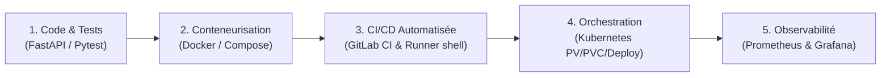

# Documentation de la Correction — Guide Complet pour les Débutants
## RNCP 38919 — Bloc 3 : Déploiement & Industrialisation (ParcelPulse)

Bienvenue dans la documentation complète de la correction de référence du projet d'examen **ParcelPulse** ([`../reference_project`](../reference_project)).

Ce guide a été rédigé avec une approche **« pour les nuls »** : aucun jargon n'est laissé sans explication, chaque commande est détaillée, et chaque étape est accompagnée de son résultat attendu et de ses solutions de dépannage.

---

## 🎯 Compétences RNCP 38919 Bloc 3 Couvertes

Le projet d'examen simule une mise en production complète d'un modèle d'IA/Machine Learning sous forme de microservice :



### Schéma ASCII équivalent

```text
+-----------------------------------------------------------------------------------------+
|                  CHAÎNE DE VALEUR TECHNIQUE — RNCP 38919 BLOC 3                         |
+-----------------------------------------------------------------------------------------+

 [1. Code & Tests] ──► [2. Docker & Compose] ──► [3. GitLab CI & Runner] ──► [4. K8s] ──► [5. Monitoring]
   • FastAPI             • Dockerfile multi-stage  • Pipeline automatique      • Namespace      • Prometheus
   • Pydantic            • docker-compose stack    • Pytest en conteneur 3.12   • PV / PVC       • Grafana
   • Joblib ML           • Isolation volumes       • docker build sur la VM     • Deployment     • PromQL
   • Pytest 100%                                   • Runner shell opérationnel  • Service        • Alerting
```

---

## 📚 Sommaire des Guides Pas à Pas

Pour comprendre et faire fonctionner le projet de référence à 100 %, suivez les guides dans l'ordre chronologique :

| N° | Fichier | Objectif et Contenu |
|:---:|---|---|
| **00** | [00_ARCHITECTURE_ET_FONCTIONNEMENT_GLOBAL.md](00_ARCHITECTURE_ET_FONCTIONNEMENT_GLOBAL.md) | **Comprendre le projet** : Scénario ParcelPulse, flux complets, rôles de chaque dossier et de notre Runner GitLab K8s sur AWS EC2. |
| **01** | [01_EXECUTION_LOCALE_PAS_A_PAS.md](01_EXECUTION_LOCALE_PAS_A_PAS.md) | **Tourner en local** : Créer le `.venv`, générer `model.joblib`, exécuter les tests `pytest`, démarrer l'API Uvicorn et tester avec `curl`. |
| **02** | [02_CONTENEURISATION_DOCKER_ET_COMPOSE.md](02_CONTENEURISATION_DOCKER_ET_COMPOSE.md) | **Conteneuriser** : Décryptage du Dockerfile, `docker build`, `docker run` et orchestration de la stack complète (API + Prometheus + Grafana) avec Compose. |
| **03** | [03_GITLAB_CI_ET_RUNNER_SHELL.md](03_GITLAB_CI_ET_RUNNER_SHELL.md) | **Automatiser avec GitLab** : Exploiter notre Runner GitLab opérationnel sur la VM AWS (`52.31.224.223`), configuration `.gitlab-ci.yml`, stages test & build. |
| **04** | [04_DEPLOIEMENT_KUBERNETES_PAS_A_PAS.md](04_DEPLOIEMENT_KUBERNETES_PAS_A_PAS.md) | **Déployer sur Kubernetes** : Les 6 manifests `k8s/`, persistance du modèle avec PV/PVC, l'astuce de l'`initContainer`, commandes `kubectl` et smoke tests. |
| **05** | [05_SUPERVISION_PROMETHEUS_ET_GRAFANA.md](05_SUPERVISION_PROMETHEUS_ET_GRAFANA.md) | **Superviser l'API** : Métriques `/metrics`, requêtes PromQL réelles (RPS, erreurs, latence), dashboard Grafana et simulation de charge en direct. |
| **06** | [06_DEPANNAGE_ET_FAQ_DES_NULS.md](06_DEPANNAGE_ET_FAQ_DES_NULS.md) | **La Boîte Anti-Panique** : Résolution en 1 clic de toutes les erreurs courantes (ModuleNotFoundError, pip --user, port déjà pris, K8s Pending, etc.). |
| **07** | [07_RUNBOOK_COMPLET_VALIDATION_ET_PIPELINE_CI.md](07_RUNBOOK_COMPLET_VALIDATION_ET_PIPELINE_CI.md) | **Le Runbook Exhaustive** : Procédure complète et vérifiée de A à Z — validation locale (tests, Compose, Prometheus/Grafana, kind), diagnostic de la VM AWS, création du projet GitLab, push, et le piège `privileged` de Docker-in-Docker démontré expérimentalement. |

---

## 🛠️ Contexte de l'Environnement Opérationnel

- **Poste Local (macOS) :** Développement, tests unitaires, client HTTP, `git push`.
- **Serveur Distant AWS EC2 (`52.31.224.223`) :**
  - Machine Ubuntu 22.04 LTS connectable via SSH (`ssh -i "./data_enginering_machine.pem" ubuntu@52.31.224.223`).
  - **GitLab Runner 100 % opérationnel** hébergé dans Kubernetes (`~/gitlab/kubernetes/runner`).
  - Capable d'exécuter automatiquement les jobs de test et de build Docker lors de chaque push Git !
