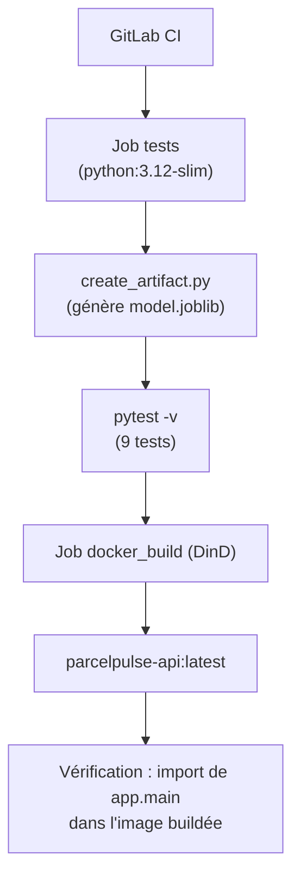

# ParcelPulse — RNCP 38919 Bloc 3 Practice (Projet de Référence)

> 📖 **Guide complet pour les débutants :**  
> Une documentation pas à pas complète (guides 00 à 06) est disponible dans le dossier [`../docs/`](../docs/README.md) pour comprendre, exécuter, tester et déployer ce projet à 100 %.

---

## Configuration de Référence

```text
APP_NAME      = parcelpulse-api
DEFAULT_PORT  = 8000
MODEL_PATH    = models/model.joblib
NAMESPACE     = parcelpulse
```

---

## Architecture de la Solution

### Ce que fait réellement `.gitlab-ci.yml`



Les étapes `docker push` vers Docker Hub et le déploiement Kubernetes sont **volontairement absents** du pipeline : elles exigent un registre et des secrets (`DOCKERHUB_USER`, `DOCKERHUB_TOKEN`) qui ne peuvent pas être versionnés. Le passage à la cible distante est documenté au §4.

### Chaîne de déploiement cible (hors pipeline automatique)

```text
GitLab (Dépôt)
  ↓
Runner (Kubernetes sur AWS EC2 52.31.224.223)
  ↓
Pytest (Tests unitaires & validation Pydantic)
  ↓
Docker (Build de l'image de conteneur)
  ↓
DockerHub / Registry
  ↓
Kubernetes (Deployment, PV/PVC, ConfigMap, Service)
  ↓
FastAPI (:8000)
  ↓
Prometheus (:9090)
  ↓
Grafana (:3000)
```

---

## 1. Exécution Locale

```bash
# 1. Préparer l'environnement
python3 -m venv .venv
source .venv/bin/activate
pip install -r requirements.txt

# 2. Générer l'artefact Machine Learning
#    (déjà versionné dans models/ : cette étape sert à le régénérer)
python scripts/create_artifact.py

# 3. Lancer les tests unitaires (9 tests : seuils du modèle, validation Pydantic, métriques)
python -m pytest -v

# 4. Démarrer l'API Uvicorn
python -m uvicorn app.main:app --host 0.0.0.0 --port 8000 --reload
```

> [!NOTE]
> Règle métier du modèle (`app/demo_model.py`) : `risk = 1` si `distance_km + 2 × package_weight_kg >= 20`, sinon `0`.
> Le smoke test valide les deux régimes (18.9 → `risk 0`, 30 → `risk 1`) et le seuil exact (20 → `risk 1`).

---

## 2. Conteneurisation Docker

```bash
# Construire l'image Docker
docker build -t parcelpulse-api:latest .

# Lancer le conteneur seul
docker run --rm -p 8000:8000 parcelpulse-api:latest
```

---

## 3. Orchestration Docker Compose (API + Prometheus + Grafana)

```bash
# Démarrer la stack complète en arrière-plan
docker compose up -d --build

# Vérifier l'état des conteneurs
docker compose ps

# Arrêter la stack
docker compose down
```

Accès aux interfaces :
- **FastAPI Docs :** [http://localhost:8000/docs](http://localhost:8000/docs)
- **Prometheus :** [http://localhost:9090/targets](http://localhost:9090/targets)
- **Grafana :** [http://localhost:3000](http://localhost:3000) (`admin` / `admin`)

> [!WARNING]
> La stack Compose et le `kubectl port-forward` du §4 utilisent **tous deux le port 8000** de votre machine.
> Arrêtez l'un avant de démarrer l'autre, sinon le conteneur (ou le tunnel) échoue au démarrage.

---

## 4. Déploiement Kubernetes

### Prérequis : un cluster local joignable

`kubectl apply` contacte l'API server Kubernetes. Si aucun cluster ne tourne, l'erreur est trompeuse — elle blamedes manifests alors que le cluster est simplement arrêté :

```text
error validating "k8s/configmap.yml": error validating data: failed to download openapi:
Get "https://127.0.0.1:54522/openapi/v2?timeout=32s": dial tcp 127.0.0.1:54522:
connect: connection refused
```

Ce message signifie « contexte Kubernetes mort », pas « YAML invalide ». Démarrez un cluster :

```bash
kind create cluster                     # kind (le plus rapide)
# ou : minikube start --driver=docker
# ou : k3d cluster create k3s-cluster
# ou : activer Kubernetes dans Docker Desktop

kubectl cluster-info                    # doit répondre
```

### Déploiement en une commande

```bash
bash scripts/deploy_k8s.sh
```

Le script enchaîne les étapes obligatoires et **échoue avec un message explicite** à la première qui manque :

| Étape | Action | Pourquoi |
|---|---|---|
| 1 | Vérifier que le cluster répond | Détecte le contexte mort (`connection refused`) |
| 2 | `docker build -t parcelpulse-api:latest .` | L'image doit exister |
| 3 | `kind load docker-image` / `minikube image load` | Le cluster **ne voit pas** les images construites sur l'hôte |
| 4 | `kubectl apply -f k8s/namespace.yml` puis `-f k8s/` | Voir l'encadré sur l'ordre alphabétique ci-dessous |
| 5 | `kubectl rollout restart` puis `rollout status` | Le tag `:latest` ne redéclenche pas de rollout tout seul |

> [!IMPORTANT]
> **Pourquoi le namespace est appliqué en deux fois ?**
> `kubectl apply -f <dossier>` traite les fichiers par **ordre alphabétique** : `configmap.yml` et `deployment.yml` passent **avant** `namespace.yml`, et échouent avec
> `Error from server (NotFound): namespaces "parcelpulse" not found`.
> Un second `kubectl apply -f k8s/` rattrape l'erreur, mais le déploiement n'est propre qu'en appliquant le namespace d'abord.

### Validation en une seule commande

```bash
bash scripts/deploy_k8s.sh --smoke
```

Le même déploiement, suivi du smoke test **sans manipulation de terminal supplémentaire** : le script ouvre un `port-forward` temporaire sur un port libre, enchaîne les 11 assertions, puis referme le tunnel.

Ce mode résout la friction classique du `port-forward` : le processus est lié au pod qu'il cible, donc le `rollout restart` de l'étape 5 le coupe systématiquement. Sans `--smoke`, il faut rouvrir le tunnel après chaque déploiement.

### Équivalent manuel

```bash
# 1. Image disponible dans le cluster (obligatoire avec kind/minikube)
docker build -t parcelpulse-api:latest .
kind load docker-image parcelpulse-api:latest

# 2. Manifests, namespace en premier
kubectl apply -f k8s/namespace.yml
kubectl apply -f k8s/

# 3. Vérifier l'état (pod 1/1 Running, PVC Bound)
kubectl get all,pvc -n parcelpulse

# 4. Ouvrir l'accès en local (laisse ce terminal occupé)
kubectl port-forward svc/parcelpulse-api-service 8000:8000 -n parcelpulse

# 5. Dans un AUTRE terminal : valider l'API
bash scripts/smoke_test.sh
```

### Nettoyage

```bash
bash scripts/undeploy_k8s.sh
```

Supprime le namespace, les objets namespacés **et** le PersistentVolume. Ce dernier est indispensable à supprimer : avec `persistentVolumeReclaimPolicy: Retain`, un PV laissé derrière reste à l'état `Released` et bloque la création du prochain PVC (statut `Pending` indéfiniment).

### Déploiement sur un registre distant (Docker Hub)

Pour un cluster distant, l'image locale n'est pas transférable. Poussez-la puis adaptez `k8s/deployment.yml` :

```bash
docker tag parcelpulse-api:latest <DOCKERHUB_USER>/parcelpulse-api:latest
docker push <DOCKERHUB_USER>/parcelpulse-api:latest
```

```yaml
# k8s/deployment.yml — conteneur ET initContainer
image: <DOCKERHUB_USER>/parcelpulse-api:latest
imagePullPolicy: Never   # ou IfNotPresent avec un tag immuable (ex. :1.0.0)
```

---

## 5. Requêtes PromQL Réellement Observées

`prometheus_fastapi_instrumentator` expose les métriques avec les libellés **`handler`, `method` et `status`** — il n'existe **aucun libellé `app`** :

```text
http_requests_total{handler="/predict", method="POST", status="2xx"} 4.0
```

> [!WARNING]
> Une requête filtrée par `{app="parcelpulse-api"}` ne renvoie **rien** : aucun_series ne contient ce libellé. Filtrez par `handler`, `method` ou `status`.

1. **Compteur total des requêtes reçues :**
   ```promql
   http_requests_total
   ```

2. **Débit de requêtes par seconde (RPS sur 1 minute) :**
   ```promql
   sum(rate(http_requests_total[1m]))
   ```

3. **Taux d'erreurs (codes 4xx et 5xx), en pourcentage :**
   ```promql
   sum(rate(http_requests_total{status=~"[45].."}[1m]))
     / sum(rate(http_requests_total[1m])) * 100
   ```

4. **Latence 95e percentile (buckets fins par handler) :**
   ```promql
   histogram_quantile(
     0.95,
     sum(rate(http_request_duration_highr_seconds_bucket[1m])) by (le)
   )
   ```

5. **Latence moyenne par endpoint (histogramme `http_request_duration_seconds`) :**
   ```promql
   sum(rate(http_request_duration_seconds_sum[1m]))
     / sum(rate(http_request_duration_seconds_count[1m]))
   ```

6. **Répartition des codes de retour :**
   ```promql
   sum by (status) (rate(http_requests_total[5m]))
   ```
