# LAB 01 — Bash, Variables d'Environnement et Environnements Virtuels (venv)

Ce premier lab pose les bases indispensables de la chaîne DevOps : la gestion des variables d'environnement sous Bash/Zsh, la persistance dans les fichiers de configuration du shell, la lecture de ces variables en Python et l'isolation des dépendances via `venv`.

---

## 1. Objectifs Pédagogiques

- Déclarer et exporter des variables avec `export` ;
- Comprendre la persistance dans `~/.bashrc` (Linux) ou `~/.zshrc` (macOS) ;
- Comprendre la différence critique entre exécuter (`./script.sh`) et sourcer (`source ./script.sh`) ;
- Lire les variables d'environnement depuis Python avec `os.getenv` ;
- Créer, activer et vérifier un environnement virtuel Python (`venv`).

---

## 2. Concept Clé : `./script.sh` (Sous-shell) vs `source ./script.sh` (Shell courant)

C'est l'un des pièges les plus récurrents pour les candidats :

```mermaid
flowchart TD
    subgraph Execution["Exécution classique avec ./commands.sh"]
        A[Terminal Actuel] -->|Crée un sous-shell éphémère| B[Nouveau processus Bash]
        B -->|export APP_ENV & activate venv| C[Variables locales au sous-shell]
        C -->|Fin du script| D[Destruction du sous-shell]
        D -->|Retour au terminal| E[❌ Les exports et le venv sont PERDUS]
    end

    subgraph Sourcing["Exécution avec source ./commands.sh"]
        F[Terminal Actuel] -->|Exécute dans le shell courant| G[export APP_ENV & activate venv]
        G --> H[✅ Le venv reste actif et les variables sont conservées]
    end
```



*Équivalent en diagramme ASCII :*

```text
+-------------------------------------------------------------------------+
| Mode 1 : ./commands.sh (Exécution dans un sous-shell éphémère)          |
|                                                                         |
|   [Votre Terminal]                                                      |
|          |                                                              |
|          v (Fork d'un processus enfant distinct)                       |
|   [Sous-shell temporaire] ---> export APP_ENV & source .venv/bin/activate|
|          |                                                              |
|          v (Fin du script -> Destruction du processus enfant)           |
|   [Votre Terminal]        ---> ❌ Les variables et le venv sont PERDUS  |
+-------------------------------------------------------------------------+

+-------------------------------------------------------------------------+
| Mode 2 : source ./commands.sh (ou . ./commands.sh dans le shell courant)|
|                                                                         |
|   [Votre Terminal]                                                      |
|          |                                                              |
|          v (Exécution directe dans la session actuelle)                 |
|   [Votre Terminal]        ---> ✅ APP_ENV et (.venv) RESTENT ACTIFS     |
+-------------------------------------------------------------------------+
```

> **Règle d'or :** Si un script a pour but de modifier votre environnement de travail (définir des `export` ou activer un `.venv`), il **doit être sourcé** avec `source ./script.sh` ou `. ./script.sh`.

---

## 3. Permissions d'Exécution (`chmod +x`)

Si vous tentez d'exécuter un script directement et obtenez :
```text
zsh: permission denied: ./commands.sh
```
C'est que le fichier ne possède pas les droits d'exécution. Pour les accorder :
```bash
chmod +x solution/commands.sh
chmod +x starter/commands.sh

chmod +x ./commands.sh
```

---

## 4. Exercices Pas à Pas

### Étape 1 : Exporter des variables d'environnement
Dans votre terminal :
```bash
export APP_ENV=practice
export API_PORT=8000
```

Vérifier la prise en compte :
```bash
echo "$APP_ENV"
echo "$API_PORT"
env | grep -E "APP_ENV|API_PORT"
```

### Étape 2 : Rendre les variables persistantes
Ajouter ces variables à votre fichier de configuration shell :
* **Sous Linux (Bash) :** `~/.bashrc`
  ```bash
  echo 'export APP_ENV=practice' >> ~/.bashrc
  source ~/.bashrc
  ```
* **Sous macOS (Zsh) :** `~/.zshrc`
  ```bash
  echo 'export APP_ENV=practice' >> ~/.zshrc
  source ~/.zshrc
  ```

### Étape 3 : Lire les variables en Python
Compléter le fichier [`starter/env_demo.py`](./starter/env_demo.py) pour lire les variables :
```python
import os

app_env = os.getenv("APP_ENV", "development")
api_port = int(os.getenv("API_PORT", "8000"))

print(f"Environnement : {app_env}")
print(f"Port API      : {api_port}")
```

Tester l'exécution :
```bash
python starter/env_demo.py
```

### Étape 4 : Créer et activer un environnement virtuel
1. Créer l'environnement virtuel `.venv` :
   ```bash
   python3 -m venv .venv
   ```
2. L'activer dans le terminal courant :
   ```bash
   source .venv/bin/activate
   ```
3. Vérifier que l'interpréteur Python pointe bien vers le dossier local `.venv` :
   ```bash
   which python
   # Doit afficher : .../LAB_01_BASH_ENV_VENV/.venv/bin/python
   ```
4. Pour désactiver le venv une fois terminé :
   ```bash
   deactivate
   ```

---

## 5. Exécution Automatisée de la Solution

Le script [`solution/commands.sh`](./solution/commands.sh) automatise l'ensemble de ces étapes.

Pour l'exécuter tout en conservant le venv et les variables actifs :
```bash
cd solution
source ./commands.sh
```

Sortie attendue :
```text
APP_ENV=practice
API_PORT=8000
Python actif : /Users/.../labs/LAB_01_BASH_ENV_VENV/solution/.venv/bin/python
```
