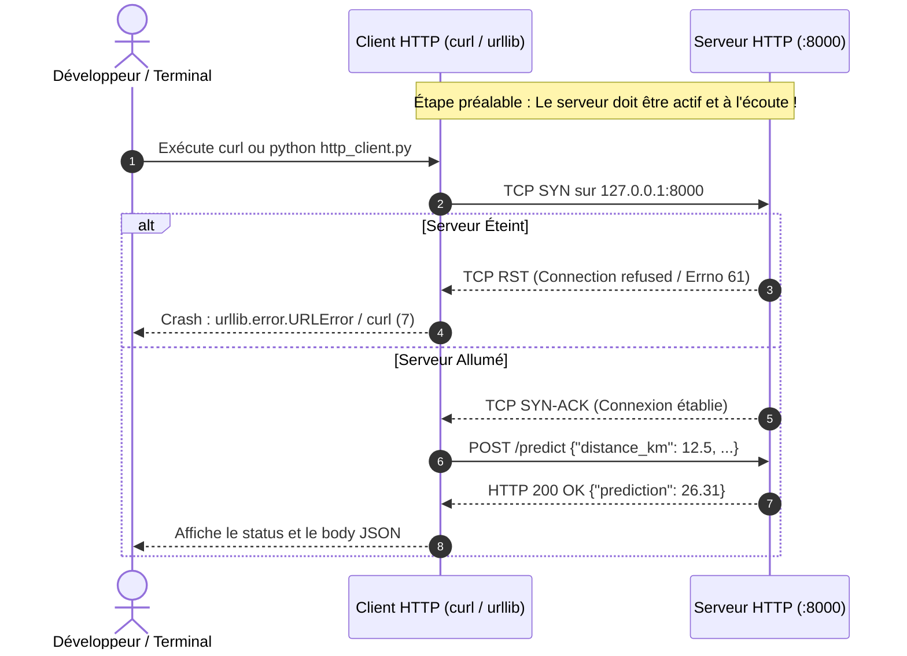
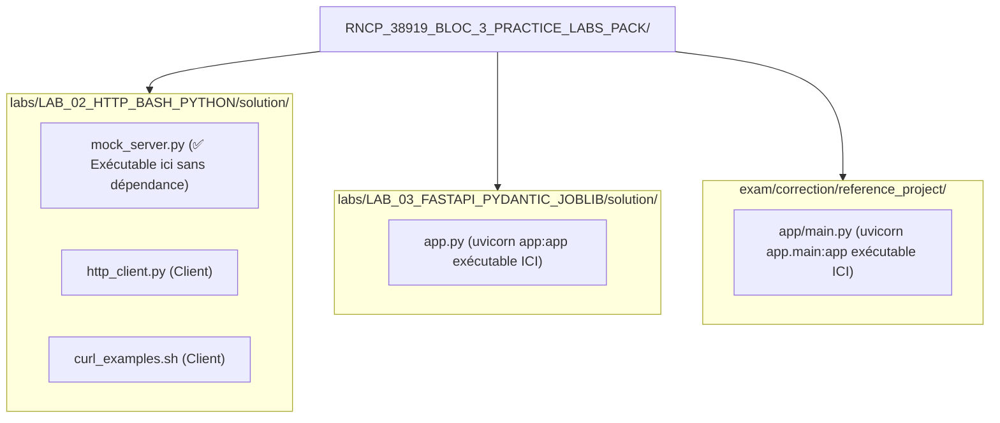

# LAB 02 — HTTP avec Bash et Python

## Objectifs pédagogiques

- Comprendre le modèle **Client-Serveur** HTTP ;
- Tester un endpoint GET avec `curl` en inspectant les en-têtes de réponse (`-i`) ;
- Envoyer un payload JSON en POST avec `curl` (`-H "Content-Type: application/json"` et `-d`) ;
- Effectuer une requête POST programmée en Python pur avec la bibliothèque standard `urllib.request`.

---

## Architecture Client / Serveur



### Schéma ASCII équivalent

```text
+-----------------------------------------------------------------------------------+
|               FLUX DE COMMUNICATION CLIENT-SERVEUR HTTP (LAB 02)                  |
+-----------------------------------------------------------------------------------+

     [Terminal Développeur]
               │
               ▼  1. Lance le client
  +──────────────────────────────+
  │ Client HTTP :                │
  │ • curl_examples.sh           │
  │ • http_client.py (urllib)    │
  +──────────────────────────────+
               │
               │  2. Tentative de poignée de main TCP vers http://localhost:8000
               ▼
   CAS A : SERVEUR ÉTEINT                 CAS B : SERVEUR ACTIF (mock_server.py / uvicorn)
  +──────────────────────────────+        +───────────────────────────────────────────────+
  │ Aucun processus n'écoute     │        │ Processus en écoute sur 0.0.0.0:8000          │
  │ sur le port 8000             │        +───────────────────────────────────────────────+
  +──────────────────────────────+                               │
               │                                                 │ 3. Échange HTTP
               ▼                                                 ▼
  [Kernel OS : TCP RST envoyé]            [POST /predict -> JSON reçu et traité]
               │                                                 │
               ▼                                                 ▼
  ❌ Erreurs observées :                   ✅ Réponse HTTP 200 OK :
  • Python : Errno 61 Connection refused  • Headers: Content-Type: application/json
  • cURL   : curl (7) Failed to connect   • Body: {"prediction": 26.31, ...}
```

---

## Démarrage du Serveur : 3 Options au choix

Pour exécuter les exercices, vous devez activer une API sur le port 8000. Choisissez l'option qui vous convient le mieux :

### Option A : Serveur Mock Autonome (Recommandé pour ce Lab — Zéro Dépendance)
Un serveur HTTP Python standard est fourni directement dans ce lab. Il ne nécessite **aucune installation externe** (ni FastAPI, ni Uvicorn) et se lance immédiatement dans le dossier courant :

Dans un **second terminal** (ou en arrière-plan avec `&`) :
```bash
# Depuis labs/LAB_02_HTTP_BASH_PYTHON/solution (ou starter)
python mock_server.py
```

> [!TIP]
> **Lancer en arrière-plan dans le même terminal :**
> ```bash
> python mock_server.py &
> ```
> *Pour l'arrêter plus tard : `kill %1` ou `pkill -f mock_server.py`.*

---

### Option B : API FastAPI du LAB 03
Si vous avez déjà installé les dépendances du projet (`fastapi`, `uvicorn`) et souhaitez tester l'API du lab suivant :

> [!IMPORTANT]
> Vous **devez impérativement vous placer dans le dossier du LAB 03** avant de lancer `uvicorn app:app` (sinon Python ne trouvera pas le fichier `app.py`).

Dans un **second terminal** :
```bash
cd ../LAB_03_FASTAPI_PYDANTIC_JOBLIB/solution
uvicorn app:app --port 8000 --reload
```
*Ou en une seule commande depuis LAB_02 :*
```bash
(cd ../LAB_03_FASTAPI_PYDANTIC_JOBLIB/solution && uvicorn app:app --port 8000)
```

---

### Option C : API du Projet de Référence Examen
Pour tester contre l'API complète du projet d'examen :

> [!CAUTION]
> **Attention au répertoire d'exécution :** Si vous lancez `uvicorn app.main:app --port 8000` directement depuis `labs/LAB_02_HTTP_BASH_PYTHON/solution`, la commande échouera avec :
> ```text
> ModuleNotFoundError: No module named 'app'
> ```
> Le package Python `app` n'existe que dans le dossier `exam/correction/reference_project` !

Dans un **second terminal** :
```bash
# 1. Naviguez d'abord dans le dossier du projet de référence :
cd ../../exam/correction/reference_project

# 2. Puis lancez Uvicorn :
uvicorn app.main:app --port 8000
```
*Ou en une seule commande protégée depuis LAB_02 :*
```bash
(cd ../../exam/correction/reference_project && uvicorn app.main:app --port 8000)
```

---

## Guide de Dépannage et Erreurs Fréquentes

### 1. `ModuleNotFoundError: No module named 'app'`
```text
Traceback (most recent call last):
  ...
  File "<frozen importlib._bootstrap>", line 1324, in _find_and_load_unlocked
ModuleNotFoundError: No module named 'app'
```
* **Cause :** Vous avez tapé `uvicorn app.main:app` ou `uvicorn app:app` alors que votre terminal se trouve dans `labs/LAB_02_HTTP_BASH_PYTHON/solution`. Uvicorn recherche un dossier ou package nommé `app` dans votre répertoire de travail actuel (`pwd`). Or, dans `LAB_02`, ce package n'existe pas.
* **Solution :** 
  - Soit vous utilisez le serveur mock local prévu pour ce lab : `python mock_server.py` ;
  - Soit vous naviguez d'abord dans le bon dossier : `cd ../../exam/correction/reference_project && uvicorn app.main:app --port 8000`.

### 2. `Connection refused [Errno 61]` ou `curl: (7) Failed to connect`
```text
urllib.error.URLError: <urlopen error [Errno 61] Connection refused>
curl: (7) Failed to connect to localhost port 8000 after 0 ms: Couldn't connect to server
```
* **Cause :** Aucun serveur n'écoute actuellement sur le port `8000`. `http_client.py` et `curl_examples.sh` sont des clients qui nécessitent un serveur actif.
* **Solution :** Démarrez `python mock_server.py` dans un terminal avant d'exécuter les clients.

---

## Diagramme d'Arborescence & Résolution des Modules



### Schéma ASCII d'Arborescence

```text
+-----------------------------------------------------------------------------------+
|               EMPLACEMENT DES SERVEURS SELON LE RÉPERTOIRE ACTUEL                 |
+-----------------------------------------------------------------------------------+

RNCP_38919_BLOC_3_PRACTICE_LABS_PACK/
│
├── labs/LAB_02_HTTP_BASH_PYTHON/solution/  ◄── VOUS ÊTES ICI (pwd)
│   ├── mock_server.py         ──► python mock_server.py (✅ Fonctionne immédiatement !)
│   ├── http_client.py         ──► Client Python
│   └── curl_examples.sh       ──► Client cURL
│
├── labs/LAB_03_FASTAPI_PYDANTIC_JOBLIB/solution/
│   └── app.py                 ──► uvicorn app:app (⚠️ Exécutable depuis ce dossier)
│
└── exam/correction/reference_project/
    └── app/
        └── main.py            ──► uvicorn app.main:app (⚠️ Exécutable depuis reference_project)
```

---

## Exercices pas à pas

Une fois le serveur démarré sur le port 8000 (par exemple avec `python mock_server.py`) :

### 1. Tester avec cURL en ligne de commande

Vérification de l'endpoint de santé `/health` :
```bash
curl -i http://localhost:8000/health
```
*Sortie attendue : En-têtes HTTP avec statut `HTTP/1.1 200 OK` et payload JSON `{"status": "ok", ...}`.*

Envoi d'un payload JSON en POST sur `/predict` :
```bash
curl -X POST http://localhost:8000/predict \
  -H "Content-Type: application/json" \
  -d '{"distance_km": 12.5, "package_weight_kg": 3.2}'
```
*Sortie attendue : Payload JSON avec la prédiction calculée.*

Ou exécutez directement le script fourni :
```bash
./curl_examples.sh
```

---

### 2. Tester avec le Client Python (`urllib.request`)

Exécutez le client HTTP en Python :
```bash
python http_client.py
```

*Sortie attendue :*
```text
status: 200
body: {
  "prediction": 26.31,
  "unit": "minutes",
  "model_version": "mock-delivery-v1",
  "received_features": {
    "distance_km": 12.5,
    "package_weight_kg": 3.2
  }
}
```

---

## Structure du Lab

```text
labs/LAB_02_HTTP_BASH_PYTHON/
├── README.md                 # Guide complet, architecture et guide de dépannage
├── starter/
│   ├── mock_server.py        # Serveur de test autonome (Python stdlib)
│   ├── curl_examples.sh      # Squelette cURL à compléter
│   └── http_client.py        # Squelette client urllib avec TODOs
└── solution/
    ├── mock_server.py        # Serveur de test autonome prêt à l'emploi
    ├── curl_examples.sh      # Script cURL complet
    └── http_client.py        # Client urllib complet avec gestion d'erreurs
```
