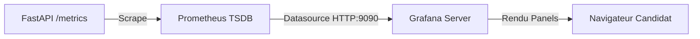

# Plan de Tableau de Bord Grafana — ParcelPulse Monitoring

Ce document décrit la structure complète et reproductible du tableau de bord Grafana pour l'application **ParcelPulse**.

---

## 1. Flux de restitution des données



```text
+-------------------+       +--------------------+       +------------------+
| FastAPI /metrics  | ----> | Prometheus (:9090) | ----> | Grafana (:3000)  |
+-------------------+       +--------------------+       +------------------+
                                                                   |
                                                                   v
                                                        [Tableau de Bord Candidat]
```

---

## 2. Configuration de la Datasource (Provisioning)

Fichier : `grafana/provisioning/datasources/prometheus.yml`

```yaml
apiVersion: 1

datasources:
  - name: Prometheus
    type: prometheus
    access: proxy
    url: http://prometheus:9090
    isDefault: true
    editable: true
```

---

## 3. Spécification des Panels du Dashboard

Nom du Dashboard : **ParcelPulse Production Monitoring**  
Rafraîchissement conseillé : **5s**  
Plage temporelle par défaut : **Last 15 minutes**

### Panel 1 — Service Availability (Statut UP/DOWN)
* **Type de visualisation :** `Stat`
* **Requête PromQL :**
  ```promql
  up{job="fastapi"}
  ```
* **Configuration d'affichage :**
  * Value mappings : `1` $\rightarrow$ "OPERATIONAL" (Vert), `0` $\rightarrow$ "DOWN" (Rouge).

---

### Panel 2 — Global Request Rate (Débit de requêtes)
* **Type de visualisation :** `Time Series`
* **Titre :** `Requests per Second (RPS)`
* **Requête PromQL :**
  ```promql
  sum(rate(http_requests_total[2m]))
  ```
* **Unité :** `reqps (requests/sec)`

---

### Panel 3 — Request Distribution by HTTP Status
* **Type de visualisation :** `Time Series` ou `Bar Gauge`
* **Titre :** `HTTP Responses by Status Code`
* **Requête PromQL :**
  ```promql
  sum by (status) (rate(http_requests_total[2m]))
  ```
* **Légende :** `Status {{status}}`

---

### Panel 4 — Request Latency Percentiles (p50 / p95)
* **Type de visualisation :** `Time Series`
* **Titre :** `API Latency (p50 & p95)`
* **Requête A (p50 / Médiane) :**
  ```promql
  histogram_quantile(0.50, sum by (le) (rate(http_request_duration_seconds_bucket[2m])))
  ```
* **Requête B (p95 / Queue de distribution) :**
  ```promql
  histogram_quantile(0.95, sum by (le) (rate(http_request_duration_seconds_bucket[2m])))
  ```
* **Unité :** `seconds (s)`

---

### Panel 5 — Memory Usage (Résident)
* **Type de visualisation :** `Gauge`
* **Titre :** `Process Memory RSS`
* **Requête PromQL :**
  ```promql
  process_resident_memory_bytes{job="fastapi"} / 1024 / 1024
  ```
* **Unité :** `Data / Megabytes (MB)`
* **Seuils (Thresholds) :** Base : Vert, 200 MB : Orange, 400 MB : Rouge.
