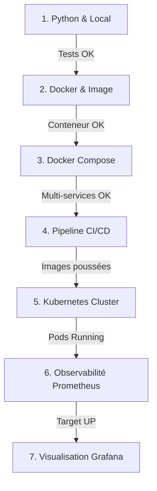

# Guide de Dépannage Méthodique — Bloc 3 DevOps

Ce document présente l'arbre de décision et la matrice de résolution des incidents types pour l'épreuve RNCP 38919.

---

## 1. Arbre de décision & Ordre d'investigation

Ne jamais déboguer une couche supérieure tant que la couche sous-jacente n'est pas 100% saine.



```text
+-------------------------------------------------------------------------+
|                  Arbre d'Investigation Séquentiel                       |
+-------------------------------------------------------------------------+
 [1. Local & Tests] ---> Valider syntaxe, venv, modèle et Pytest
          |
          v
 [2. Docker Local]  ---> Valider Dockerfile, build d'image et port binding
          |
          v
 [3. Compose Stack] ---> Valider réseau interne, depends_on et volumes
          |
          v
 [4. CI/CD Runner]  ---> Valider exécution des jobs et authentification Hub
          |
          v
 [5. Kubernetes]    ---> Valider PV/PVC Bound, Pods Running, Service exposé
          |
          v
 [6. Prometheus]    ---> Valider scraping /metrics et statut Target UP
          |
          v
 [7. Grafana]       ---> Valider Datasource et requêtes PromQL des panels
+-------------------------------------------------------------------------+
```

---

## 2. Matrice de diagnostic des 7 pannes majeures

| Niveau | Symptôme observé | Commande de diagnostic | Cause la plus fréquente | Action corrective |
|---|---|---|---|---|
| **Local** | `AttributeError: Can't get attribute '...' on <module '__main__'>` | `python -c "import joblib; joblib.load('models/model.joblib')"` | Modèle sérialisé dans le scope `__main__` du script générateur | Isoler la classe dans un module distinct (`app/demo_model.py`) et la réimporter avant `dump()` |
| **Local** | `422 Unprocessable Entity` inattendu sur `/predict` | `curl -v -X POST .../predict -d '{...}'` | Mauvais types de champs (ex: string au lieu de float) dans le payload JSON | Vérifier la concordance entre le JSON envoyé et le schéma Pydantic `PredictionInput` |
| **Docker** | Conteneur s'arrête immédiatement (`Exited (1)`) | `docker logs <container_id>` | Fichier introuvable, variable d'environnement manquante ou erreur de syntaxe | Lancer en interactif : `docker run -it --entrypoint bash <image>` pour inspecter le système de fichiers |
| **CI/CD** | Job bloqué indéfiniment à l'état `Pending` | Vérifier l'interface GitLab CI | Runner Shell inactif, mauvais tag de job ou Runner non assigné | Vérifier l'état du service runner : `sudo gitlab-runner status` ou relancer l'enregistrement |
| **K8s** | Pod au statut `CrashLoopBackOff` | `kubectl logs <pod_name> -n <ns>` et `kubectl describe pod <pod_name> -n <ns>` | Échec au chargement du modèle (volume vide) ou commande CMD invalide | Vérifier la présence du fichier dans le montage et utiliser un `initContainers` de secours |
| **K8s** | PVC bloqué au statut `Pending` | `kubectl describe pvc <pvc_name> -n <ns>` | Discordance de `storageClassName` ou capacité demandée supérieure au PV | Spécifier `storageClassName: manual` sur le PV et le PVC avec la même capacité |
| **Monitoring**| Cible Prometheus à l'état `DOWN` | Accéder à l'UI Prometheus : `http://localhost:9090/targets` | Mauvais nom d'hôte dans `targets: ['...']` ou route `/metrics` non exposée | Utiliser le nom du service Docker Compose (`api:8000`) et vérifier que l'instrumentateur est initialisé |

---

## 3. Boîte à outils de commandes d'urgence

```bash
# Vérifier la réponse HTTP locale
curl -s -o /dev/null -w "%{http_code}\n" http://localhost:8000/health

# Voir les 50 dernières lignes de logs d'un conteneur avec horodatage
docker logs --tail 50 -t parcelpulse-api

# Suivre en direct les logs d'un pod Kubernetes
kubectl logs -f -l app=parcelpulse-api -n parcelpulse

# Débugger interactivement les connexions réseau dans le cluster
kubectl run debug-net --rm -i --tty --image=curlimages/curl -- curl -Iv http://parcelpulse-service:8000/health
```
