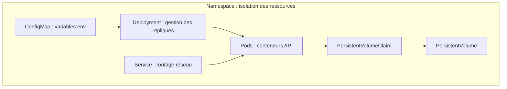

# 08 — RNCP 38919 — Bloc 3
# Guide Kubernetes

**Certification :** RNCP 38919 — Data Engineer  
**Sprint :** Sprint 19 — Préparation RNCP 38919  
**Épreuve :** Bloc 3 — Data Engineer / DevOps  
**Durée officielle :** 4 heures

**Source principale :**
- `Examen RNCP 38919 _ Bloc 3 - Data Engineer . DevOps.md`

> **Convention**
>
> - **Attendu source** : élément explicitement annoncé dans le support DataScientest.
> - **Guide pratique** : exemples YAML, commandes et mini-labs proposés pour la préparation.
>
> Le support annonce explicitement les objets Kubernetes suivants :
>
> ```text
> Namespaces
> PersistentVolumes
> PersistentVolumeClaims
> ConfigMaps
> Services
> Deployments
> ```
>
> Il ne fournit pas, dans la page source, un manifeste exact à reproduire ni un cluster précis.
> Les exemples ci-dessous servent donc de **patterns de pratique**.

---

# 1. Position de Kubernetes dans le Bloc 3

## Attendu source

Kubernetes fait partie du périmètre officiel avec :

```text
Namespace
PV
PVC
ConfigMap
Service
Deployment
```

## Modèle mental

```text
DockerHub Image
      ↓
Deployment
      ↓
Pods
      ↓
Service
      ↓
Application
```

Configuration :

```text
ConfigMap
   ↓
Deployment / Pods
```

Stockage :

```text
Pod
 ↓
PVC
 ↓
PV
```

---

# 2. Vue d’ensemble des objets à connaître



```text
+-----------------------------------------------------------------+
|               Namespace (Isolation des ressources)              |
|                                                                 |
|   [ConfigMap] -------------------> [Deployment]                 |
|   (Variables d'env)                      |                      |
|                                          v                      |
|   [Service K8s] -------------> [Pods applicatifs]               |
|   (Routage & Port 8000)                  |                      |
|                                          v                      |
|                              [PersistentVolumeClaim]            |
|                                          |                      |
|                                          v                      |
|                               [PersistentVolume]                |
+-----------------------------------------------------------------+
```

---

# 3. Namespace

## Attendu source

Le support demande la gestion des :

```text
Namespaces
```

## Guide pratique

Un Namespace permet de regrouper et isoler logiquement des ressources Kubernetes.

Exemple :

```yaml
apiVersion: v1
kind: Namespace
metadata:
  name: rncp-bloc3
```

---

# 4. Créer un Namespace

```bash
kubectl apply \
  -f namespace.yml
```

Vérifier :

```bash
kubectl get namespaces
```

---

# 5. Utiliser un Namespace

Pattern :

```bash
kubectl get pods \
  -n rncp-bloc3
```

Appliquer une ressource :

```bash
kubectl apply \
  -f deployment.yml \
  -n rncp-bloc3
```

---

# 6. Namespace dans le YAML

Alternative :

```yaml
metadata:
  name: api
  namespace: rncp-bloc3
```

---

# 7. ConfigMap

## Attendu source

Le support cite :

```text
ConfigMaps
```

## Guide pratique

Une ConfigMap sert à externaliser de la configuration non sensible.

Exemple :

```yaml
apiVersion: v1
kind: ConfigMap
metadata:
  name: api-config
  namespace: rncp-bloc3
data:
  APP_ENV: production
  MODEL_PATH: /models/model.joblib
```

---

# 8. ConfigMap — logique

```text
CODE
≠
CONFIG
```

Pattern :

```text
ConfigMap
   ↓
Pod env vars
   ↓
Python os.getenv(...)
```

---

# 9. Injecter une valeur ConfigMap

Dans un Deployment :

```yaml
env:
  - name: APP_ENV
    valueFrom:
      configMapKeyRef:
        name: api-config
        key: APP_ENV
```

---

# 10. Injecter toute la ConfigMap

Pattern :

```yaml
envFrom:
  - configMapRef:
      name: api-config
```

> `envFrom` n’est pas cité dans la page source, mais c’est un pattern de pratique utile pour relier ConfigMap et Deployment.

---

# 11. Vérifier les ConfigMaps

```bash
kubectl get configmaps \
  -n rncp-bloc3
```

Détail :

```bash
kubectl describe configmap \
  api-config \
  -n rncp-bloc3
```

---

# 12. Deployment

## Attendu source

Le support cite :

```text
Deployments
```

## Guide pratique

Le Deployment gère le déploiement de l’application.

Modèle :

```text
Deployment
   ↓
Pods
```

---

# 13. Deployment minimal

```yaml
apiVersion: apps/v1
kind: Deployment
metadata:
  name: api
  namespace: rncp-bloc3

spec:
  replicas: 1

  selector:
    matchLabels:
      app: api

  template:
    metadata:
      labels:
        app: api

    spec:
      containers:
        - name: api
          image: USER/rncp-bloc3:latest
          ports:
            - containerPort: 8000
```

---

# 14. Les trois zones critiques du Deployment

À retenir :

```text
metadata
spec.selector
spec.template
```

et surtout :

```text
selector.matchLabels
=
template.metadata.labels
```

---

# 15. Erreur classique — labels incompatibles

Incorrect :

```yaml
selector:
  matchLabels:
    app: api
```

mais :

```yaml
template:
  metadata:
    labels:
      app: backend
```

Problème :

```text
selector
≠
labels
```

---

# 16. Réplicas

Pattern :

```yaml
spec:
  replicas: 2
```

Signifie :

```text
2 Pods désirés
```

Le support ne fixe pas un nombre précis de replicas.

---

# 17. Image DockerHub

Dans le Deployment :

```yaml
image: USER/rncp-bloc3:latest
```

Chaîne :

```text
DockerHub
↓
Kubernetes
↓
Deployment
↓
Pods
```

---

# 18. Port container

```yaml
ports:
  - containerPort: 8000
```

Ce port doit être cohérent avec l’application.

Exemple FastAPI :

```text
uvicorn
→ port 8000
```

---

# 19. ConfigMap dans le Deployment

```yaml
envFrom:
  - configMapRef:
      name: api-config
```

---

# 20. Deployment avec ConfigMap

```yaml
apiVersion: apps/v1
kind: Deployment
metadata:
  name: api
  namespace: rncp-bloc3

spec:
  replicas: 1

  selector:
    matchLabels:
      app: api

  template:
    metadata:
      labels:
        app: api

    spec:
      containers:
        - name: api
          image: USER/rncp-bloc3:latest

          ports:
            - containerPort: 8000

          envFrom:
            - configMapRef:
                name: api-config
```

---

# 21. Appliquer le Deployment

```bash
kubectl apply \
  -f deployment.yml
```

---

# 22. Vérifier le Deployment

```bash
kubectl get deployments \
  -n rncp-bloc3
```

---

# 23. Vérifier les Pods

```bash
kubectl get pods \
  -n rncp-bloc3
```

---

# 24. Détail d’un Pod

```bash
kubectl describe pod \
  <pod-name> \
  -n rncp-bloc3
```

---

# 25. Logs d’un Pod

```bash
kubectl logs \
  <pod-name> \
  -n rncp-bloc3
```

Suivi :

```bash
kubectl logs \
  -f \
  <pod-name> \
  -n rncp-bloc3
```

---

# 26. Service

## Attendu source

Le support cite :

```text
Services
```

## Guide pratique

Un Service permet d’exposer logiquement des Pods.

Modèle mental :

```text
Client
 ↓
Service
 ↓
Pods
```

---

# 27. Service minimal

```yaml
apiVersion: v1
kind: Service
metadata:
  name: api-service
  namespace: rncp-bloc3

spec:
  selector:
    app: api

  ports:
    - port: 8000
      targetPort: 8000
```

---

# 28. Selector du Service

Le selector doit correspondre aux labels des Pods :

```yaml
selector:
  app: api
```

et :

```yaml
labels:
  app: api
```

---

# 29. Service — relation clé

```text
Service selector
=
Pod labels
```

Sinon :

```text
Service
→ aucun endpoint utile
```

---

# 30. Vérifier les Services

```bash
kubectl get services \
  -n rncp-bloc3
```

---

# 31. Décrire un Service

```bash
kubectl describe service \
  api-service \
  -n rncp-bloc3
```

---

# 32. Test rapide avec port-forward

## Guide pratique

Pattern utile :

```bash
kubectl port-forward \
  service/api-service \
  8000:8000 \
  -n rncp-bloc3
```

Puis :

```bash
curl \
  http://localhost:8000/health
```

> `port-forward` n’est pas annoncé dans la page source ; c’est un outil de practice pratique pour valider rapidement le Service.

---

# 33. PersistentVolume

## Attendu source

Le support cite :

```text
PersistentVolumes
```

## Guide pratique

Un PV représente une ressource de stockage persistante disponible dans le cluster.

Modèle :

```text
PersistentVolume
=
stockage disponible
```

---

# 34. PV minimal

Exemple pédagogique :

```yaml
apiVersion: v1
kind: PersistentVolume
metadata:
  name: model-pv

spec:
  storageClassName: manual
  capacity:
    storage: 1Gi

  accessModes:
    - ReadWriteOnce

  hostPath:
    path: /tmp/rncp-models
```

> **Piège Récurrent / Gotcha :**  
> `storageClassName: manual` est essentiel en environnement local (Minikube, K3s, Kind). Sans cette directive explicite, le cluster tente de lier le PVC à sa `StorageClass` par défaut (avec provisionnement dynamique) au lieu de le lier à votre `PersistentVolume` statique.
> `hostPath` est utilisé ici pour illustrer la persistance dans un lab sans cluster cloud externe.

---

# 35. Capacité

```yaml
capacity:
  storage: 1Gi
```

---

# 36. Access mode

Pattern de pratique :

```yaml
accessModes:
  - ReadWriteOnce
```

Le support ne détaille pas les modes d’accès dans la page fournie.

---

# 37. PersistentVolumeClaim

## Attendu source

Le support cite :

```text
PersistentVolumeClaims
```

## Guide pratique

Le PVC représente :

```text
une demande de stockage
```

Modèle :

```text
Pod
↓
PVC
↓
PV
```

---

# 38. PVC minimal

```yaml
apiVersion: v1
kind: PersistentVolumeClaim
metadata:
  name: model-pvc
  namespace: rncp-bloc3

spec:
  storageClassName: manual
  accessModes:
    - ReadWriteOnce

  resources:
    requests:
      storage: 1Gi
```

---

# 39. Vérifier PV et PVC

```bash
kubectl get pv
```

Puis :

```bash
kubectl get pvc \
  -n rncp-bloc3
```

---

# 40. État attendu

Pour un PVC correctement lié :

```text
STATUS
=
Bound
```

Si :

```text
Pending
```

alors le stockage n’est pas encore correctement associé.

---

# 41. Monter un PVC dans le Pod

Dans le container :

```yaml
volumeMounts:
  - name: model-storage
    mountPath: /models
```

Dans le Pod spec :

```yaml
volumes:
  - name: model-storage
    persistentVolumeClaim:
      claimName: model-pvc
```

---

# 42. Deployment + PVC

```yaml
apiVersion: apps/v1
kind: Deployment
metadata:
  name: api
  namespace: rncp-bloc3

spec:
  replicas: 1

  selector:
    matchLabels:
      app: api

  template:
    metadata:
      labels:
        app: api

    spec:
      containers:
        - name: api
          image: USER/rncp-bloc3:latest

          volumeMounts:
            - name: model-storage
              mountPath: /models

      volumes:
        - name: model-storage
          persistentVolumeClaim:
            claimName: model-pvc
```

---

# 43. Cas `joblib`

Le support annonce aussi :

```text
joblib
```

Un lab cohérent est donc :

```text
PV
↓
PVC
↓
/models
↓
model.joblib
↓
FastAPI
↓
joblib.load
```

---

# 44. ConfigMap + PVC + Deployment

Architecture complète :

```text
ConfigMap
   ↓
env vars
   ↓
Deployment
   ↓
Pod
   │
   ├── /models
   │      ↓
   │     PVC
   │      ↓
   │     PV
   │
   └── port 8000
          ↓
       Service
```

---

# 45. Manifests conseillés pour practice

```text
k8s/
├── namespace.yml
├── configmap.yml
├── pv.yml
├── pvc.yml
├── deployment.yml
└── service.yml
```

---

# 46. Ordre logique d’application

## Guide pratique

```text
Namespace
↓
ConfigMap
↓
PV
↓
PVC
↓
Deployment
↓
Service
```

Ce n’est pas une obligation absolue de Kubernetes pour toutes les ressources, mais c’est un ordre pratique lisible pour un lab.

---

# 47. Appliquer tous les manifests

```bash
kubectl apply \
  -f k8s/
```

> Selon l’outil / version / organisation des manifests, appliquer un dossier est un pattern pratique fréquent.

---

# 48. Vérification globale

```bash
kubectl get all \
  -n rncp-bloc3
```

Puis :

```bash
kubectl get configmaps \
  -n rncp-bloc3
```

```bash
kubectl get pvc \
  -n rncp-bloc3
```

```bash
kubectl get pv
```

---

# 49. Architecture FastAPI sur Kubernetes

```text
DockerHub
   ↓
Deployment
   ↓
Pod FastAPI
   ↓
Service
   ↓
HTTP client
```

Configuration :

```text
ConfigMap
↓
Pod env vars
```

Stockage :

```text
PV
↓
PVC
↓
/models/model.joblib
```

---

# 50. Debug — ordre recommandé

## Guide pratique

```text
1. Namespace existe ?
2. ConfigMap existe ?
3. PVC Bound ?
4. Deployment Ready ?
5. Pod Running ?
6. Logs propres ?
7. Service existe ?
8. Selector correct ?
9. API joignable ?
```

---

# 51. Pod Pending

Vérifier :

```bash
kubectl describe pod \
  <pod> \
  -n rncp-bloc3
```

Causes possibles de practice :

```text
ressource non disponible
PVC non lié
image inaccessible
```

---

# 52. Pod `ImagePullBackOff`

Modèle de diagnostic :

```text
nom image ?
tag ?
repository DockerHub ?
image privée ?
authentification ?
```

---

# 53. Pod `CrashLoopBackOff`

Vérifier :

```bash
kubectl logs \
  <pod> \
  -n rncp-bloc3
```

Puis :

```bash
kubectl describe pod \
  <pod> \
  -n rncp-bloc3
```

Causes typiques :

```text
application plante
variable absente
fichier joblib absent
commande incorrecte
```

---

# 54. Service sans accès

Vérifier :

```text
selector du Service
=
labels des Pods
```

Puis :

```bash
kubectl describe service \
  api-service \
  -n rncp-bloc3
```

---

# 55. PVC `Pending`

Vérifier :

```bash
kubectl describe pvc \
  model-pvc \
  -n rncp-bloc3
```

Puis :

```bash
kubectl get pv
```

---

# 56. ConfigMap non lue

Vérifier :

```text
nom ConfigMap
clé
envFrom / configMapKeyRef
namespace
```

---

# 57. Variables d’environnement dans le Pod

Pattern de pratique :

```bash
kubectl exec \
  <pod> \
  -n rncp-bloc3 \
  -- env
```

> `kubectl exec` n’est pas mentionné dans la page source ; utile pour les labs.

---

# 58. Vérifier un fichier dans un volume

Pattern :

```bash
kubectl exec \
  <pod> \
  -n rncp-bloc3 \
  -- ls -la /models
```

---

# 59. Supprimer une ressource

```bash
kubectl delete \
  -f deployment.yml
```

---

# 60. Supprimer tout un dossier de manifests

Pattern :

```bash
kubectl delete \
  -f k8s/
```

---

# 61. Mini-lab 1 — Namespace

Créer :

```text
rncp-bloc3
```

Puis vérifier avec :

```bash
kubectl get namespaces
```

---

# 62. Mini-lab 2 — ConfigMap

Créer :

```text
APP_ENV=practice
```

dans :

```text
api-config
```

Puis vérifier :

```bash
kubectl describe configmap \
  api-config \
  -n rncp-bloc3
```

---

# 63. Mini-lab 3 — Deployment

Déployer une image Docker simple.

Objectif :

```text
Deployment
→ Pod Running
```

---

# 64. Mini-lab 4 — Service

Créer :

```text
api-service
```

et tester avec :

```text
port-forward
+
curl
```

---

# 65. Mini-lab 5 — PV / PVC

Créer :

```text
PV 1Gi
PVC 1Gi
```

Objectif :

```text
PVC
→ Bound
```

---

# 66. Mini-lab 6 — volume dans le Deployment

Monter :

```text
PVC
→ /models
```

Puis vérifier depuis le Pod.

---

# 67. Mini-lab 7 — joblib

Placer un artefact dans le volume.

L’application doit charger :

```text
/models/model.joblib
```

---

# 68. Mini-lab 8 — ConfigMap env vars

Injecter :

```text
MODEL_PATH=/models/model.joblib
```

via ConfigMap.

Dans Python :

```python
os.getenv(
    "MODEL_PATH"
)
```

---

# 69. Mini-lab 9 — API complète

Objectif :

```text
DockerHub image
↓
Deployment
↓
Pod
↓
Service
↓
curl /health
```

---

# 70. Mini-lab 10 — casse volontaire

Modifier :

```yaml
selector:
  app: wrong-label
```

Observer le problème.

Puis corriger :

```text
Service selector
=
Pod labels
```

---

# 71. Mini-lab 11 — image invalide

Mettre un tag inexistant.

Observer :

```text
ImagePullBackOff
```

Puis diagnostiquer.

---

# 72. Mini-lab 12 — modèle absent

Configurer :

```text
MODEL_PATH=/models/missing.joblib
```

Observer les logs du Pod.

Puis corriger.

---

# 73. Checklist de maîtrise Kubernetes

```text
[ ] créer un Namespace
[ ] créer une ConfigMap
[ ] créer un Deployment
[ ] aligner selector et labels
[ ] créer un Service
[ ] créer un PV
[ ] créer un PVC
[ ] monter un PVC
[ ] lire une config depuis le Pod
[ ] kubectl apply
[ ] kubectl get
[ ] kubectl describe
[ ] kubectl logs
```

---

# 74. Questions flash

1. Quels sont les six objets Kubernetes explicitement annoncés ?
2. À quoi sert un Namespace ?
3. À quoi sert une ConfigMap ?
4. À quoi sert un Deployment ?
5. À quoi sert un Service ?
6. À quoi sert un PV ?
7. À quoi sert un PVC ?
8. Quelle relation relie Pod, PVC et PV ?
9. Quelle relation doit exister entre Service selector et Pod labels ?
10. Quelle relation doit exister entre Deployment selector et template labels ?
11. Que vérifier si un Pod est en `CrashLoopBackOff` ?
12. Que vérifier si un PVC reste `Pending` ?
13. Comment exposer une image DockerHub dans Kubernetes ?
14. Comment relier ConfigMap à Python ?
15. Comment relier PVC à un fichier `model.joblib` ?

---

# 75. Réponses flash

```text
1. Namespace, PV, PVC, ConfigMap, Service, Deployment.
2. isolation / organisation logique.
3. fournir de la configuration.
4. gérer le déploiement des Pods.
5. exposer / router vers les Pods.
6. représenter une ressource de stockage.
7. demander du stockage.
8. Pod → PVC → PV.
9. ils doivent correspondre.
10. ils doivent correspondre.
11. logs + describe + config + artefacts.
12. PV disponibles + describe PVC.
13. image: USER/repo:tag dans Deployment.
14. ConfigMap → env vars → os.getenv.
15. PV → PVC → mount /models → joblib.load.
```

---

# 76. Cheatsheet 30 secondes

Namespace :

```yaml
apiVersion: v1
kind: Namespace
metadata:
  name: rncp-bloc3
```

Deployment :

```yaml
apiVersion: apps/v1
kind: Deployment
metadata:
  name: api
spec:
  replicas: 1
  selector:
    matchLabels:
      app: api
  template:
    metadata:
      labels:
        app: api
    spec:
      containers:
        - name: api
          image: USER/app:latest
```

Service :

```yaml
apiVersion: v1
kind: Service
metadata:
  name: api-service
spec:
  selector:
    app: api
  ports:
    - port: 8000
      targetPort: 8000
```

Commandes :

```bash
kubectl apply -f k8s/
kubectl get pods
kubectl describe pod <pod>
kubectl logs <pod>
```

---

# 77. Fil rouge à retenir

```text
NAMESPACE
   ↓
CONFIGMAP
   ↓
DEPLOYMENT
   ↓
PODS
   ↓
SERVICE

PV
 ↓
PVC
 ↓
POD
```

---

# 78. Document suivant

```text
09_RNCP_38919_BLOC_3_PROMETHEUS_PROMQL_GUIDE.md
```

Objectif :

> approfondir la partie monitoring explicitement annoncée :
> `prometheus-fastapi-instrumentator`,
> `config/prometheus.yml`,
> exposition des métriques et requêtes PromQL.
