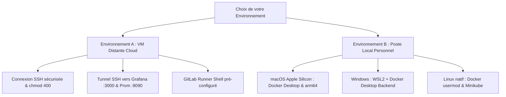

# 16 — Guide Pratique des Environnements & Portabilité Multi-OS
**Certification visée :** RNCP 38919 — Data Engineer (Bloc 3)  
**Type :** Guide opérationnel d'infrastructure & démarrage  
**Public cible :** Candidats s'exécutant sur VM distante ou sur poste local (Mac / Windows WSL2 / Linux)  

---

## 1. Vue d'Ensemble des Environnements d'Exécution



*Équivalent en diagramme ASCII :*

```text
+-------------------------------------------------------------------------+
|                  Choix de votre Environnement d'Exécution               |
+------------------------------------+------------------------------------+
                                     |
         +---------------------------+---------------------------+
         |                                                       |
         v                                                       v
+------------------------------------+  +---------------------------------+
|   Environnement A : VM Distante    |  |  Environnement B : Poste Local  |
|   (DataScientest / AWS Ubuntu)     |  |  (Mac Silicon / Win / Linux)    |
+------------------------------------+  +---------------------------------+
  |-- Connexion SSH (.pem chmod 400)      |-- macOS : Docker Desktop k8s
  |-- Tunnel SSH (Ports 8000/9090/3000)   |-- Windows : WSL2 & fins de ligne
  `-- GitLab Runner Shell pré-installé    `-- Linux : usermod Docker & K3s
```

---

## 2. Environnement A — VM Distante DataScientest (AWS Ubuntu)

Lors des sessions de formation ou de passage d'examen, DataScientest fournit généralement une instance Ubuntu accessible par clé SSH (fichier `.pem`).

### Étape 1 : Sécuriser la clé privée SSH
Par défaut sous Unix, une clé privée avec des droits trop ouverts (`644` ou `755`) est rejetée :
```bash
chmod 400 data_enginering_machine.pem
```

### Étape 2 : Se connecter avec Tunnel de Port-Forwarding
Pour pouvoir accéder aux interfaces web de l'API (8000), de Prometheus (9090) et de Grafana (3000) depuis votre navigateur local, **ouvrez toujours la session avec les redirections de ports** :
```bash
ssh -i "./data_enginering_machine.pem" \
    -L 8000:localhost:8000 \
    -L 9090:localhost:9090 \
    -L 3000:localhost:3000 \
    ubuntu@<IP_PUBLIQUE_VM>
```

*URLs accessibles immédiatement sur votre machine :*
* Documentation Swagger FastAPI : `http://localhost:8000/docs`
* Métriques brutes Prometheus : `http://localhost:8000/metrics`
* Console Prometheus Server : `http://localhost:9090`
* Tableaux de bord Grafana : `http://localhost:3000` (Login par défaut : `admin / admin`)

---

## 3. Environnement B — Poste Local Personnel

### 3.1. macOS (Apple Silicon M1 / M2 / M3 / M4)

1. **Docker Desktop :**
   * Installer Docker Desktop pour Mac (Apple Silicon).
   * Activer Kubernetes localement dans `Settings > Kubernetes > Enable Kubernetes`.
2. **Architecture des images (arm64 vs amd64) :**
   * Pour exécuter localement : le build standard fonctionne directement.
   * Pour pousser sur DockerHub à destination d'un cluster Linux x86_64, forcer la plateforme :
     ```bash
     docker build --platform linux/amd64 -t <USER>/parcelpulse-api:latest .
     ```
3. **Shell par défaut :**
   * macOS utilise `zsh` au lieu de `bash`. Les variables d'environnement persistantes doivent être déclarées dans `~/.zshrc` puis rechargées via :
     ```bash
     source ~/.zshrc
     ```

---

### 3.2. Windows (avec WSL2)

1. **Pré-requis :**
   * Installer WSL2 avec une distribution Ubuntu (`wsl --install -d Ubuntu`).
   * Installer Docker Desktop pour Windows et activer l'option `Use the WSL 2 based engine` ainsi que l'intégration avec votre distribution Ubuntu.
2. **Piège critique des fins de ligne (CRLF vs LF) :**
   * Sous Windows, Git convertit parfois les fins de ligne en `CRLF` (`\r\n`).
   * Lors du lancement de scripts bash (`smoke_test.sh`), cela produit l'erreur : `\r: command not found`.
   * **Solution :** Le fichier `.gitattributes` du pack force `LF`. Si besoin, convertir manuellement :
     ```bash
     dos2unix scripts/smoke_test.sh
     ```

---

### 3.3. Linux Natif (Ubuntu / Debian / Fedora)

1. **Permissions Docker sans `sudo` :**
   ```bash
   sudo usermod -aG docker $USER
   newgrp docker
   docker ps
   ```
2. **Kubernetes local :**
   Utiliser Minikube avec le driver Docker :
   ```bash
   minikube start --driver=docker
   kubectl get nodes
   ```

---

## 4. Tableau Récapitulatif des Commandes Diagnostic

| Besoin | Commande de vérification | Résultat attendu |
|---|---|---|
| **Python & venv** | `python3 -m venv .venv && source .venv/bin/activate` | Prompt préfixé par `(.venv)` |
| **Démon Docker** | `docker info` | Informations système sans erreur de socket |
| **Cluster K8s** | `kubectl cluster-info` | `Kubernetes control plane is running` |
| **Port disponible** | `lsof -i :8000` (Mac/Linux) ou `netstat -ano` (Win) | Aucun processus en écoute préalable |
| **GitLab Runner** | `gitlab-runner list` | Liste des runners enregistrés actifs |
